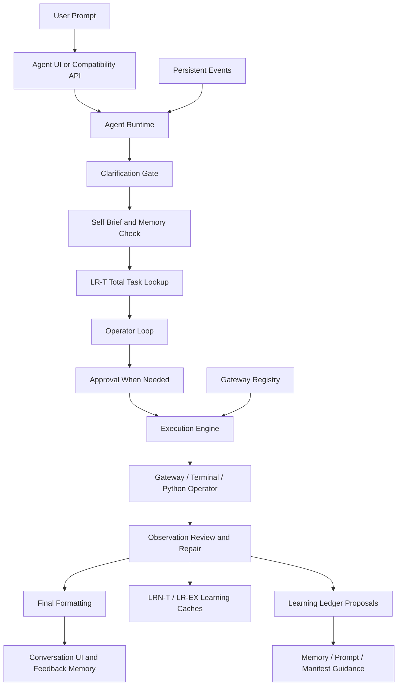

# OpenFABRIC Agent Runtime

OpenFABRIC is a local-first, typed agent runtime for safe command execution,
trusted Python operators, persistent agent memory, learned runtime structures,
scheduled events, gateway-managed workspaces, deterministic UI rendering, and
reviewable capability evolution from run evidence. It is designed to make
smaller local or OpenAI-compatible models more useful for real agent work by
wrapping model output in typed contracts, stepwise decomposition, validation,
approval gates, trace evidence, recovery loops, and durable workflow systems.

The current runtime is built around one rule:

> The LLM decides meaning.
> The runtime validates typed contracts and safety.
> The gateway touches the real environment.

The local Agent UI is the primary interactive surface. Compatibility surfaces
such as `/runs`, `/sessions`, and the `aor` CLI still route through the same
typed runtime, but day-to-day development and debugging should use `/agent-ui`.


## Current Architecture

Ordinary work uses a shared operator-native pipeline in Agentic and
Conversational modes:

- `operator.shell_command`
- `operator.python_action`
- `operator.python_transform`

The default operator path remains conservative and stepwise: decompose
non-trivial requests, plan the current step, validate, pause for confirmation
when needed, execute, observe, and feed the recorded evidence into the next
step. A request can still execute as one action when the decomposed task is
genuinely atomic.

That pacing is also the smaller-model posture. OpenFABRIC improves reliability
by narrowing each model-authored job and letting runtime-owned validators,
approvals, recovery profiles, evals, and gateway boundaries decide what can
run. It does not promise smaller models are equivalent to larger models; it
makes their behavior easier to inspect, correct, and operate locally.

Deterministic runtime introspection remains available through `runtime.*`
capabilities such as:

- `runtime.describe_capabilities`
- `runtime.describe_pipeline`
- `runtime.show_last_plan`
- `runtime.explain_last_failure`

The LLM can propose shell commands, Python programs, input bindings,
clarification questions, repairs, final answers, and memory drafts. The runtime
validates action ids, function contracts, cwd, safety policy, command risk,
approval requirements, terminal routing, memory relevance, and graph shape
before anything touches the machine.




## Quick Start

```bash
./docker-all-services/build.sh
./docker-all-services/start.sh
```

Docker is the preferred path after the source has been synced down. It starts
the Agent runtime, Agent UI, manual, website, and audio runtime. Open:

- `http://127.0.0.1:8011/agent-ui` for the Agent UI
- `http://127.0.0.1:8013/manual` for the manual service
- `http://127.0.0.1:8014/website` for the product website

Run in the background:

```bash
./docker-all-services/start.sh -d
```

Then install and start a gateway. This is required for command-backed agent
work; the gateway is the process that touches the real shell:

```bash
./src/gateway_agent/install.sh
./src/gateway_agent/startup.sh
curl http://127.0.0.1:8787/healthz
```

For a gateway on another trusted machine:

```bash
GATEWAY_NODE_NAME=workstation ./src/gateway_agent/startup.sh --host 0.0.0.0 --port 8787
```

Finally attach an OpenAI-compatible LLM endpoint. Existing endpoints should
respond at `/v1/models`:

```bash
curl http://127.0.0.1:8000/v1/models -H 'Authorization: Bearer local'
```

To host locally with vLLM, create the conda environment and run one of the
checked-in launch profiles. This follows the current vLLM quickstart and
release guidance at `https://docs.vllm.ai/en/latest/getting_started/quickstart/`
and `https://vllm.ai/releases`.

```bash
conda create -n vllm python=3.12 -y
conda activate vllm
pip install --upgrade uv
uv pip install vllm --torch-backend=auto
./src/llm/start-current-qwen3-coder-30b-a3b-awq.sh
```

The complete step-by-step guide is in the served manual:
`http://127.0.0.1:8013/manual#doc=install-startup`.

## Native Source Startup

Use the native source path when developing OpenFabric or debugging the runtime:

```bash
./install.sh
./startup.sh
```

Open the local Agent UI:

- `https://127.0.0.1:8011/agent-ui` when SSL is enabled
- `http://127.0.0.1:8011/agent-ui` when SSL is disabled
- `http://127.0.0.1:8012/healthz` for the audio runtime
- `http://127.0.0.1:8013/manual` for the manual service
- `http://127.0.0.1:8014/website` for the product website

OpenFABRIC requires Python 3.11 or newer. The installer will automatically
prefer `python3.13`, `python3.12`, or `python3.11` when available, and it will
recreate `.venv` if an older interpreter was used previously.

If your server has multiple Python installs and you want to force a specific
3.11+ interpreter, pass it explicitly:

```bash
PYTHON_BIN=python3.11 ./install.sh
```

Useful launch options:

```bash
./startup.sh --port 8311
./startup.sh --audio-port 8312 --manual-port 8313 --website-port 8314
AOR_HOST=127.0.0.1 ./startup.sh
./startup.sh --https
AOR_APP_CONFIG_PATH=/path/to/bootstrap.yaml ./startup.sh
```

## Docker Distribution

The all-services stack is the default Docker distribution:

```bash
./docker-all-services/build.sh
./docker-all-services/start.sh
```

It runs:

- Agent runtime and Agent UI on `8011`;
- manual on `8013`;
- website on `8014`;
- audio runtime internally at `http://audio:8012`;
- persistent state in the `openfabric-all-services-data` Docker volume.

The gateway and LLM are intentionally outside Docker. Install and run each
gateway natively on the node that should execute commands, and run vLLM or
another OpenAI-compatible server wherever the model hardware lives.

The smaller server/manual-only stack is still available:

```bash
./docker/build.sh
./docker/start.sh
```

That smaller stack does not build `whisper-cli` or run the audio runtime; use
`docker-all-services/` for Docker voice dictation.

To serve the Dockerized UI over HTTPS:

```bash
AOR_SSL_ENABLED=1 ./docker-all-services/start.sh
```

Then open `https://<host-ip>:8011/agent-ui` and accept the browser warning.
If the image or deployment does not include the development cert/key, the
entrypoint generates a fresh pair under `/data/artifacts/ssl/` and reuses it on
later starts because `/data` is persistent.

Runtime state is stored in the named Docker volume mounted at `/data`.
On first run, the entrypoint copies the checked-in seed databases
`artifacts/agent_memory.db` and `artifacts/prompts.db` into
`/data/artifacts` if they are missing. Existing files in `/data` are never
overwritten, so prompt edits, memory, chats, gateway settings, scheduled
events, caches, outputs, and the Playwright profile survive restarts.

The default Docker gateway URL is `http://host.docker.internal:8787`, which
targets the native gateway running on the Docker host. Remote gateways can be
added from the Agent UI with their URLs and nicknames.

LLM hosting is not bundled. Configure the OpenAI-compatible endpoint from the
Agent UI settings; the backend persists runtime controls in the settings DB. For
legacy bootstrap-only deployments, set `AOR_APP_CONFIG_PATH` to an explicit YAML
file:

```yaml
services:
  server:
    environment:
      AOR_APP_CONFIG_PATH: /data/config.yaml
    volumes:
      - openfabric-all-services-data:/data
      - ../config.yaml:/data/config.yaml:ro
```

Playwright Chromium is installed in the image and runs headlessly by default.
Its browser profile is stored at `/data/playwright-duckai-profile`.

Local voice dictation runs through a separate audio runtime microservice. The
Agent UI still calls `/api/audio-transcriber`, but the main agent server proxies
those requests to the audio runtime at `AOR_AUDIO_TRANSCRIBER_SERVICE_URL`
(`http://audio:8012` in the all-services stack, `http://localhost:8012` in
native source runs).
`./startup.sh` starts that audio process automatically with the low model tier
unless `AOR_AUDIO_TRANSCRIBER_AUTOSTART=0`; you can also run it directly with
`./startup-audio.sh`. Use `AOR_AUDIO_RUNTIME_PORT`, `./startup.sh --audio-port 8312`,
`AOR_AUDIO_TRANSCRIBER_MODEL_TIER=med`, or
`AOR_AUDIO_TRANSCRIBER_MODEL_TIER=high` to change the audio endpoint or opt
into a larger model.

`./startup.sh` also starts the standalone manual service at
`http://127.0.0.1:8013/manual` unless `AOR_MANUAL_AUTOSTART=0`. Use
`AOR_MANUAL_PORT` or `./startup.sh --manual-port 8313` when `8013` is already
busy.

The standalone product website starts at `http://127.0.0.1:8014/website` unless
`AOR_WEBSITE_AUTOSTART=0`. Use `AOR_WEBSITE_PORT` or
`./startup.sh --website-port 8314` when `8014` is already busy. You can also run
it directly with `./startwebsite.sh`.

The repository does not redistribute `whisper-cli` binaries or Whisper model
files. For local source installs, `./install.sh` runs
`./setup-audio-transcriber.sh`, which installs common system dependencies when a
supported package manager is available, reuses a system or `.aor` `whisper-cli`
when one exists, and otherwise builds whisper.cpp locally. Models are stored
under `artifacts/models/whisper` and are downloaded when missing unless
`AOR_DOWNLOAD_WHISPER_MODEL=0` is set. Override
`AOR_AUDIO_TRANSCRIBER_MODEL_PATH` / `AOR_AUDIO_TRANSCRIBER_MODEL_URL` to manage
the model yourself. Use `./install-no-build.sh` when you want the core app
install to avoid audio builds/downloads; audio is enabled only if compatible
local assets already exist.


## What The Runtime Does

The runtime can:

- classify prompts into direct-answer, tool, workflow, and feedback intent;
- ask one clarifying question when user intent is missing;
- avoid asking about discoverable local facts such as current branch or cwd;
- probe discoverable machine state with ordinary validated operator steps
  instead of asking the user for labels, device names, or other local facts the
  runtime can inspect;
- create a request self-brief before planning;
- retrieve only relevant persistent memory after task/tool/intent
  classification, with conservative domain hints for obvious Git/Docker
  requests;
- turn validator failures, corrected runs, capability gaps, and feedback into
  Learning Ledger capability proposals for review;
- convert retrieved memory into visible runtime directives for direct answers,
  operator planning, plan review, cache reuse, and final answers;
- learn and reuse validated total-task structures with LRN-T/LR-T so repeated
  similar prompts can skip decomposition without skipping validation,
  routing, approval, or execution checks;
- reuse safe exact-step command/Python replay entries with LR Direct and use
  LR-EX semantic shape judging when the current step is equivalent but not an
  exact text match;
- author operator actions for shell, trusted Python programs, and Python
  transforms;
- defer Python code generation until upstream output shape is known;
- build and validate an acyclic action DAG;
- pause for approval before mutating or risky work;
- route terminal-prompting commands through the Agent UI terminal;
- repair malformed JSON/code, failed deferred Python, and execution failures
  with structured evidence;
- run the decomposition-driven operator loop through the same validator and
  safety policy, one scoped step at a time;
- run a shared structured-output repair pass when an LLM returns JSON that is
  close to, but not valid for, the expected Pydantic schema;
- use one global clarification mode (`auto_pilot`, `balanced`, or `pedantic`)
  and a typed clarification resolver to auto-resolve high-confidence
  entity/option matches without bypassing validators;
- reuse Parameter Store entries with executable `value_json` and non-secret
  `context_json` guidance for prompts, clarifications, parameter matching, and
  SQL semantics;
- discover SQL schemas through `/discoverdb`, persist generated schema/relation
  metadata in Parameter Store, and allow read-only semantic/inferred joins with
  warnings while hard-rejecting unsafe or schema-invalid SQL;
- stream stdout and stderr into collapsible command capsules;
- judge final answers against expected artifacts when enabled;
- collect post-run feedback and propose memory entries for user approval;
- draft, save, run, pause, cancel, and delete persistent interval events;
- auto-approve only the same user-facing confirmation prompts that the UI would
  otherwise show, when the relevant toggle is enabled;
- preserve trace, profiling, validation, approval, memory, and execution
  details.


## Main Endpoints

Health:

- `GET /healthz`

Agent UI:

- `GET /agent-ui`
- `GET /agent-ui-client`
- `GET /agent-ui-mobile`
- `GET /directory`
- `GET /settings`
- `GET /prompt-editor`
- `GET /parameter-editor`
- `GET /learning-ledger`
- `GET /reliability`
- `GET /api/agent/directory`
- `POST /api/agent/request`
- `GET /api/agent/stream/{request_id}`
- `GET /api/agent/trace/{request_id}`
- `GET /api/agent/raw/{request_id}/{data_ref}`
- `GET /api/agent/file`
- `GET /api/agent/health`
- `GET /api/agent/version`
- `GET /api/agent/version/check`
- `GET /api/agent/runtime-controls`
- `POST /api/agent/runtime-controls`
- `POST /api/agent/confirmation/{request_id}`
- `POST /api/agent/clarification/{request_id}`
- `POST /api/agent/continue/{request_id}`
- `POST /api/agent/stop/{request_id}`
- `POST /api/agent/restart`
- `GET /prompt-editor?mode=parameters&key={key}`

Integration API:

- `POST /api/agent/integrations/execute`
- `GET /api/agent/integrations/results/{request_id}`
- `POST /api/agent/integrations/confirm/{request_id}`
- `POST /api/agent/integrations/clarify/{request_id}`

These non-streaming routes let external systems submit agent prompts, reuse the
same runtime controls saved by the UI settings database, and receive blocking
result envelopes documented in `/openapi.json`.

Settings, model, terminal, and memory:

- `GET /api/agent/model/config`
- `GET /api/agent/settings/registry`
- `GET /api/agent/settings/config`
- `GET /api/agent/settings/preferences`
- `PUT /api/agent/settings/preferences`
- `GET /api/agent/prompt-history`
- `POST /api/agent/prompt-history`
- `GET /api/agent/prompt-macros`
- `GET /api/agent/chats`
- `GET /api/agent/chats/{conversation_id}`
- `DELETE /api/agent/chats/{conversation_id}`
- `POST /api/agent/conversation/summary`
- `GET /api/agent/cache/stats`
- `POST /api/agent/cache/clear`
- `GET /api/agent/lrnt/stats`
- `POST /api/agent/lrnt/clear`
- `POST /api/agent/lrdirect/clear`
- `POST /api/agent/name/suggest`
- `GET /api/agent/command-allowlist`
- `POST /api/agent/command-allowlist`
- `DELETE /api/agent/command-allowlist/{entry_id}`
- `GET /api/agent/gateways`
- `POST /api/agent/gateways`
- `PATCH /api/agent/gateways/{gateway_id}`
- `DELETE /api/agent/gateways/{gateway_id}`
- `POST /api/agent/gateways/{gateway_id}/health`
- `WebSocket /api/agent/terminal/ws`
- `GET /api/agent/terminal/config`
- `POST /api/agent/terminal/cwd`
- `GET /api/agent/llm/status`
- `GET /api/agent/llm/log`
- `POST /api/agent/llm/start`
- `POST /api/agent/llm/stop`
- `GET /api/audio-transcriber/config`
- `POST /api/audio-transcriber/transcribe`
- `GET /api/agent/memory`
- `POST /api/agent/memory`
- `PATCH /api/agent/memory/{memory_id}`
- `POST /api/agent/memory/{memory_id}/retire`
- `POST /api/agent/memory/{memory_id}/restore`
- `GET /api/agent/memory/{memory_id}/audit`
- `POST /api/agent/memory/context`
- `POST /api/agent/memory/feedback`
- `POST /api/agent/memory/feedback/draft`
- `POST /api/agent/memory/optimize`
- `POST /api/agent/memory/proposals/{proposal_id}/apply`
- `GET /api/agent/parameters`
- `POST /api/agent/parameters`
- `GET /api/agent/parameters/{key}`
- `PATCH /api/agent/parameters/{key}`
- `DELETE /api/agent/parameters/{key}`
- `POST /api/agent/parameters/{key}/reveal`
- `POST /api/agent/parameters/draft`
- `POST /api/agent/databases/discover`
- `POST /api/agent/databases/discover/commit`
- `POST /api/agent/sql/query`

Prompt Editor, Learning Ledger, Reliability, Tasks, Monitors, and
notifications:

- `GET /api/agent/prompt-editor/templates`
- `GET /api/agent/prompt-editor/templates/{prompt_key}`
- `PATCH /api/agent/prompt-editor/templates/{prompt_key}`
- `POST /api/agent/prompt-editor/templates/{prompt_key}/reset`
- `POST /api/agent/prompt-editor/templates/{prompt_key}/render`
- `GET /api/agent/prompt-editor/parameters`
- `GET /api/agent/prompt-editor/memories`
- `POST /api/agent/prompt-editor/memories`
- `GET /api/agent/prompt-editor/memories/{memory_id}`
- `PATCH /api/agent/prompt-editor/memories/{memory_id}`
- `GET /api/agent/learning-ledger/summary`
- `POST /api/agent/learning-ledger/clear`
- `GET /api/agent/learning-ledger/runs`
- `GET /api/agent/learning-ledger/runs/{request_id}`
- `GET /api/agent/learning-ledger/proposals`
- `GET /api/agent/learning-ledger/proposals/{proposal_id}`
- `PATCH /api/agent/learning-ledger/proposals/{proposal_id}`
- `POST /api/agent/learning-ledger/proposals/{proposal_id}/approve`
- `POST /api/agent/learning-ledger/proposals/{proposal_id}/apply`
- `POST /api/agent/learning-ledger/proposals/{proposal_id}/reject`
- `POST /api/agent/learning-ledger/proposals/{proposal_id}/retire`
- `GET /api/agent/learning-ledger/lessons`
- `PATCH /api/agent/learning-ledger/lessons/{lesson_id}`
- `POST /api/agent/learning-ledger/lessons/{lesson_id}/approve`
- `POST /api/agent/learning-ledger/lessons/{lesson_id}/reject`
- `POST /api/agent/learning-ledger/lessons/{lesson_id}/retire`
- `POST /api/agent/learning-ledger/lessons/{lesson_id}/restore`
- `POST /api/agent/learning-ledger/lessons/{lesson_id}/digest-note`
- `GET /api/agent/reliability/profile`
- `GET /api/agent/reliability/profile/{model_id}`
- `GET /api/agent/reliability/runs`
- `GET /api/agent/reliability/runs/{request_id}`
- `GET /api/agent/reliability/runs/{request_id}/report.json`
- `GET /api/agent/reliability/runs/{request_id}/report.md`
- `GET /api/agent/reliability/evals`
- `POST /api/agent/reliability/evals/run`
- `GET /api/agent/tasks`
- `GET /api/agent/tasks/{task_id}`
- `DELETE /api/agent/tasks`
- `DELETE /api/agent/tasks/{task_id}`
- `GET /api/agent/tasks/{task_id}/attempts`
- `GET /api/agent/tasks/{task_id}/checkpoints`
- `POST /api/agent/tasks`
- `POST /api/agent/tasks/{task_id}/start`
- `POST /api/agent/tasks/{task_id}/retry`
- `POST /api/agent/tasks/{task_id}/cancel`
- `POST /api/agent/tasks/{task_id}/archive`
- `POST /api/agent/monitors/draft`
- `GET /api/agent/monitors`
- `POST /api/agent/monitors`
- `GET /api/agent/monitors/{monitor_id}`
- `GET /api/agent/monitors/{monitor_id}/observations`
- `GET /api/agent/monitors/{monitor_id}/stream`
- `POST /api/agent/monitors/{monitor_id}/start`
- `POST /api/agent/monitors/{monitor_id}/pause`
- `POST /api/agent/monitors/{monitor_id}/cancel`
- `POST /api/agent/monitors/{monitor_id}/archive`
- `GET /api/agent/notifications`
- `PATCH /api/agent/notifications/{notification_id}`
- `POST /api/agent/notifications/mark-all-read`

Events:

- `POST /api/agent/events/draft`
- `POST /api/agent/events/from-prompt`
- `GET /api/agent/events`
- `POST /api/agent/events`
- `PATCH /api/agent/events/{event_id}`
- `DELETE /api/agent/events/{event_id}`
- `POST /api/agent/events/{event_id}/trigger`
- `GET /api/agent/events/{event_id}/runs`
- `POST /api/agent/events/{event_id}/runs/{event_run_id}/cancel`

Manual service:

- `GET /`
- `GET /manual`
- `GET /manual/`
- `GET /api/manual/catalog`
- `GET /api/manual/document/{doc_id}`
- `GET /api/manual/search`
- `GET /api/manual/tags`
- `GET /api/manual/related/{doc_id}`

Website service:

- `GET /`
- `GET /website`
- `GET /website/`
- `GET /website/product`
- `GET /website/use-cases`
- `GET /website/resources`
- `GET /healthz`

Compatibility endpoints:

- `POST /runs`
- `POST /runs/stream`
- `GET /runs`
- `GET /runs/{run_id}`
- `POST /sessions`
- `GET /sessions`
- `GET /sessions/{id}`
- `GET /sessions/{id}/events`


## Agent UI

The Agent UI shows:

- Agentic, Conversational, and Advisory mode toggle;
- a single composer Run button that creates a FIFO durable task, attaches
  immediately when idle, and changes to Queue while a run, task, approval, or
  clarification is active;
- Quick controls -> Agent behavior -> Answers toggle for Detailed and Simple
  final responses;
- runtime learning controls for Auto-learn, LRN-T/LR-T, LR-T threshold, and
  LR Direct replay behavior;
- a compact terminal button next to Mic that is an alias for the same persisted
  terminal visibility preference exposed in Settings;
- an off-by-default terminal-header switch that can include terminal cwd,
  session metadata, and a capped visible terminal snapshot in Advisory prompts;
- Quick controls / Settings -> Clarification segmented control for
  Auto-pilot, Balanced, and Pedantic behavior;
- Fast profile wiring that switches Agentic requests into streaming, fast
  reasoning, conservative repair, and visible response streaming;
- Auto-Approve Commands toggle, scoped to visible user-facing confirmation
  prompts only;
- request and final response conversation history;
- queued composer submissions are saved as durable tasks with the active
  conversation, gateway, model, terminal, routing, and auto-approve context;
- queued durable tasks auto-attach when they start, replay the retained trace,
  follow request-id handoffs such as task auto-approval continuations, and
  render the final result when the task finishes;
- inline clarification controls;
- confirmation cards for mutating actions;
- Modify Memory and Run Feedback flows;
- collapsible command output capsules with copy and clear controls;
- optional terminal pane for live shell interaction, with the composer terminal
  button and Settings terminal toggle kept in sync through backend preferences;
- separate resizable Settings, Memory, Gateway, Events, Tasks, Monitors,
  Parameters, Chat History, and Notifications drawers;
- Directory, Mission Control Settings, Prompt Editor, Learning Ledger,
  Reliability, Client UI, and Mobile UI standalone surfaces;
- Parameter Store drawer with an Open Editor action for the full
  `/parameter-editor` page, which opens Prompt Editor parameter mode;
- trace pane with progress, model introspection, memory checks, validation, and
  execution events;
- Visualization pane with a live Mermaid request-flow map, timing details,
  loops, zoom, pan, horizontal/vertical layout toggle, and raw Mermaid copy;
- model status below the prompt box;
- configurable agent display name;
- prompt history with `Shift+Up` and `Shift+Down`;
- backend-persisted UI preferences for theme, pane visibility, chat bubbles,
  number animation, opt-in chat pop animation, browser notifications, sound,
  voice, and immersive sizing;
- immersive mode with quick controls and a settings burger in the conversation
  header; the quick controls, settings burger, backend plug, and mirrored
  run/LLM/LR status badges sit in a right-aligned rail under the gateway
  picker, and the Settings drawer remains available as an overlay while the
  normal topbar, model badge, and non-chat panes are hidden.

Read-only shell commands can run without approval. Mutating or risky actions
pause before execution and resume only after approval.

There is no fast-lane exception to confirmation pacing. Hard safety blockers,
command deny rules, cwd checks, bindings, and policy checks remain
authoritative for every operator step. Advisory mode can optionally include
terminal cwd/session metadata and the latest visible terminal output for
context, but runnable advisory snippets stay terminal-only and are not converted
into operator commands.


## Conversational Mode

Conversational mode stores bounded process-local conversation state for the
Agent UI. A follow-up can either:

- answer from prior operator output when the context is sufficient; or
- propose new operator actions, which are validated and approval-gated normally.

Conversation state is volatile and clears on New Chat or process restart. Large
outputs are not blindly copied into the conversation prompt; the runtime uses
bounded previews, result metadata, and data refs.


## Python Operators

Python is now a trusted operator execution backend, not a narrow import
whitelist sandbox.

`operator.python_action` must define:

```python
def main(inputs):
    ...
```

Use `python_action` when one Python program should inspect files, run
subprocesses, parse data, orchestrate commands, and return the final computed
result.

`operator.python_transform` must define:

```python
def transform(inputs):
    ...
```

Use `python_transform` when the Python step is primarily a transformation over
declared upstream inputs.

Both forms are structurally validated and approval-gated by risk. Python may
use normal imports, filesystem APIs, subprocesses, and data-processing
libraries when the action risk and user approval allow it. Deferred Python code
is generated only after upstream output exists, so the LLM receives a bounded
preview of the real input shape before writing code.


## Persistent Memory

Persistent agent memory is stored in SQLite at:

```text
artifacts/agent_memory.db
```

unless `AOR_AGENT_MEMORY_DB_PATH` or config overrides the settings path.

Memory entries can be exact-model, model-family, or global. They are advisory
only: current user instructions, live stdout/stderr, typed validation, and
approval/safety policy always override memory.

The runtime retrieves memory after self-brief/task classification so it can
match task type, tool type, intent type, tags, model scope, and request text
instead of injecting unrelated memories. Conservative deterministic hints can
promote obvious prompts such as "commit and push this git repo" into the Git
retrieval context even when an upstream LLM stage labels the task generically.

Applied memories become runtime-only directives with match reasons and
strength levels. They are shown in trace metadata and the UI memory indicator,
and they are checked during operator planning and cache reuse. Diagnostic
memory search does not increment usage; only memory applied to a request
increments `use_count`.

`artifacts/agent_memory.db` is intentionally tracked as a reusable seed memory
and capability-guidance store. `artifacts/prompts.db` is also tracked as the
seed LLM prompt-template catalog. Local runtime history, learned task caches,
command template caches, computation caches, events, chats, and gateway
settings should stay machine-local unless explicitly curated.


## Parameter Store, Context, And SQL Discovery

Runtime parameters are stored in SQLite at:

```text
artifacts/agent_parameters.db
```

Each entry has:

- `value_json` for executable data such as credentials, hosts, ports, tokens,
  paths, IDs, database names, SQL `schema_catalog`, `relation_foreign_scheme`,
  and `schema_discovery`;
- `context_json` for non-secret domain guidance used by prompts,
  clarification resolution, parameter matching, SQL semantics, and
  capability-specific entity selection.

The full editor is available at `/parameter-editor` and supports deep links
such as `/parameter-editor?key=canonical_v1`. Sensitive `value_json` stays
masked until the audited reveal endpoint is used. `context_json` can be edited
without revealing secrets.

`/discoverdb` refreshes SQL schema metadata through reviewable drafts. Existing
database profiles are updated on commit rather than skipped, generated
schema/relation fields are replaced in `value_json`, and `context_json` is
preserved. SQL prompts receive bounded schema/relation summaries plus bounded
domain context; validators still reject unsafe SQL and unknown tables/columns.
Read-only joins based on inferred or domain relationships execute with
warnings instead of hard rejection.


## Persistent Events

Runtime events let users save interval prompts such as:

```text
check git status every hour
```

Events are drafted by the LLM but saved only after user review. Saved events are
stored in SQLite at `artifacts/agent_events.db` by default and run from the
server process even when the browser is closed. Each event stores its prompt,
interval, status, selected gateway, terminal cwd, model/operator context, and
whether generated confirmations should be auto-approved.

Scheduled runs use the same runtime path as normal requests: memory, cache,
gateway routing, validation, trace, visualization, confirmation generation, and
final formatting still apply. Event auto-approval only submits the existing
confirmation prompt; it does not answer clarifications or bypass safety blocks.


## Durable Tasks And Queued Runs

The prompt composer has one entry point. Run creates a chat-sourced durable
task through `/api/agent/tasks` with `start_now: true`. When the runtime is
idle, the backend immediately starts the oldest queued task and the UI attaches
to its stream, so the button still reads as Run. While a request, durable task,
approval, or clarification is active, the same button changes to Queue and the
new task waits behind older queued work.

Queued submissions preserve chat source, conversation id, selected model,
agent mode, gateway routing, settings context, terminal context when present,
and request-scoped auto-approve intent. The task drawer still keeps its own
Create Task and Create + Start controls for explicit task management.

When a queued task starts while the UI is open, the UI fetches
`/api/agent/trace/{request_id}` first, renders the retained trace, and then
streams new events from the last trace id. If the task auto-approves a
confirmation and moves from a parent approval request to a child execution
request, the attached UI follows that task request handoff and replaces stale
approval controls with the live or final child trace.


## Gateway Agent

Shell actions use the gateway for environment-facing execution:

```bash
./src/gateway_agent/startup.sh
```

The gateway supports buffered execution, streaming execution, cancellation, and
interactive PTY-backed terminal sessions. Commands that may need passphrases,
passwords, credential prompts, or a controlling TTY are routed through the
Agent UI terminal when a trusted terminal session is available.

The Agent UI keeps a persistent gateway registry in
`artifacts/agent_gateways.db`. Each gateway can have its own terminal cwd. The
terminal Save Workspace button and browser close/gateway-switch autosave update
that cwd so the next request or restart resumes from the right workspace.
The square terminal button next to Mic toggles the same persisted terminal
visibility setting as Settings. On mobile, the terminal button hands off to the
desktop Agent UI with the terminal enabled.

For a gateway on another machine, bind the gateway to a reachable host:

```bash
./src/gateway_agent/startup.sh --host 0.0.0.0 --port 8787
```

See [src/gateway_agent/README.md](src/gateway_agent/README.md) for gateway
details.


## Local vLLM

Launch profiles for local OpenAI-compatible vLLM servers live in `src/llm/`.
The Settings drawer includes an xterm-backed launch terminal that can activate
the configured conda environment and run one of those scripts.

See [src/llm/README.md](src/llm/README.md) for model scripts and benchmark
commands.


## License And Attributions

See [LICENSE](LICENSE) for the project license and
[THIRD_PARTY_ATTRIBUTIONS.md](THIRD_PARTY_ATTRIBUTIONS.md) for third-party
components, licenses, and upstream sources.


## Documentation Map

- [docs/architecture.md](docs/architecture.md) - system map and current truth
- [docs/01_overview_for_humans.md](docs/01_overview_for_humans.md) - plain
  language explanation
- [docs/02_request_lifecycle.md](docs/02_request_lifecycle.md) - stage-by-stage
  lifecycle
- [docs/03_components_and_boundaries.md](docs/03_components_and_boundaries.md)
  - subsystem responsibilities
- [docs/04_llm_stages_and_contracts.md](docs/04_llm_stages_and_contracts.md)
  - LLM contracts and validation
- [docs/05_capabilities_safety_and_gateway.md](docs/05_capabilities_safety_and_gateway.md)
  - operator capabilities, safety, and gateway routing
- [docs/06_worked_example_memory_report.md](docs/06_worked_example_memory_report.md)
  - end-to-end worked example
- [docs/07_user_manual.md](docs/07_user_manual.md)
  - user manual, storage locations, settings, memory, terminal, and
    troubleshooting
- [docs/08_agent_memory_seed_and_capability_store.md](docs/08_agent_memory_seed_and_capability_store.md)
  - tracked reusable memory/capability DB guidance
- [docs/09_capability_evolution_layer.md](docs/09_capability_evolution_layer.md)
  - reviewed runtime improvement proposals from run evidence
- [docs/10_capability_reliability_kernel.md](docs/10_capability_reliability_kernel.md)
  - weak-model recovery, approval envelopes, verification, evals, and reports
- [docs/11_parameter_store_context_and_sql.md](docs/11_parameter_store_context_and_sql.md)
  - Parameter Store `context_json`, full Parameter Editor, `/discoverdb`, SQL
    prompting, and join validation
- [docs/12_system_surfaces_and_api_reference.md](docs/12_system_surfaces_and_api_reference.md)
  - current browser surfaces, Agent UI API groups, compatibility routes,
    manual and website service routes, audio routes, and UI state rules
