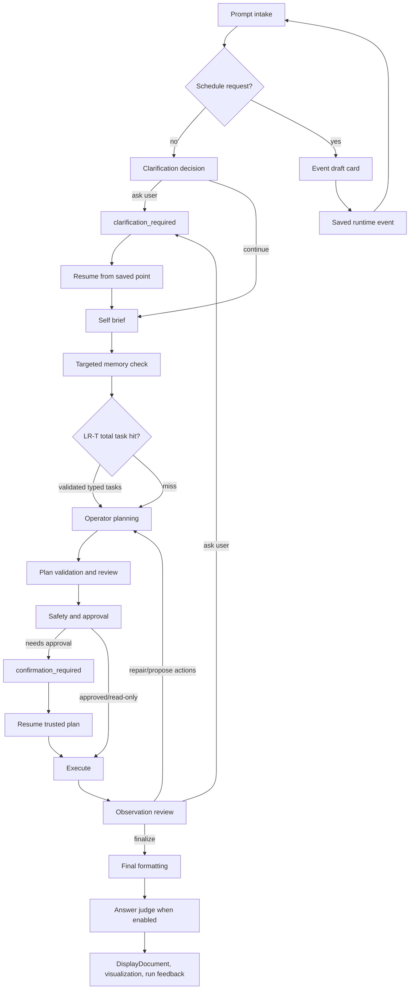

# Request Lifecycle

This document explains the current request lifecycle stage by stage.

It focuses on the typed runtime path used by the local Agent UI. Integration
requests route through the same lifecycle and return blocking JSON envelopes
instead of SSE. Compatibility request surfaces also route through the same
runtime, but they do not expose every UI feature such as command capsules,
memory editing, terminal input, and conversation controls.


## Lifecycle At A Glance




## Shared LLM Usage Pattern

LLM-assisted stages follow the same pattern:

1. build a small stage-specific prompt;
2. include targeted memory guidance when available;
3. ask for typed JSON or strict code shape;
4. validate the response with Pydantic models and structural checks;
5. reject malformed proposals or ask for bounded repair when appropriate;
6. trust only the deterministic validated result.

If the model returns JSON that is close but fails the target schema, the shared
structured-call layer can ask for one schema-only repair. That repair prompt
contains the expected schema, invalid payload, and Pydantic errors, and it
explicitly tells the model not to re-answer the user task.

The LLM is responsible for semantic authorship. The runtime is responsible for
typed contracts, safety, and execution.


## 0. Prompt Intake

**Where:** `src/agent_runtime/api/agent_ui.py`,
`src/agent_runtime/api/app.py`

**Purpose**

Convert the incoming Agent UI or compatibility payload into a prompt and
runtime context.

**Inputs**

- prompt text;
- workspace root;
- Agentic, Conversational, or Advisory mode;
- final response mode;
- agent display name;
- memory settings;
- LRN-T/LR-T and LR Direct learning controls;
- `agent_clarification_mode`;
- matched Parameter Store summaries, execution-only values, and bounded
  `context_json` guidance;
- terminal session id and cwd when available;
- conversation id;
- cancellation state.
- selected `llm_model`;
- selected gateway and per-gateway terminal cwd;
- durable task context when a queued/task run launched the request;
- event context when a scheduled event launched the request;
- runtime controls such as Auto-Approve Commands.

**Outputs**

- prompt text;
- context passed to `AgentRuntime.handle_request(...)`.

**LLM step:** No

### Composer Queue Branch

The Agent UI composer has one entry point. Run creates a chat-sourced durable
task through `POST /api/agent/tasks` with `start_now: true`. If no request or
durable task is active, the backend starts the oldest queued task immediately
and the UI attaches to that task stream. If a request, task, approval, or
clarification is active, the same button changes to Queue and the new task
waits behind older queued work.

That task preserves conversation id, selected model, agent mode, gateway and
routing metadata, settings context, terminal context when active, and
request-scoped auto-approve intent. The backend starts it immediately only when
no active chat/task work is blocking; otherwise it remains queued until the
active root request or child continuation finishes.

When a queued durable task starts while the UI is open, the UI first fetches
`/api/agent/trace/{request_id}` to replay retained trace events and then opens
the stream with `after_id` set to the latest retained event. If task
auto-approval moves work from a parent confirmation request to a child
execution request, the UI follows the durable task's current request id and
renders the live or final child trace.


## 1. Clarification Decision

**Where:** `src/agent_runtime/operator/pipeline.py`,
`src/agent_runtime/core/orchestrator.py`,
`src/agent_runtime/clarification.py`

**Purpose**

Let the LLM ask one user-facing question before planning if user intent is
missing and the selected clarification mode calls for asking.

Clarification behavior is controlled by one setting:

| Mode | Behavior |
| --- | --- |
| `auto_pilot` | Continue with high-confidence assumptions for most gaps. |
| `balanced` | Default. Auto-resolve obvious typos, plurals, casing, acronyms, and near-exact entity matches. |
| `pedantic` | Ask whenever a meaningful option is missing or ambiguous. |

**Allowed outcomes**

- continue;
- ask one clarification question with exactly three suggested options plus UI
  freeform Other.

Before surfacing a clarification, the shared typed clarification resolver can
run as an independent LLM operation. It receives the original prompt, proposed
question, missing-information label, available candidates, relevant bounded
Parameter Store `context_json`, the current clarification mode, and risk flags.
It returns either `continue_with_assumption` or `ask_user`.

When it continues, selected entities, assumptions, and execution directives are
attached to request/session context for downstream SQL, operator, repair, or
capability prompts. These directives are context, not permission to bypass
validation.

**Important rule**

The LLM should not ask about discoverable local facts such as current branch,
cwd, installed environments, Docker images, file lists, versions, command
output, or repository status. It should inspect those facts with read-only
actions.

**Runtime checks**

- typed `clarification_required` shape;
- typed `AgentClarificationResolution` shape when the resolver is used;
- max clarification rounds;
- saved pause state for resume.
- hard validators, SQL safety, credential flows, and confirmation policy remain
  authoritative even when a clarification is auto-resolved.


## 2. Self Brief

**Where:** `src/agent_runtime/operator/pipeline.py`

**Purpose**

Ask the LLM to generate a compact request brief before planning. The brief
captures task type, tool type, intent type, relevant tags, risks, likely
terminal needs, and known constraints.

**Why it exists**

The self-brief gives later stages a stable task classification and makes memory
retrieval targeted instead of broad.


## 3. Targeted Memory Check

**Where:** `src/agent_runtime/core/orchestrator.py`,
`src/agent_runtime/memory/`,
`src/agent_runtime/parameters/`

**Purpose**

Retrieve relevant persistent memory after the request has enough
classification context.

The same stage also attaches matching Parameter Store summaries. Raw executable
parameter values are kept in execution-only context, while `context_json`
guidance is summarized separately for prompts and clarification resolution.

**Retrieval priority**

1. exact active model;
2. model family;
3. global.

**Relevance checks**

- task type;
- tool type;
- intent type;
- tags;
- request text overlap;
- active status only.

The retrieval context can be enriched by deterministic hints. For example,
stage/commit/push/repo language promotes an otherwise generic prompt to the
Git domain so Git memories can be considered, while a phrase like "stage the
presentation" remains generic.

Diagnostic searches and UI previews do not increment usage. Memory applied to a
real request increments `use_count`.

**LLM step:** No for retrieval, yes for memory draft/optimization endpoints.

Applied memory is converted into runtime-only directives. Operator plans and
cache hits can be checked for memory compliance before deterministic validation
continues.

Parameter context is advisory in the same sense: it may help select a database,
table, file, project, metric, or concept, but it cannot override current user
instructions, live evidence, validators, approvals, or safety policy.


## 3b. LRN-T / LR-T Total-Task Reuse

**Where:** `src/agent_runtime/core/orchestrator.py`,
`src/agent_runtime/lrn_total_tasks/`

**Purpose**

Reuse a validated typed task structure from a previous successful request
before spending a new LLM call on decomposition.

LRN-T is the write side. After a successful request with typed tasks, the
runtime stores the prompt shape, classification snapshot, model family,
workflow mode, registry contract hash, task frames, global constraints, and
routing metadata in `artifacts/agent_lrn_total_tasks.db`.

LR-T is the lookup side. It matches only active entries whose normalized prompt
similarity meets `lrnt_similarity_threshold` and whose classification,
workflow mode, model family, and registry contract hash are compatible.

**Runtime checks**

- entries must be active, current schema version, and failure-free;
- reused tasks are revalidated with `PlanningContractValidator`;
- downstream operator planning, memory compliance, validation, safety,
  approval, execution, observation, and final formatting still run normally;
- an invalid reuse candidate or failed reused request quarantines the entry
  instead of keeping it in rotation.

**LLM step:** No for lookup/write. The normal decomposition LLM step is skipped
only on a validated LR-T hit.


## 4. Operator Planning

**Where:** `src/agent_runtime/operator/pipeline.py`

**Purpose**

Create one or more operator actions for ordinary work.

Current operator kinds:

- `shell_command`;
- `python_action`;
- `python_transform`.

The planner may also decide to finalize from existing context or ask for
clarification if user intent is required.

Before asking the planning LLM for a streaming step, LR Direct may reuse an
exact prior step from the command-template or computation cache. LR-EX extends
that path with a structured LLM shape judge for semantically equivalent
payload-aware command or Python replay shapes. Both paths still respect
current memory directives, risk/effect compatibility, validation, approval,
and gateway policy.

**Runtime checks**

- known action kind;
- unique ids;
- dependencies exist;
- input bindings are valid;
- no cycles;
- no unresolved placeholders;
- interaction and execution modes are valid.


## 5. Deferred Python Code Generation

**Where:** `src/agent_runtime/operator/pipeline.py`,
`src/agent_runtime/input_pipeline/argument_extraction.py`

**Purpose**

When Python depends on upstream output, the plan may omit final code at planning
time. The runtime executes upstream actions first, then asks the LLM for Python
code using a bounded preview of the real input shape.

`python_action` code must start with:

```python
def main(inputs):
```

`python_transform` code must start with:

```python
def transform(inputs):
```

**Repair packet includes**

- exact validation failure or exception;
- generated code;
- input preview;
- upstream stdout/stderr/output preview;
- original user goal;
- previous repair attempts.


## 6. Plan Validation And Review

**Where:** `src/agent_runtime/operator/pipeline.py`,
`src/agent_runtime/input_pipeline/planning_review.py`

**Purpose**

Validate the plan and optionally ask the LLM to review for obvious logical
gaps.

**Biases**

- verification should test the actual user goal;
- verification should not contradict itself;
- if a verification command is harder than the task, simplify it;
- successful source rows or computed artifacts must not disappear from the
  final answer.

**Runtime checks**

- review output cannot directly execute;
- any revised plan is revalidated from scratch;
- repeated same-shape validation failures stop cleanly.
- memory compliance review can request one repair pass when high-confidence
  directives are violated.
- cache hits are checked against current memory so stale cached plans do not
  bypass newer user-approved instructions.


## 6b. Dynamic Validation Adjudication

**Where:** `src/agent_runtime/operator/pipeline.py`,
`src/agent_runtime/memory/`

**Purpose**

Keep deterministic validation strict while allowing a scoped LLM adjudication
step for marked context-sensitive errors, such as placeholder-looking text that
is actually literal source payload.

**Allowed decisions**

- allow literal payload;
- require repair;
- block;
- ask user.

Hard safety checks remain non-overridable. Validation-policy memories are
retrieved separately from normal memory and only for matching validator error,
task, tool, and intent context.


## 7. Safety And Approval

**Where:** `src/agent_runtime/execution/safety.py`,
`src/agent_runtime/operator/pipeline.py`

**Purpose**

Decide whether execution is allowed and whether approval is required.

**Runtime checks**

- registered operation;
- command safety;
- cwd/workspace bounds;
- mutating vs read-only classification;
- Python risk;
- terminal requirement;
- confirmation requirement.

Read-only shell commands can execute without approval. Mutating or risky
commands pause and wait for approval.

If Auto-Approve Commands is enabled, the UI or scheduler submits the existing
confirmation approval through the same confirmation endpoint. The runtime still
creates the confirmation state first.


## 8. Execution

**Where:** `src/agent_runtime/execution/engine.py`

**Purpose**

Execute trusted DAG nodes.

**Runtime work**

- execute nodes in dependency order;
- send shell actions to gateway `/exec` or `/exec/stream`;
- send prompt-shaped shell commands to the Agent UI terminal when required;
- start terminal-detached commands for long-running terminal-owned work;
- run Python actions/transforms as local trusted operator code;
- populate result store and data refs;
- stream stdout/stderr/result output to the Agent UI.

### Streaming Decomposition Branch

For non-trivial Agentic work, decomposition remains in control. The runtime
asks for granular subtasks, validates and executes one scoped task/action,
streams the real stdout/stderr/result evidence, and feeds that evidence back
into the next planning step. The same validator, policy checks, cwd checks,
binding checks, approval gates, and execution engine stay authoritative for
every step.

Atomic requests can still produce one decomposed task and one action when the
task is genuinely independent and complete.


## 9. Observation Review

**Where:** `src/agent_runtime/operator/pipeline.py`

**Purpose**

Review the result after execution, whether actions succeeded or failed.

The LLM can decide to:

- finalize;
- propose more actions;
- repair failed actions;
- ask the user for intent;
- fail with evidence.

Observation review replaces older drift where success-only completion review
and error-only repair had separate behavior.


## 10. Code-Only Repair For Deferred Python

**Where:** `src/agent_runtime/operator/pipeline.py`

**Purpose**

If deferred Python fails structurally, throws an exception, or produces a
suspicious zero/empty result from non-empty input, the runtime first attempts a
focused code-only repair before falling back to broader plan repair.

This keeps a good plan from being discarded because one generated Python body
was malformed.


## 11. Final Formatting And Answer Judge

**Where:** `src/agent_runtime/output_pipeline/`,
`src/agent_runtime/operator/final_formatter.py`

**Purpose**

Produce a concise final answer from operator outputs without duplicating raw
capsule output unnecessarily.

Modes:

- Detailed: compose a richer final answer.
- Simple: return a short completion/result summary and rely more on capsules.

Scheduled event runs force detailed final composition so Event History has a
useful result summary even when the user normally prefers Simple mode.

When enabled, the answer judge checks that required artifacts are present. For
example, if the user asked to list rows, an empty final table is not acceptable
when the source command produced rows.


## 12. Display, Feedback, Memory, And Capability Proposals

**Where:** `src/agent_runtime/api/static/agent_ui/`,
`src/agent_runtime/memory/`,
`src/agent_runtime/learning_ledger/`

**Purpose**

Render the final response and let the user turn post-run feedback into durable
memory or reviewed capability improvements.

The feedback flow captures a typed object containing:

- outcome;
- prompt;
- request id;
- run status;
- final response;
- error when present;
- model name;
- applied memory ids and counts.

The LLM can draft editable feedback text or propose memory entries, but
LLM-authored memory remains proposed until the user applies it.

Feedback can become task memory, preference memory, or validation-policy memory.
Workflow advice such as "empty `docker ps` output means no containers" should
be stored as task memory rather than validator policy.

The Learning Ledger also analyzes run evidence after completion. It can draft
typed capability proposals from validator failures, failed-then-corrected
commands, capability gaps, and structured LLM proposal metadata.

The learned runtime caches are updated separately from the reviewable Learning
Ledger. Successful runs can write LRN-T total-task structures and LR Direct or
LR-EX replay entries. Reused LRN-T entries that later fail are quarantined so
they do not keep influencing future requests.

Proposal targets include task memory, validation policy, prompt patch,
capability manifest overlay, and executable backend patch bundle. Safe
non-executable proposals can be approved and applied to local artifact stores.
Executable backend patch proposals remain `approved_pending_apply` until a
maintainer explicitly applies code and restarts the runtime.


## Persistent Event Branch

When a prompt looks like a schedule request, the UI first calls the event draft
endpoint. If the draft says it is not a schedule request, the normal request
flow continues. If it is a schedule request, the UI shows editable event drafts
instead of executing the task immediately.

Saved events store:

- title and prompt to run;
- interval schedule;
- selected gateway and node;
- terminal cwd;
- model and operator settings;
- auto-approve confirmation preference;
- run history.

The scheduler poller launches due events through the same `_run_agent_request`
path as normal prompts. It does not backfill every missed interval after
restart; overdue active events run once and then compute the next interval.
Overlapping runs for the same event are prevented and marked as skipped or
delayed.

Scheduled-event durable tasks follow the same task attach rules as chat-created
tasks: parent approval traces can be auto-approved in the background, child
request ids become the task's current request, and the UI follows the task to
the child trace when it is attached.


## Conversational Branch

When Conversational mode is enabled, the request context uses a conversation id.

The runtime first decides whether the follow-up can be answered from prior
context or whether it needs new operator actions. New actions use the same
clarification, memory, validation, safety, approval, execution, observation,
and rendering path as Agentic mode.


## The Most Important Pattern

Across the lifecycle, the same rule repeats:

1. use the LLM for semantic authorship when meaning is fuzzy;
2. use memory as targeted advisory context, not proof;
3. treat learned task/replay caches as accelerators, not permission;
4. validate proposals against typed contracts;
5. execute only trusted actions;
6. repair with concrete evidence;
7. ask the user only for intent, not discoverable facts;
8. show enough trace and visualization to explain what happened;
9. store reusable memory and scheduled events separately from local runtime
   history and caches.
