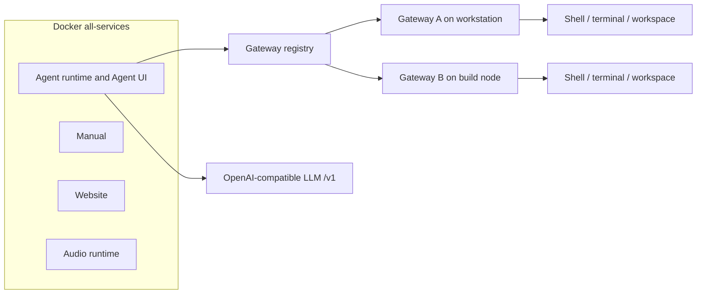
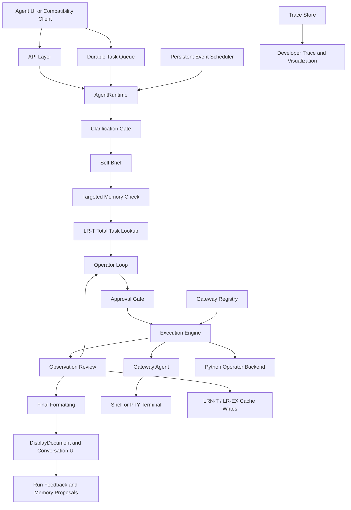

# Agent Runtime Documentation

This page is the landing page for the current runtime documentation suite.

It describes the codebase as it works now: one operator-native execution path
for Agentic and Conversational modes, typed validation, approval-gated local
execution, stage-agnostic clarification, persistent memory, learned runtime
structures, durable task queuing, persistent runtime events, gateway-specific workspaces, live
visualization, and structured UI rendering.

The runtime is local-first and smaller-model ready by design. Local or
OpenAI-compatible models can help with meaning, decomposition, structured
plans, repairs, and final answers, while runtime-owned typed contracts,
guardrails, validation, approval gates, trace evidence, recovery, and evals
make those model outputs inspectable and bounded.


## Core Rule

> The LLM decides meaning.
> The runtime validates typed contracts and safety.
> The gateway touches the real environment.

## Install Topology

After source sync, the preferred product install path is Docker all-services
plus native gateways and a separate LLM endpoint:

```bash
./docker-all-services/build.sh
./docker-all-services/start.sh
./src/gateway_agent/install.sh
./src/gateway_agent/startup.sh
```

Docker runs the product surfaces. Gateways are native because they are the
execution "hands" on each machine. The LLM is either an existing
OpenAI-compatible `/v1` endpoint or a local vLLM server launched from a conda
environment.




## Supported Interactive Surface

The local Agent UI is the primary supported interactive surface:

- `GET /agent-ui`
- `GET /agent-ui-client`
- `GET /agent-ui-mobile`
- `GET /directory`
- `GET /settings`
- `GET /prompt-editor`
- `GET /parameter-editor`
- `GET /learning-ledger`
- `GET /reliability`
- `POST /api/agent/request`
- `GET /api/agent/stream/{request_id}`
- `GET /api/agent/trace/{request_id}`
- `POST /api/agent/integrations/execute`
- `GET /api/agent/integrations/results/{request_id}`
- `POST /api/agent/integrations/confirm/{request_id}`
- `POST /api/agent/integrations/clarify/{request_id}`
- `POST /api/agent/confirmation/{request_id}`
- `POST /api/agent/clarification/{request_id}`
- `GET/POST /api/agent/runtime-controls`
- `GET/PUT /api/agent/settings/preferences`
- `GET/POST/PATCH/DELETE /api/agent/events...`
- `GET/POST /api/agent/tasks...`
- `GET/POST /api/agent/monitors...`
- `GET/POST/PATCH/DELETE /api/agent/gateways...`

Integration endpoints reuse the Agent UI request lifecycle but return blocking
JSON envelopes instead of SSE. Compatibility endpoints and the `aor` CLI still
route into the runtime, but the docs focus on the Agent UI because it exposes
confirmations, command streaming, terminal input, conversation state,
persistent memory, scheduled events, gateway selection, tasks, monitors,
parameters, prompt editing, reliability evidence, trace/visualization details,
UI preferences, and `DisplayDocument` rendering directly. The full route map is
maintained in `docs/12_system_surfaces_and_api_reference.md`.


## Big Picture



In plain language:

1. The user sends a natural-language request.
2. The LLM may ask one clarifying question if user intent is genuinely missing.
3. The runtime creates a self-brief and retrieves only relevant persistent
   memory, promoted by conservative domain hints when the prompt is obviously
   Git or Docker shaped.
4. The runtime checks whether a learned LR-T total-task structure can safely
   reuse validated typed tasks for this request.
5. The LLM proposes operator actions for new or current task work.
6. The runtime validates structure, bindings, safety, approval, and terminal
   requirements.
7. Read-only work can run directly; mutating or risky work pauses for approval.
8. Shell work goes through the gateway; prompt-shaped commands use the Agent UI
   terminal; Python work runs as a trusted operator backend.
9. Results are observed, repaired when possible, formatted, displayed,
   visualized, and made available for feedback/memory learning.
10. Successful runs can teach LRN-T task structures and LR Direct/LR-EX replay
    shapes for later requests.
11. If the user submits while work is active, the composer queues a durable
    task that keeps conversation, model, gateway, terminal, and approval
    context, then auto-follows retained trace events and child continuations
    when it starts.
12. Persistent interval events can re-enter the same request path later with
   their saved gateway, cwd, model, and operator context.
13. The Learning Ledger can turn validator failures, corrected runs,
    capability gaps, and feedback into typed capability proposals for review.

The architecture deliberately asks smaller models for narrow, typed artifacts
instead of unchecked end-to-end authority. That makes weak-model behavior easier
to diagnose, repair, or block while preserving local execution control.


## Repository Map

- API entrypoint: `src/agent_runtime/api/app.py`
- Agent UI API/routes: `src/agent_runtime/api/agent_ui.py`
- Agent UI assets: `src/agent_runtime/api/static/agent_ui/`
- Runtime orchestrator: `src/agent_runtime/core/orchestrator.py`
- Core typed models: `src/agent_runtime/core/types.py`
- Semantic compatibility: `src/agent_runtime/core/semantic_compatibility.py`
- Input pipeline: `src/agent_runtime/input_pipeline/`
- Capability manifests: `src/agent_runtime/capabilities/`
- Operator loop, prompts, validation, repair: `src/agent_runtime/operator/`
- Execution engine and safety: `src/agent_runtime/execution/`
- Persistent memory: `src/agent_runtime/memory/`
- LRN-T/LR-T total-task learning: `src/agent_runtime/lrn_total_tasks/`
- Plan, command-template, and computation caches:
  `src/agent_runtime/plan_cache/`,
  `src/agent_runtime/command_template_cache/`,
  `src/agent_runtime/computation_cache/`
- Learning ledger and capability evolution: `src/agent_runtime/learning_ledger/`
- Persistent events: `src/agent_runtime/events/`
- Gateway registry: `src/agent_runtime/gateways/`
- Output planning and rendering: `src/agent_runtime/output_pipeline/`
- Observability and trace formatting: `src/agent_runtime/observability/`
- Gateway app and terminal runner: `src/gateway_agent/`
- Local vLLM scripts and benchmark tools: `src/llm/`


## Current Runtime Truths

- Ordinary local work uses generic operator actions rather than a large menu of
  one-off capabilities.
- The current operator actions are `operator.shell_command`,
  `operator.python_action`, and `operator.python_transform`.
- Standard Agent requests and Conversational requests share the same
  operator-native planning/execution primitives for ordinary work.
- Clarification behavior is controlled by `agent_clarification_mode`
  (`auto_pilot`, `balanced`, or `pedantic`). Legacy
  `llm_operator_clarification_strategy` values are accepted only as
  compatibility input and normalized into that single mode.
- Before a user-facing clarification is shown, a typed clarification resolver
  can auto-resolve high-confidence entity/option matches and attach selected
  entities, assumptions, and execution directives to request context.
- The old product/dataflow planner is bypassed for operator-backed requests.
- Operator input bindings carry stdout, stderr, output, JSON, or typed Python
  results between actions.
- Deferred Python code can be generated after upstream output exists, using a
  bounded preview of the real input shape.
- Python operator execution is trusted local execution. It is structurally
  validated and approval-gated by risk; it is not treated as an import-whitelist
  security sandbox.
- Shell commands execute through the gateway, including streaming,
  cancellation, and PTY-backed terminal input when required.
- Agentic requests decompose non-trivial work into granular streaming steps.
  Each step runs only after the existing validator, safety policy, approval
  gates, and execution engine accept it.
- LRN-T/LR-T is an optional learned total-task structure layer. On a safe hit,
  it reuses prior validated typed task frames and skips decomposition and
  semantic verb assignment, but it still runs downstream planning, validation,
  safety, approval, execution, observation, and final formatting.
- LRN-T matches on normalized prompt similarity, classification snapshot,
  model family, workflow mode, and registry contract hash. Entries that fail
  validation or produce a failed final status are quarantined instead of reused.
- LR Direct can replay exact streaming steps from command-template or
  computation caches. LR-EX extends this with a cheap structured LLM shape
  judge for semantically equivalent payload-aware command or Python replay
  shapes, without changing cached commands, code, payloads, or safety policy.
- Commands that may require passphrases, credentials, or a controlling TTY are
  normalized to `interaction_mode: may_prompt` and require an active trusted
  terminal session.
- Persistent memory is retrieved after self-brief/task classification and must
  match model scope plus task/tool/intent/tag/text relevance. Deterministic
  hints add Git/Docker context for obvious prompts when the LLM classification
  is generic.
- Parameter Store entries have executable `value_json` and non-secret
  `context_json`. `value_json` supplies raw execution values and shell
  environment variables; bounded `context_json` supplies domain guidance for
  prompts, clarification resolution, parameter matching, and SQL semantics.
- Retrieved memory becomes request-specific directives used by direct answers,
  operator planning, plan review, cache reuse, and final answers.
- Memory is advisory and compliance-checked. It cannot bypass current user
  instructions, validation, approval, or live runtime evidence.
- Parameter context is advisory too. It cannot reveal secrets, approve joins,
  skip confirmations, lower risk, or override hard validators.
- SQL database profiles use `value_json.schema_catalog`,
  `value_json.relation_foreign_scheme`, and `value_json.schema_discovery` for
  generated discovery metadata. Domain notes for SQL live in `context_json`.
- SQL join validation hard-rejects unsafe or schema-invalid SQL, silently
  approves DB-declared foreign keys, and allows read-only inferred/domain
  joins with warnings.
- Validation policies are stored in the memory system but retrieved separately
  for matching context-sensitive validator errors only.
- The Learning Ledger stores lessons, capability insights, and capability
  proposals in `agent_learning_ledger.db`.
- Capability proposals can become task memory, validation policies, prompt
  guidance blocks, planner manifest overlays, or executable backend patch
  bundles.
- Prompt patches update only marked guidance blocks in `artifacts/prompts.db`
  and store rollback metadata.
- Capability manifest overlays are additive, planner-visible metadata only.
  They cannot lower risk, remove confirmation, change schemas, or alter the
  execution backend.
- Executable backend patch proposals stop at `approved_pending_apply`; they are
  never hot-loaded or applied automatically.
- The Agent UI has separate Settings, Memory, Gateway, Events, Tasks, Monitors,
  Parameters, Chat History, and Notifications drawers. Width and transient
  layout hints are browser-local; durable UI preferences are stored through the
  backend settings preference store.
- Standalone UI surfaces include Directory, Mission Control Settings, Prompt
  Editor, Parameter Editor mode, Learning Ledger, Reliability, Client UI, and
  Mobile UI.
- Immersive mode hides the normal topbar and non-chat panes while keeping quick
  controls, a settings burger, backend status, and runtime badges in a
  right-aligned rail under the gateway picker. The Settings drawer remains
  available as an overlay in immersive mode.
- Chat messages default to rectangular cards with no pop animation. Chat
  bubbles and pop animation modes remain backend-persisted opt-in preferences:
  Soft rise, Slide up, Slide side, Scale pop, Spring, Flip, Skew snap, Blur
  glow, or Drop in.
- The full Parameter Editor is served at `/parameter-editor` and as
  `/prompt-editor?mode=parameters`. It separates Identity, Value, Context, and
  Inspector sections so users can edit domain guidance without revealing
  secrets.
- The Developer Trace pane is preserved beside a Visualization pane that builds
  a live Mermaid request-flow map from SSE trace events and final trace payloads.
- Stepwise execution emits trace and command events so each scoped action,
  output, repair, and approval state is visible before final completion.
- Runtime events are stored in SQLite and scheduled by an in-process poller.
  They run through the same agent pipeline and can auto-approve only generated
  confirmation prompts.
- The composer Run button is the only prompt entry point. It always creates a
  chat-sourced durable task with `start_now: true`; the backend starts the
  oldest queued task when idle, and the button changes to Queue while active
  work is running or waiting.
- Open UIs auto-attach durable tasks when they start, replay retained trace
  events before streaming live ones, and follow task request-id handoffs caused
  by background auto-approval continuations.
- Final responses can be Detailed or Simple. Command capsules remain the source
  of raw stdout/stderr detail.
- Final answers show a grouped learning summary such as `LR-T applied`,
  `LR-T not applied`, `LR-D applied`, or `LRN learned`; raw learned-runtime ids
  remain in trace details.
- Scheduled events force detailed final answers so run history contains a useful
  result summary.
- Read-only shell actions do not require approval. Mutating or risky actions
  pause for confirmation.
- The Auto-Approve Commands toggle auto-submits that visible confirmation
  prompt; it does not answer clarifications or bypass validation/safety.
- Rendering produces both user-facing markdown/text and a structured
  `DisplayDocument` for the Agent UI.


## Storage Model

Persistent runtime storage:

- `artifacts/runtime.db` - compatibility/run store path.
- `artifacts/agent_memory.db` - persistent agent memory SQLite database,
  overridable with `AOR_AGENT_MEMORY_DB_PATH`.
- `artifacts/agent_parameters.db` - Parameter Store values, context metadata,
  use counts, and audit events.
- `artifacts/prompts.db` - seed LLM prompt-template catalog,
  overridable with `AOR_AGENT_PROMPTS_DB_PATH`.
- `artifacts/agent_learning_ledger.db` - learning runs, lessons, capability
  insights, and proposals, overridable with
  `AOR_AGENT_LEARNING_LEDGER_DB_PATH`.
- `artifacts/agent_lrn_total_tasks.db` - LRN-T/LR-T learned total-task
  structures, overridable with `AOR_LRNT_DB_PATH`.
- `artifacts/agent_events.db` - scheduled events and event run history,
  overridable with `AOR_AGENT_EVENTS_DB_PATH`.
- `artifacts/agent_gateways.db` - local gateway registry and per-gateway
  terminal cwd, overridable with `AOR_AGENT_GATEWAYS_DB_PATH`.
- `artifacts/agent_plan_cache.db` - private reusable operator plan cache.
- `artifacts/agent_command_template_cache.db` - private command template and
  LR Direct/LR-EX command replay cache.
- `artifacts/agent_computation_cache.db` - private deferred-computation cache.
- `src/llm/results/` - local benchmark reports when vLLM benchmarks are run.

Only the curated seed memory database and prompt-template catalog are intended
to be tracked by default. Runtime DBs, event history, gateway settings, chats,
and caches are local artifacts.

Volatile process memory:

- pending confirmations;
- pending clarification pause state;
- active request traces;
- Agent UI conversation turns;
- terminal session handles and active process ids;
- cancellation events.

Browser-local storage:

- UI theme and random pastel theme state;
- Settings and Memory drawer widths;
- Gateway and Events drawer widths;
- prompt history;
- selected mode/settings toggles;
- cached UI preferences such as pane visibility.


## Documentation Guide

- [01_overview_for_humans.md](01_overview_for_humans.md)
  - A plain-language explanation of what the runtime is and why it exists.

- [02_request_lifecycle.md](02_request_lifecycle.md)
  - The full request flow from prompt intake to final rendering.

- [03_components_and_boundaries.md](03_components_and_boundaries.md)
  - The major subsystems, what each one owns, and where the boundaries are.

- [04_llm_stages_and_contracts.md](04_llm_stages_and_contracts.md)
  - Every stage where the LLM is used, plus the structured contracts and
    deterministic checks around it.

- [05_capabilities_safety_and_gateway.md](05_capabilities_safety_and_gateway.md)
  - Operator-backed capabilities, safety, approval, terminal routing, and
    gateway behavior.

- [06_worked_example_memory_report.md](06_worked_example_memory_report.md)
  - One full prompt walkthrough using operator actions.

- [07_user_manual.md](07_user_manual.md)
  - User-facing manual for the UI, memory, settings, terminal, LLM launch, and
    storage locations.

- [08_agent_memory_seed_and_capability_store.md](08_agent_memory_seed_and_capability_store.md)
  - Guidance for maintaining the tracked reusable memory/capability database.

- [09_capability_evolution_layer.md](09_capability_evolution_layer.md)
  - Capability proposal targets, user workflow, safety policy, API routes, and
    architecture details.

- [10_capability_reliability_kernel.md](10_capability_reliability_kernel.md)
  - Typed recovery, weak-model model profiles, bounded approval envelopes,
    outcome verification, evals, APIs, UI, and reports.

- [11_parameter_store_context_and_sql.md](11_parameter_store_context_and_sql.md)
  - Parameter Store `context_json`, full Parameter Editor, `/discoverdb`, SQL
    prompting, and SQL join validation.


## Good Starting Paths

If you are new to the system:

1. Start with [01_overview_for_humans.md](01_overview_for_humans.md).
2. Then read [07_user_manual.md](07_user_manual.md).
3. Then use [02_request_lifecycle.md](02_request_lifecycle.md) as the precise
   stage reference.

If you are implementing or debugging:

1. Start with [02_request_lifecycle.md](02_request_lifecycle.md).
2. Then read [04_llm_stages_and_contracts.md](04_llm_stages_and_contracts.md).
3. Keep [05_capabilities_safety_and_gateway.md](05_capabilities_safety_and_gateway.md)
   nearby while changing execution, approval, terminal, or Python behavior.
