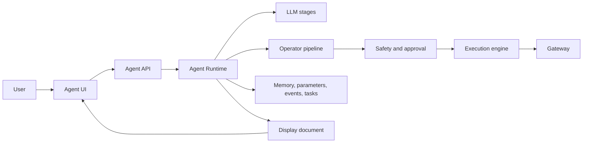

# OpenFabric Manual

OpenFabric is a local-first, typed agent runtime for turning plain-language
work requests into validated execution on machines you control. It is designed
to make smaller local or OpenAI-compatible models more useful for real agent
work by surrounding model output with typed contracts, decomposition,
validation, approval gates, traceability, recovery, and durable workflow
systems. It is built for the kind of work where an assistant must do more than
answer a question: inspect a repository, run a command, operate inside a
workspace, remember approved preferences, schedule a recurring task, ask for
approval before risky actions, and leave behind enough evidence that the result
can be trusted later.

The Agent UI is the everyday workspace. This manual is the durable technical
reference for understanding how the system is installed, how requests move
through the runtime, how safety gates work, where state is stored, how gateways
touch the local environment, and how maintainers can reason about the design.
For a page-by-page tour of the browser surfaces, read
[UI Pages Tour](19-ui-pages-tour.md).

OpenFabric exists because useful agents need a real operating boundary. A cloud
chat product can generate suggestions, but the moment an agent is expected to
act on files, shells, terminals, long-running services, local models, private
workspace state, and user-specific habits, the important questions become
systems questions:

- What is allowed to touch the machine?
- Which parts are model-authored, and which parts are runtime-owned?
- How is execution validated before it happens?
- Where does memory live, and who approves it?
- How can a user inspect what happened after the answer is produced?
- What remains private because it never needed to leave the local environment?

OpenFabric is the answer to those questions in runtime form.

## Why I Created It

I created OpenFabric because I wanted an agent that behaves like technical
infrastructure, not a remote prompt box with extra buttons. The goal was not to
make the model feel more magical. The goal was to make the model more usable by
putting it inside a system that has contracts, traceability, local execution,
approval gates, durable memory, and clear ownership boundaries.

The practical motivation is simple: real development and operations work lives
on local machines and private networks. Repositories, shell history, terminal
state, credentials, logs, databases, artifacts, local LLM servers, audio tools,
and one-off scripts often cannot be treated as disposable text pasted into a
browser. I wanted a runtime where the assistant can help with that work while
still making the user the final authority over risky actions.

OpenFabric was created to make the agent accountable. It should explain what it
is doing, route commands through a controlled gateway, preserve command output,
record validation and repair attempts, and separate advice from execution. That
is the difference between an assistant that merely responds and an agent that
can be operated, debugged, and improved.

## What This Agent Is For

OpenFabric is for local, technical workflows that benefit from language-model
reasoning but cannot rely on language-model output alone. It is designed to:

- understand natural-language work requests and classify intent;
- ask or auto-resolve a clarification according to the selected clarification
  mode when critical intent is missing;
- plan typed shell and Python operator actions;
- validate action contracts before execution;
- pause for approval before mutating or risky work;
- execute through a gateway rather than directly from the browser or model;
- stream stdout, stderr, exit codes, and artifacts into command capsules;
- repair malformed model output or failed actions with structured evidence;
- route low-risk reports through one validated LLM-authored action while still
  enforcing runtime safety boundaries;
- preserve traces, profiling data, memory use, and final display documents;
- store approved memory, parameters, parameter context, prompts, tasks,
  monitors, events, and gateway settings in local SQLite-backed stores;
- learn local total-task structures and direct-replay shapes for repeated work
  without turning those caches into trusted authority;
- convert selected run evidence into reviewed capability proposals for memory,
  validation policy, prompt guidance, planner manifest overlays, or explicit
  backend patch work;
- run with local or OpenAI-compatible model endpoints;
- expose a manual that documents both product use and maintainer architecture.

This makes it useful for repository maintenance, local automation, debugging,
workflow drafting, recurring operational checks, command execution with review,
audio-assisted input, and technical exploration where the user wants the
assistant close to the workspace instead of detached from it.

## The Core Design Rule

The runtime is designed around a simple rule:

> The LLM proposes meaning and typed actions. The runtime validates contracts and safety. The gateway touches the real environment.

That rule is the foundation of the system. The model can interpret intent and
draft structured actions, but it does not get unchecked authority over the
machine. The runtime owns validation, policy, memory attachment, action graph
shape, approval requirements, repair attempts, and final rendering. The gateway
owns the actual shell boundary.

## Why Local Matters

Running locally is not just a deployment preference. It changes the trust model
of the agent.

Local execution means the agent can operate near the files, tools, terminals,
models, and services that define the real task. It can inspect the current
workspace instead of relying on copied snippets. It can run tests, start local
servers, use local audio transcription, connect to gateway-managed shells, and
preserve artifacts in the same environment where the work happened.

Local state also makes the system more controllable. Memory is stored in local
databases. Gateway selection and terminal working directories are machine-local
settings. Approval history, traces, caches, prompts, scheduled events, and
learning records can be inspected as runtime data instead of disappearing into a
remote session.

There is also a privacy and governance reason. Many technical tasks involve
source code, logs, credentials-adjacent configuration, customer data, internal
tooling, or private infrastructure details. A local-first agent can minimize
what must be sent to any model endpoint. When a model is remote, the runtime can
still narrow and structure what is sent. When the model is local, even the model
call can stay inside the user's machine or network.

Finally, local execution is better for reproducibility. A command run through a
gateway has a working directory, selected gateway, stdout, stderr, exit code,
approval state, and trace entry. Those details are operational evidence. They
make it possible to debug the agent, not just read its final answer.

## Why Smaller Models Can Work Here

OpenFabric is local-first, but it is not built on the assumption that a model
alone is reliable enough to operate a machine. Smaller local or
OpenAI-compatible models can be useful because the runtime narrows each model
job: classify intent, emit typed JSON, propose one scoped action, repair a
malformed payload, or compose a final answer from evidence.

The runtime supplies the missing operating structure: typed contracts, stepwise
decomposition, validators, memory compliance checks, command risk policy,
approval gates, gateway execution, trace evidence, retries, recovery profiles,
and evals. This does not make every smaller model equivalent to a larger model,
but it raises the floor for local models by making mistakes visible, bounded,
and repairable before they touch the workspace.

## Local Runtime Vs. Cloud Agent

OpenFabric is not trying to replace every cloud assistant. Cloud tools are
excellent for general reasoning, broad knowledge, and low-friction access from
any device. OpenFabric is for the part of agent work where the environment,
execution boundary, and state ownership matter.

| Concern | Typical cloud assistant | OpenFabric local runtime |
| --- | --- | --- |
| Workspace access | Usually copied, uploaded, or connector-mediated | Reads and acts near the local workspace through controlled runtime paths |
| Execution | Often simulated, remote, or hidden behind product-specific tools | Routed through local gateway execution with stdout, stderr, exit code, and artifacts |
| Trust boundary | Product-owned service boundary | User-owned runtime, gateway, stores, and approval policy |
| Memory | Account or service scoped | Local, inspectable, approval-based memory stores |
| Safety | Product-level policies and tool permissions | Runtime validation, typed contracts, command risk checks, and user approval |
| Debugging | Limited to visible chat/tool history | Trace data, command capsules, profiling, validation details, and stored results |
| Model hosting | Provider controlled | Local or OpenAI-compatible endpoints, configured by the user |
| Offline or private-network use | Usually limited | Designed for local machines and private gateway nodes |

The difference is architectural. A cloud assistant is primarily a service that
can call tools. OpenFabric is a local runtime that can use a model. That
inversion matters because the runtime remains responsible for the work even
when the model changes.

## What Makes It Technical Infrastructure

OpenFabric treats an agent request as a lifecycle, not a single completion. A
request may pass through prompt classification, clarification, self-briefing,
targeted memory retrieval, LRN-T/LR-T cache lookup, plan drafting, schema
validation, action DAG validation, LR Direct/LR-EX replay checks, safety
review, approval, gateway execution, observation review, repair, final
formatting, and feedback memory drafting.

Those stages exist to keep the system inspectable. They also make the runtime
portable across models. The model can be upgraded, replaced, hosted locally, or
served by an OpenAI-compatible endpoint, while the same runtime contracts keep
execution behavior consistent.

The important boundary is that the model is not the operating system. It is one
stage inside the operating system of the agent. OpenFabric surrounds model
reasoning with deterministic code, policy, stores, APIs, and UI affordances so
the user can see and control the difference between suggestion, plan, approval,
execution, and result.

## When To Use It

Use OpenFabric when the task depends on local context, repeatable command
execution, private workspace state, durable memory, approval-gated automation,
or a clear record of what happened. It is a good fit for developers, operators,
researchers, and technical users who want an assistant that can work in the
same environment they do.

Use a normal cloud chat when the task is mainly explanation, brainstorming,
general research, or writing that does not need local execution or private
workspace awareness. The systems can complement each other: cloud assistants
are convenient thinking surfaces, while OpenFabric is the local agent runtime
for work that needs environment ownership.

## What To Read First

- Clone Setup Quick Start explains the full native setup path after cloning the
  Git repository.
- Install And Startup explains the scripts, services, ports, and launch modes.
- Docker Setup explains how to run the server and audio runtime from Docker,
  plus how to attach a native gateway and OpenAI-compatible model endpoint.
- First Run And Agent UI explains the daily workspace.
- Modes, Approvals, And Clarifications explains when the runtime pauses and why.
- Command Capsules, Terminal, And Gateway explains the local execution boundary.
- Memory, Events, And Monitors explains durable state and recurring work.
- Tasks, Parameters, Prompts, And Learning explains how the agent becomes more
  useful without turning memory into unchecked authority.
- Parameter Store Context And SQL Discovery explains `value_json`,
  `context_json`, the full Parameter Editor, `/discoverdb`, and SQL join
  validation.
- Capability Evolution And Learning Ledger explains how reviewed proposals turn
  evidence into safe local runtime improvements.
- Capability Reliability Kernel explains how weak-model failures become typed
  recovery events, approval-envelope decisions, verifier results, evals, and
  customer reports.
- System Surfaces And API Reference maps the current browser pages, Agent UI
  route groups, compatibility routes, manual service routes, audio routes, and
  UI preference behavior.
- Integration Execution API explains how external systems can submit
  non-streaming agent prompts and receive OpenAPI-documented result envelopes.
- Architecture Overview starts the maintainer path through request lifecycle,
  LLM contracts, operator pipeline, execution safety, storage, and observability.

## Local Services

| Service | Default URL | Launcher |
| --- | --- | --- |
| Agent runtime | `https://127.0.0.1:8011/agent-ui` when SSL is enabled | `./startup.sh` |
| Audio runtime | `http://127.0.0.1:8012/healthz` | `./startup-audio.sh` |
| Manual service | `http://127.0.0.1:8013/manual` | `./startmanual.sh` |
| Gateway agent | `http://127.0.0.1:8787/healthz` | `src/gateway_agent/startup.sh` |

## Manual Corpus

The manual combines three kinds of documents:

- Authored product and architecture pages in `src/manual/content`.
- Copied legacy docs in `src/manual/content/legacy`.
- Generated living references from source inspection at service startup.

The manual is part of the runtime philosophy: important behavior should be
visible, documented, and close to the code that implements it.
