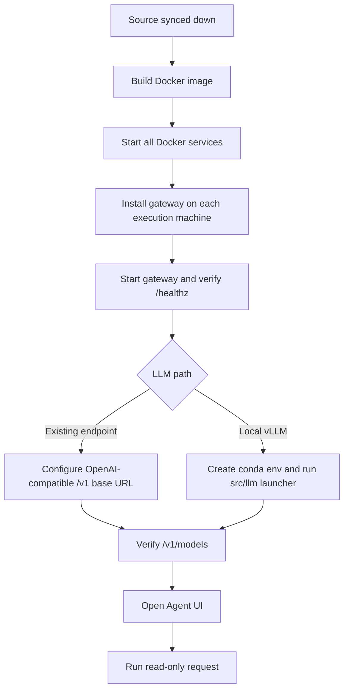
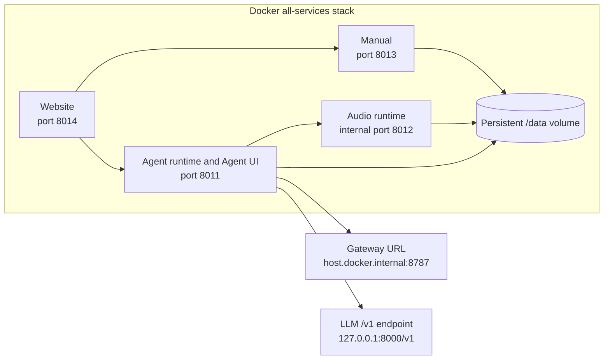
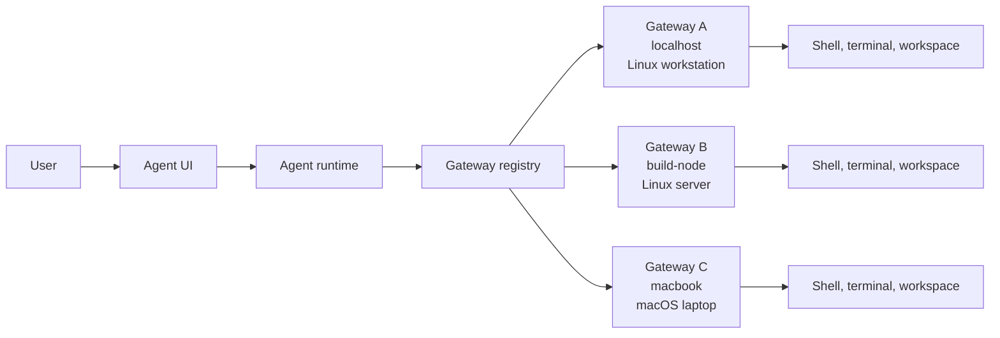
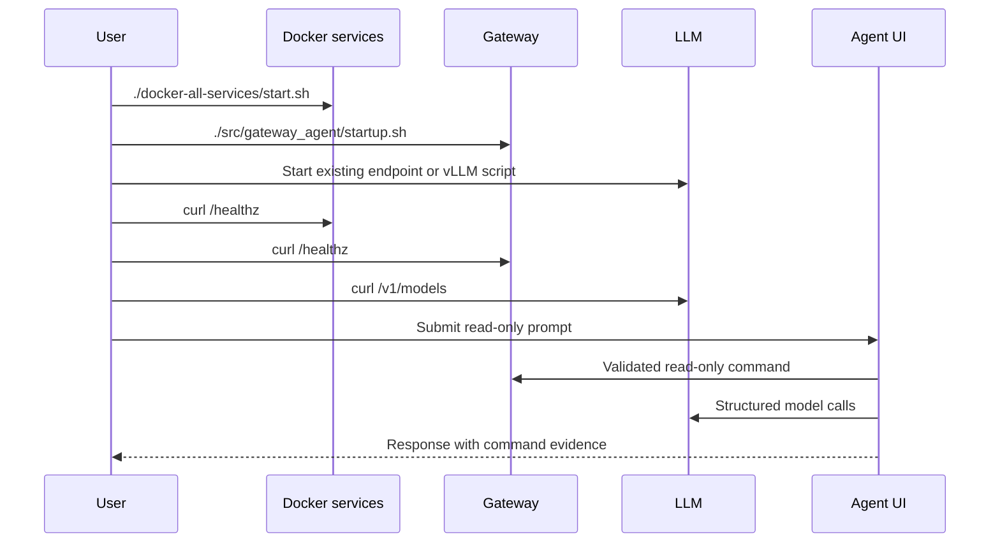

# Complete Install And Startup Manual

This manual starts after the OpenFabric source has already been synced or
cloned onto the machine. It ends with a usable local agent system: Dockerized
OpenFabric services, a reachable gateway, an attached LLM endpoint, and a first
validated Agent UI request.

Docker is the preferred application path. It builds and runs the Agent runtime,
Agent UI, manual, website, and audio runtime from the repository scripts. The
gateway and LLM server remain separate because they are machine-facing
infrastructure: gateways touch shells and terminals, and LLM servers own GPUs,
model weights, and inference processes.

## The Required Order

Bring the system up in this order:

1. Build and run Docker services.
2. Install and run at least one gateway.
3. Attach an existing OpenAI-compatible LLM endpoint or create a `vllm` conda
   environment and launch a local model.
4. Validate every layer with health checks.
5. Open the Agent UI and run a read-only request.

The gateway step is crucial. The gateway is the "hands" of OpenFabric. The
Agent runtime can reason, validate, ask for approval, and prepare command
capsules, but gateway processes are what actually run shell commands on the
machines you control. Without a reachable gateway, the UI can load and the LLM
can answer some direct questions, but command-backed agent work cannot operate
properly.



## What You Are Installing

| Component | Default URL | Installed by | Purpose |
| --- | --- | --- | --- |
| Agent runtime and Agent UI | `http://127.0.0.1:8011/agent-ui` | Docker all-services stack | Main API and browser workspace |
| Audio runtime | Docker-internal `http://audio:8012` | Docker all-services stack | Voice transcription support |
| Manual service | `http://127.0.0.1:8013/manual` | Docker all-services stack | Searchable product and architecture manual |
| Website service | `http://127.0.0.1:8014/website` | Docker all-services stack | Product website and manual entry points |
| Gateway agent | `http://127.0.0.1:8787/healthz` or remote host | Native gateway script | Machine-local shell, terminal, and command boundary |
| LLM server | `http://127.0.0.1:8000/v1` by default | Existing server or vLLM script | OpenAI-compatible model endpoint |



## Prerequisites

Install or confirm these before starting:

- Git, with the repository already synced down.
- Docker Engine with Compose v2.
- `curl` for health checks.
- Python 3.11 or newer for native gateway setup.
- Conda or Miniconda only if you want the local vLLM setup path.
- A reachable OpenAI-compatible model endpoint, or GPU hardware suitable for
  the local vLLM model you choose.
- Network access between the Agent runtime container and each gateway or LLM
  host.

On Linux, the all-services compose file uses `host.docker.internal` via a host
gateway entry so the container can call a gateway running on the Docker host.
On Docker Desktop or remote gateway deployments, use the gateway's reachable
host or LAN IP when loopback does not mean the same machine.

## Step 1: Confirm Repository Root

From the repository root, confirm the expected scripts are present:

```bash
pwd
ls docker-all-services docker src src/llm src/gateway_agent
```

You should see:

- `docker-all-services/build.sh`
- `docker-all-services/start.sh`
- `src/gateway_agent/install.sh`
- `src/gateway_agent/startup.sh`
- `src/llm/start-current-qwen3-coder-30b-a3b-awq.sh`

## Step 2: Build Docker

Build the preferred all-services image:

```bash
./docker-all-services/build.sh
```

To tag a specific image version:

```bash
./docker-all-services/build.sh v1.0.0
```

The all-services build uses `docker/server.Dockerfile` and creates an image
named `openfabric-all-services:latest` unless `OPENFABRIC_IMAGE` or
`OPENFABRIC_VERSION` is set.

## Step 3: Run Docker

Start the full local product stack:

```bash
./docker-all-services/start.sh
```

Run in the background:

```bash
./docker-all-services/start.sh -d
```

Start a tagged version:

```bash
./docker-all-services/start.sh v1.0.0
```

Open:

| Service | URL |
| --- | --- |
| Agent UI | `http://127.0.0.1:8011/agent-ui` |
| Runtime health | `http://127.0.0.1:8011/healthz` |
| Manual | `http://127.0.0.1:8013/manual` |
| Manual health | `http://127.0.0.1:8013/healthz` |
| Website | `http://127.0.0.1:8014/website` |

Watch logs:

```bash
docker compose -f docker-all-services/docker-compose.yaml logs -f
```

Stop the stack without deleting persisted state:

```bash
docker compose -f docker-all-services/docker-compose.yaml down
```

The stack stores local state in the `openfabric-all-services-data` volume. That
volume preserves memory, prompts, chats, gateway settings, scheduled events,
caches, generated outputs, audio model files, browser profile data, and local
SSL material across rebuilds.

## Step 4: Install The Gateway

Install the gateway on every machine that should execute commands. For the
Docker host:

```bash
./src/gateway_agent/install.sh
```

This creates `src/gateway_agent/.venv` and installs the gateway runtime with
the Python tooling expected by the agent.

Start the local loopback gateway:

```bash
./src/gateway_agent/startup.sh
```

Verify it:

```bash
curl http://127.0.0.1:8787/healthz
curl http://127.0.0.1:8787/capabilities
```

The default gateway identity is:

```text
GATEWAY_NODE_NAME=localhost
GATEWAY_BIND_HOST=127.0.0.1
GATEWAY_BIND_PORT=8787
```

For a gateway on a different trusted machine, choose a unique node name and bind
to a reachable interface:

```bash
GATEWAY_NODE_NAME=workstation ./src/gateway_agent/startup.sh --host 0.0.0.0 --port 8787
```

Then add that gateway from the Agent UI Gateway drawer with a nickname, host or
IP, port, and node. The gateway does not include built-in authentication, so do
not expose it to an untrusted network. Use loopback, a firewall, a VPN, or a
trusted reverse proxy.



## Step 5: Attach An Existing LLM Endpoint

OpenFabric expects an OpenAI-compatible API. The endpoint must support:

- `GET /v1/models`
- `POST /v1/chat/completions`

The default local endpoint is:

```text
http://127.0.0.1:8000/v1
```

Verify an existing endpoint:

```bash
curl http://127.0.0.1:8000/v1/models \
  -H 'Authorization: Bearer local'
```

In the Agent UI, open Settings, then LLM Endpoint, and set:

| Field | Example |
| --- | --- |
| Scheme | `http` |
| Host / IP | `127.0.0.1` |
| Port | `8000` |
| Base path | `/v1` |
| Model | `auto` or an explicit served model id |

Use `auto` when `/v1/models` returns a reliable model list. Use an explicit
model id when the model server requires it.

## Step 6: Or Create A Local vLLM Conda Environment

Use this path when you want to host the model yourself. The current official
vLLM quickstart recommends Python 3.12 and supports installing vLLM through
`uv` inside a conda environment. Upstream references:
`https://docs.vllm.ai/en/latest/getting_started/quickstart/` and
`https://vllm.ai/releases`.

```bash
conda create -n vllm python=3.12 -y
conda activate vllm
pip install --upgrade uv
uv pip install vllm --torch-backend=auto
```

Then launch one of the repository's vLLM profiles:

```bash
./src/llm/start-current-qwen3-coder-30b-a3b-awq.sh
```

For a smaller first test:

```bash
./src/llm/start-qwen2.5-1.5b-instruct.sh
```

Useful overrides:

```bash
PORT=8001 MAX_MODEL_LEN=16384 ./src/llm/start-qwen2.5-coder-32b-awq.sh
GPU_MEMORY_UTILIZATION=0.86 ./src/llm/start-qwen3-coder-30b-a3b-awq.sh
MAX_MODEL_LEN=8192 ./src/llm/start-current-qwen3-coder-30b-a3b-awq.sh
```

If a model fails with GPU memory pressure, reduce `MAX_MODEL_LEN` first, then
reduce `GPU_MEMORY_UTILIZATION`, then choose a smaller model profile.

The Agent UI Settings drawer can also ask the gateway to start and stop the
configured local LLM command. That path uses these gateway-backed routes:

- `GET /api/agent/llm/status`
- `GET /api/agent/llm/log`
- `POST /api/agent/llm/start`
- `POST /api/agent/llm/stop`

The gateway must be running before those LLM launch controls can work.

```mermaid
flowchart TD
    Runtime[Agent runtime] --> Choice{LLM endpoint}
    Choice --> Existing[Existing OpenAI-compatible server]
    Choice --> Local[Local vLLM launched from conda env]
    Local --> Conda[conda env: vllm]
    Conda --> Script[src/llm/start-*.sh]
    Existing --> API[/v1/models and /v1/chat/completions]
    Script --> API
    API --> Runtime
```

## Step 7: Validate Every Layer

Run these checks from the host:

```bash
curl http://127.0.0.1:8011/healthz
curl http://127.0.0.1:8013/healthz
curl http://127.0.0.1:8014/healthz
curl http://127.0.0.1:8787/healthz
curl http://127.0.0.1:8000/v1/models -H 'Authorization: Bearer local'
```

If Docker is running the all-services stack, also verify gateway and model
reachability from the server container:

```bash
docker exec openfabric-all-server curl -s http://host.docker.internal:8787/healthz
docker exec openfabric-all-server curl -s http://host.docker.internal:8000/v1/models \
  -H 'Authorization: Bearer local'
```



## Step 8: First Agent UI Request

Open:

```text
http://127.0.0.1:8011/agent-ui
```

Try a read-only request:

```text
What repository workspace can you see, what branch is checked out, and which gateway handled the shell command?
```

Expected behavior:

- The model helps classify and plan the request.
- The runtime validates the action contract and shell safety.
- The gateway runs the read-only command.
- The response shows command evidence and a final summary.
- Mutating commands pause for approval before execution.

## Manual And Native Source Alternatives

Docker is preferred for running the product stack, but the native source path is
still useful for development:

```bash
./install.sh
./startup.sh
```

Start only the manual:

```bash
./setup-manual.sh
./startmanual.sh --reload
```

Native runtime ports:

| Service | URL |
| --- | --- |
| Agent UI | `https://127.0.0.1:8011/agent-ui` when SSL is enabled; `http://127.0.0.1:8011/agent-ui` otherwise |
| Audio runtime | `http://127.0.0.1:8012/healthz` |
| Manual service | `http://127.0.0.1:8013/manual` |

`startup.sh` accepts:

```bash
./startup.sh --host 0.0.0.0 --port 8011 --audio-port 8012 --manual-port 8013
./startup.sh --https
./startup.sh --reload
```

Skip optional child services when needed:

```bash
AOR_AUDIO_TRANSCRIBER_AUTOSTART=0 ./startup.sh
AOR_MANUAL_AUTOSTART=0 ./startup.sh
```

## Troubleshooting

If Docker services do not start:

```bash
docker compose -f docker-all-services/docker-compose.yaml ps
docker compose -f docker-all-services/docker-compose.yaml logs -f
```

If the Agent UI opens but command execution fails, check the gateway first:

```bash
curl http://127.0.0.1:8787/healthz
curl http://127.0.0.1:8787/capabilities
```

If the Docker server cannot reach a host gateway, verify the host gateway name:

```bash
docker exec openfabric-all-server curl -s http://host.docker.internal:8787/healthz
```

If model calls fail, verify the exact `/v1` URL and bearer key:

```bash
curl http://127.0.0.1:8000/v1/models -H 'Authorization: Bearer local'
```

If vLLM cannot load the selected model, start with a smaller profile or reduce
context:

```bash
MAX_MODEL_LEN=8192 ./src/llm/start-current-qwen3-coder-30b-a3b-awq.sh
```

If ports are busy, change the compose environment or use the native launcher
port flags. The all-services defaults are `8011` for the Agent runtime, `8013`
for the manual, `8014` for the website, `8787` for the gateway, and `8000` for
the LLM endpoint.
