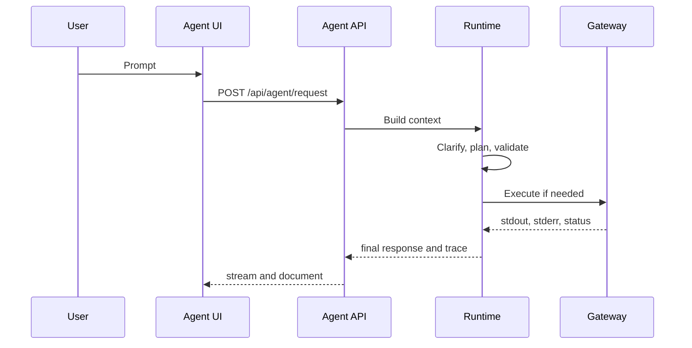

# First Run And Agent UI

After `./startup.sh`, open:

```text
https://127.0.0.1:8011/agent-ui
```

Use `http://127.0.0.1:8011/agent-ui` only when SSL is disabled. When SSL is
enabled, the TLS port expects HTTPS directly and does not serve a same-port HTTP
redirect.

The Agent UI is the main working surface. It combines a conversation pane, prompt composer, terminal pane, trace pane, visualization pane, Settings, Memory, Gateway, Events, Tasks, Monitors, Parameters, Chat History, Notifications, prompt tools, and command output capsules. Companion pages reuse the same static frontend at `/agent-ui-client`, `/agent-ui-mobile`, `/directory`, `/settings`, `/prompt-editor`, `/parameter-editor`, `/learning-ledger`, and `/reliability`.

## First Request

Try a read-only request first:

```text
Show the current Python version and summarize the active virtual environment.
```

The runtime should classify the request, plan an operator action, validate it, run it locally or through the selected gateway, and render a response with trace details.



## Model Choice And Runtime Support

OpenFabric can run with local or OpenAI-compatible model endpoints selected in
Settings. The model is important, but the runtime is deliberately not asking it
to carry the whole job alone. Requests move through clarification, typed
planning, validation, approval, gateway execution, trace capture, observation,
repair, and final formatting. That pipeline makes smaller models more useful
for local agent work by keeping each model-authored step scoped and checked.

## Composer Run And Queue Behavior

The prompt composer has one submit path. When no request or durable task is
active, the button says Run, saves the prompt as a durable task with
`start_now: true`, and attaches to the oldest queued task when it starts. While
another request, durable task, approval, or clarification is active, the same
button says Queue and saves the prompt behind older queued work.

Queued composer prompts keep the current conversation id, selected model, agent
mode, gateway/routing metadata, settings context, terminal context when active,
and request-scoped auto-approve intent. The current trace remains visible while
the queued work waits.

When a queued durable task starts while the UI is open, the UI fetches the saved
trace first, renders the retained events, then follows live stream events from
the last trace id. If the task continues from a parent approval request to an
approved child request, the UI follows that task handoff and renders the live or
final child result.

## Main Surfaces

| Surface | Purpose |
| --- | --- |
| Conversation | Prompts, responses, approvals, clarifications, command capsules |
| Terminal | Interactive shell route for commands that need a terminal |
| Trace | Stage diagnostics and runtime events |
| Visualization | Mermaid-style run graph from observed events |
| Settings | Runtime controls, model configuration, UI preferences |
| Memory | Persistent reusable guidance and feedback |
| Events | Scheduled future or repeating runtime requests |
| Gateway | Remote or local command execution endpoints |
| Tasks | Saved task records for repeated work |
| Monitors | Background checks and their outcomes |
| Parameters | Quick Parameter Store access |
| Chat History | Local conversation navigation |
| Notifications | Event and monitor outcomes |

The square terminal button beside Mic is a second control for the same
persisted terminal visibility preference as Settings. Turning it on or off
updates the Settings terminal toggle and backend preferences. When opened from
Mobile UI, the Terminal button hands off to `/agent-ui?terminal=1`, enables the
same terminal preference, and expands the desktop terminal pane.

## Standalone Pages

| Page | Route | Purpose |
| --- | --- | --- |
| Client UI | `/agent-ui-client` | Compact client-facing workspace |
| Mobile UI | `/agent-ui-mobile` | Touch-first workspace with larger controls |
| Directory | `/directory` | Browse local UI pages and runtime surfaces |
| Mission Control Settings | `/settings` | Backend registry, runtime controls, and UI preferences |
| Prompt Editor | `/prompt-editor` | Prompt templates, memories, and parameter mode |
| Parameter Editor | `/parameter-editor` | Alias into Prompt Editor parameter mode |
| Learning Ledger | `/learning-ledger` | Lessons, run evidence, and capability proposals |
| Reliability | `/reliability` | Reliability profile, runs, evals, and reports |

## Settings, Immersive Mode, And Motion

The Settings drawer and Mission Control Settings page use the same backend
settings preference store. Durable UI preferences include theme, agent display
name, visible panes, chat bubble style, number animation, chat pop animation,
browser notifications, sound, voice input, and auto immersive width.

Chat messages default to rectangular cards with no pop animation. Optional pop
animation modes are Soft rise, Slide up, Slide side, Scale pop, Spring, Flip,
Skew snap, Blur glow, and Drop in; the setting applies to new conversation
bubbles on desktop/client and to the matching mobile surface.

Immersive mode hides the normal topbar and non-chat panes. The conversation
header keeps quick controls, a settings burger, the backend plug, and mirrored
run/LLM/LR badges together in a right-aligned rail underneath the gateway
picker. The model name stays out of that immersive header. The settings burger
opens the same Settings drawer as an overlay so pane controls remain reachable.

## Fast Profile And Output Controls

Quick controls -> Agent behavior has two everyday speed/answer controls:

- Answers: Detailed asks the LLM to compose a richer final response from the
  evidence. Simple returns a shorter completion/result summary and leaves more
  detail in command capsules. Detailed is the default; the quick Fast profile
  switches to Simple for lower latency.
- Fast profile: switches Agentic behavior to the canonical speed-oriented
  backend settings: `workflow_execution_mode=streaming`, fast reasoning,
  conservative repair, deterministic policy, and visible response streaming.

Settings contains the persistent version of these controls. Open Settings,
then Behavior to choose policy, reasoning, repair, workflow execution, response
streaming, clarification, LRN-T/LR-T, LR-T threshold, and LR Direct profiles.
In `auto` and `streaming` workflow modes, tool requests decompose into small
operator steps unless the request is already atomic or a validated LR-T
total-task structure safely applies.

## A Good First Check

Open Settings and confirm:

- the active model endpoint is reachable;
- the selected gateway is expected;
- command approval policy matches your risk tolerance;
- workflow execution, reasoning, repair, and policy profiles match your needs;
- LRN-T/LR-T and LR Direct cache settings match your tolerance for local
  learned reuse;
- Answers is Detailed unless you intentionally want shorter final responses;
- Include terminal in Advisory is off unless the current advisory question
  needs terminal cwd/session metadata and the visible terminal snapshot;
- the chat pop animation and chat bubble style match your preference;
- memory and learning settings match the current workspace.
