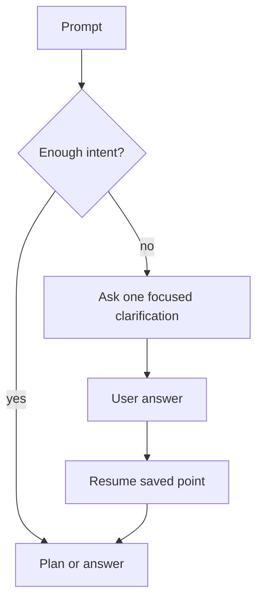
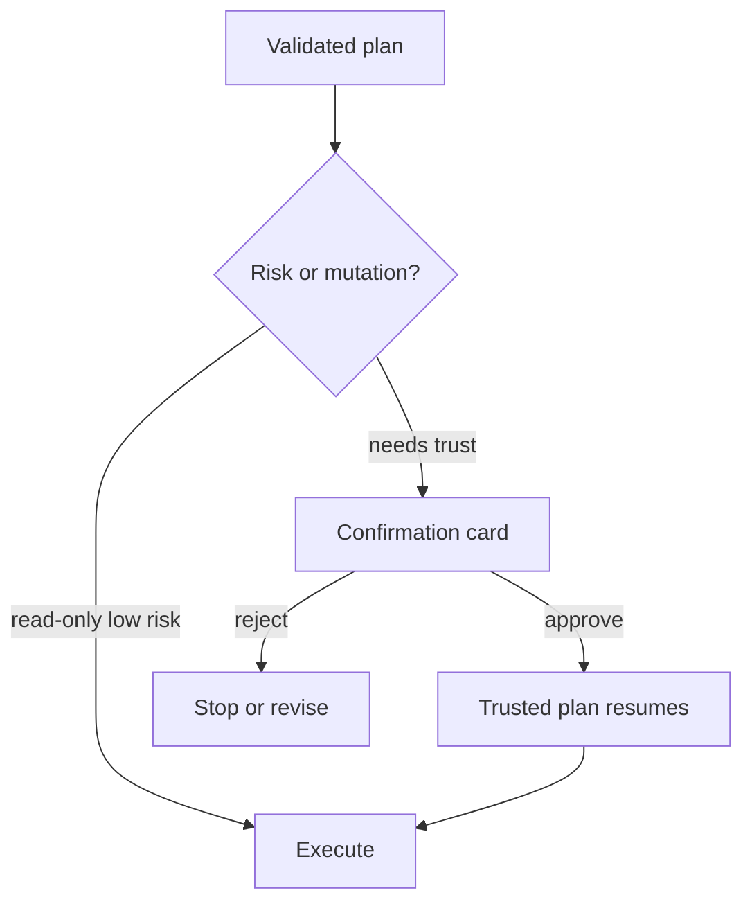

# Modes, Approvals, And Clarifications

The runtime can answer conversationally or act through an operator plan. Both modes share the same safety posture: ambiguous requests may ask a clarification, and risky local effects require approval unless controls explicitly allow them.

## Mode Shape

| Mode | Best For | Runtime Behavior |
| --- | --- | --- |
| Conversational | Questions, explanations, editing help | Avoids command execution unless the request needs it |
| Agentic | Local inspection, file work, multi-step tasks | Builds typed operator actions and validates them |
| Advisory | Command advice, shell explanations, planning help | Produces guidance and snippets without executing them |
| Runtime introspection | Explaining capabilities or last run state | Uses deterministic `runtime.*` capabilities |

## Advisory Terminal Context

Advisory mode never executes in the terminal. Its runnable snippets remain
terminal-only suggestions for the operator to review and run manually.

When the terminal-header switch **Include terminal in Advisory** is enabled,
the next Advisory prompt can include trusted terminal cwd/session metadata and a
capped snapshot of the visible terminal output. The switch is off by default,
is not persisted across page loads, and does not affect Agentic or
Conversational requests. Use it when the Advisory answer needs the current
terminal state, such as an error message, working directory, or visible command
output, but the agent should still answer rather than execute.

## Clarification Flow

Clarifications are intended to reduce guesswork, not to make the user fill out a form. A good clarification is narrow and asks for the one missing choice that would change execution.

Clarifications should not be used for discoverable machine state. If the model
needs a current branch, mounted device, USB label, cwd, process list, or similar
local fact, the operator should propose a read-only probe capsule instead of
asking the user to type it. For read-only reports, the minimal execution route
can fold discovery and reporting into one validated action.

Clarification behavior is controlled by one global setting:

| Mode | Behavior |
| --- | --- |
| `auto_pilot` | Make high-confidence assumptions for most missing details. |
| `balanced` | Default. Auto-resolve obvious typos, pluralization, casing, acronyms, and near-exact entity matches. |
| `pedantic` | Ask whenever a meaningful option is missing or ambiguous. |

Before a clarification is shown, the runtime can run a typed clarification
resolver. The resolver receives the proposed question, available candidates,
bounded Parameter Store context, the selected mode, and risk flags. It can
continue with typed selected entities, assumptions, and execution directives, or
it can surface the question to the user. Auto-resolution never bypasses SQL
safety, command validation, credential flows, mutation confirmation, or approval
policy.

## Execution Profiles

Execution pacing is controlled by backend-owned profiles instead of separate
tryout knobs:

| Control | Behavior |
| --- | --- |
| `workflow_execution_mode` | Chooses `auto`, `full_plan`, or `streaming`; `auto` follows the staged streaming path unless the request is already atomic. |
| `reasoning_profile` | Controls deliberation depth, plan review, answer judging, and self-brief behavior. |
| `repair_profile` | Controls repair thresholds and retry budgets. |

Read-only reports follow the same decomposition path as other non-trivial
requests. Mutating, approval-gated, or genuinely dependent workflows still
route through staged planning and approval policy.

## Approval Flow

Approvals protect file writes, process control, package installs, network-impacting operations, and other commands where a wrong step can change local state.

Profiles never bypass confirmation. Hard safety blockers, command deny rules,
cwd validation, binding validation, and policy checks still apply.

## Command Allowlist

The UI can remember approved command hashes. Use this for stable commands that you understand, not for broad convenience. If a command changes, it should be reviewed again.
