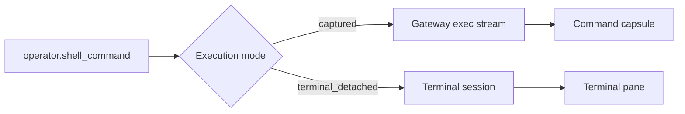
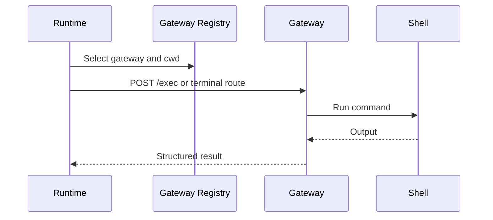

# Command Capsules, Terminal, And Gateway

Command capsules are the UI representation of executed operator actions. They keep stdout, stderr, exit code, command metadata, and verification evidence close to the final answer.

## Capsule Contents

A command capsule may show:

- command text and working directory;
- gateway and execution mode;
- exit code and status;
- stdout and stderr previews;
- extracted artifacts or raw data references;
- verification details when the plan checks its own result.

## Tryout Event Capsules

Fast tryout modes expose attempted work before the final response. The request
stream can include these visible events:

- `operator.tryout.candidate`
- `operator.tryout.accepted`
- `operator.tryout.executing`
- `operator.tryout.output`
- command start, output, validation, repair, and completion events

They are evidence, not a second safety system. Every capsule still has to
validate as an operator action before the gateway receives any command.

## Terminal Use

Most commands run captured. The terminal route is reserved for commands that need an interactive TTY or are intentionally detached, such as a long-running server, `tail -f`, a REPL, or a password prompt.

The terminal pane can be shown or hidden from Settings or with the square
terminal button beside Mic in the composer. Both controls write the same
backend-persisted terminal visibility preference. The terminal header still
collapses or expands the pane without changing that preference. On the Mobile
Agent UI, the Terminal button opens `/agent-ui?terminal=1`, enables the same
visibility preference, and expands the desktop terminal pane.

Advisory mode has a separate **Include terminal in Advisory** switch in the
terminal header. When enabled, Advisory prompts receive the terminal cwd,
session id, and a capped visible terminal-output snapshot as context. This does
not set `execute_in_terminal` and does not make Advisory run commands.

## Gateway Boundary

The gateway is the process that touches the real shell. The Agent API sends trusted execution requests to it, and the gateway returns structured execution results.

The boundary matters because it separates:

- planning from execution;
- UI state from shell state;
- model output from validated commands;
- runtime orchestration from platform-specific terminal behavior.

## Gateway Routing

