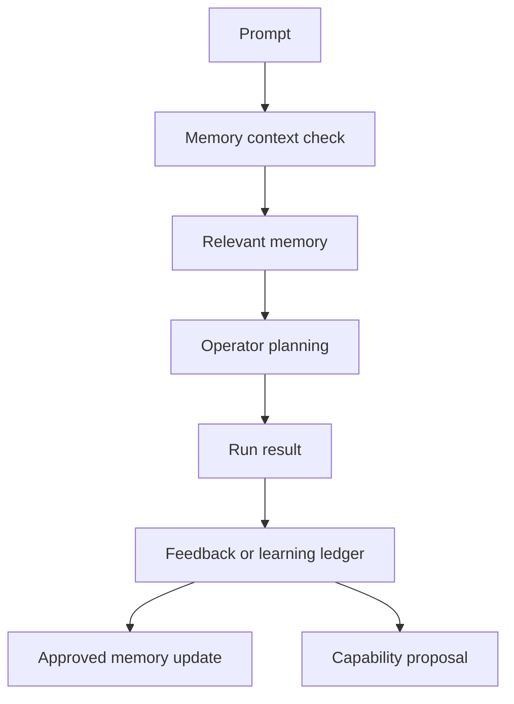

# Memory, Events, And Monitors

OpenFabric has several durable systems that let one run inform later work.

## Memory

Memory stores reusable guidance, preferences, tool advice, and approved lessons. It should contain information that remains useful beyond the current conversation.

Good memory is conditional:

- when a rule applies;
- when it does not apply;
- preferred commands or output shapes;
- safety notes;
- user-approved conventions.

Learning Ledger proposals can also turn run evidence into validation policies,
prompt guidance, planner manifest overlays, or explicit backend patch work. The
proposal review flow is separate from normal memory browsing so learned
capability changes remain visible and auditable.

## Durable Tasks

Durable tasks save prompts with attempts, checkpoints, retries, cancellation,
and archive state. The task drawer can create and start them directly, and the
composer creates chat-sourced tasks automatically when Run is pressed while
another request, task, approval, or clarification is active.

Queued tasks run when the backend queue is clear. If the UI is open, it
auto-attaches when a task starts, replays the retained trace, follows live
events, and follows task-owned approval continuations to the child request that
contains the final result.

For the full task, parameter, prompt, and learning guide, read
[Tasks, Parameters, Prompt Editor, And Learning Ledger](07-tasks-parameters-prompts-learning.md).

## Events

Events save future or repeating runtime requests. They re-enter the same request pipeline later, so scheduled work still receives clarification, safety checks, gateway selection, and trace output.

## Monitors

Monitors repeatedly observe a condition and can produce observations, status changes, and follow-up actions. They are useful for watching logs, endpoints, files, or long-running tasks.

## Notifications

Notifications surface event and monitor outcomes in the Agent UI. They help separate background work from the active conversation.
