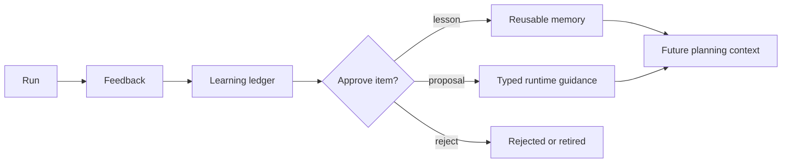

# Tasks, Parameters, Prompt Editor, And Learning Ledger

Several Agent UI panels are built for repeatable work rather than one-off chat.

## Tasks

Tasks track longer-lived goals, attempts, checkpoints, retries, cancellation, and archive state. Use tasks when a request should survive beyond one message or needs clear progress history.

The composer Run button is also the queue entry point. When no request or task
is active, Run submits the prompt normally. While a run, task, approval, or
clarification is active, the same button changes to Queue and creates a durable
task with `start_now: true`. The drawer's Create Task and Create + Start
buttons remain available for explicit task management.

Queued composer tasks preserve source `chat`, conversation id, selected model,
agent mode, gateway/routing metadata, settings context, terminal context when
present, and request-scoped auto-approve intent. They run when the backend
queue is free.

When a queued task starts while the UI is open, the UI auto-attaches to the
task, fetches `/api/agent/trace/{request_id}` to render retained trace events,
then streams future events from the last trace id. If background auto-approval
moves the task from a parent approval request to a child execution request, the
UI follows the task to the child request and renders the final result instead
of leaving stale approval controls active.

## Parameters

Parameters store named values and non-secret agent guidance the runtime can
reuse. Sensitive values can be masked and revealed only through controlled UI
routes.

Examples:

- endpoint URLs;
- project paths;
- model preferences;
- tokens or secrets that should not appear in normal prompts.

Every entry has two JSON areas:

| Field | Purpose |
| --- | --- |
| `value_json` | Executable data such as credentials, hosts, ports, tokens, paths, IDs, database names, and generated SQL discovery metadata. |
| `context_json` | Non-secret guidance for prompts, clarification, matching, entity selection, and SQL/domain semantics. |

The canonical context shape is:

```json
{
  "version": 1,
  "user_provided_domain_context": {
    "summary": "",
    "prompt_guidance": "",
    "clarification_guidance": "",
    "concepts": [],
    "metrics": [],
    "relationships": []
  }
}
```

`parameter_shell_env` and raw execution values come only from `value_json`.
They never include `context_json`.

## Parameter Editor

Open the full Parameter Editor at `/parameter-editor`, or deep-link directly to
an entry with `/parameter-editor?key=canonical_v1`.

The editor separates:

- Identity: key, description, aliases, tags, and sensitive toggle.
- Value: a dedicated `value_json` JSON editor.
- Context: summary, prompt guidance, clarification guidance, concepts, metrics,
  relationships, and an advanced raw `context_json` editor.
- Inspector: masked summary, field schemas, environment names, audit/use
  metadata, and validation errors.

Sensitive values load masked by default. Reveal uses the audited reveal route.
You can edit context without revealing secrets.

## SQL Profiles And DiscoverDB

`/discoverdb` creates or refreshes database profiles through reviewable drafts.
Generated schema metadata is stored in `value_json`:

- `schema_catalog`;
- `relation_foreign_scheme`;
- `schema_discovery`.

Domain guidance such as DICOM hierarchy notes, clinical definitions, cohort
rules, and clarification hints belongs in `context_json`. SQL prompts receive
bounded context guidance, while validators still reject unsafe SQL and unknown
tables/columns. Read-only joins that are semantic or inferred but not
DB-declared foreign keys execute with warnings.

For the detailed field-by-field guide with copyable examples, read
[Adding Parameter Metadata For The Agent](16-parameter-store-context-sql.md).

## Prompt Editor

The prompt editor exposes runtime prompt templates, variables, previews, and
reset controls. It is for maintainers who need to inspect or adjust
model-facing instructions while keeping template variables explicit.

The same editor shell also has Memories and Parameters modes. `/parameter-editor`
boots directly into Parameters mode.

## Learning Ledger

The learning ledger records run feedback, lessons, run evidence, capability
insights, and capability proposals. It helps convert observed success or
failure into approved future guidance without making learned data more
authoritative than validation or approval policy.



## Capability Proposals

Capability proposals are typed improvement drafts. They can target:

- task memory;
- validation policy;
- prompt guidance blocks;
- planner manifest overlays;
- executable backend patch bundles.

Prompt and manifest proposals are reviewable in the Learning Ledger page.
Prompt patches update only marked guidance blocks in `artifacts/prompts.db`.
Manifest overlays add planner-visible metadata for existing capabilities and
cannot change execution backend, risk, confirmation, or schemas. Executable
backend patch proposals are stored as approved pending apply and require a
manual code-editing workflow.

Read the full user manual at
[Capability Evolution And Learning Ledger](14-capability-evolution-learning-ledger.md).

## Learned Runtime Caches

The runtime has local learned caches that are separate from Learning Ledger
approval workflows:

- LRN-T writes successful validated total-task structures.
- LR-T reuses those structures for similar prompts after matching prompt
  shape, classification, model family, workflow mode, and registry contract.
- LR Direct reuses exact streaming-step command or Python replay entries.
- LR-EX can reuse equivalent payload-aware replay shapes after a structured
  LLM shape judge approves the match.

These caches live under `artifacts/`, can be cleared from their API routes,
and do not bypass memory compliance, validation, approval, gateway routing, or
safety policy.

Final answers summarize learned-runtime activity in grouped rows rather than
dumping raw event ids. Typical rows are:

- `LR-T applied`: a learned total-task structure was reused.
- `LR-T not applied`: candidates were checked but did not meet the configured
  similarity threshold.
- `LR-D applied`: LR Direct replayed exact cached execution steps.
- `LRN learned`: reusable task or step actions were saved for future runs.

When nothing was reused, the footer uses `Learning summary - no learning reused`.
Detailed ids and score diagnostics stay in trace details for debugging.

When a learned runtime cache is applied during a conversation, compact inline
tags such as `LR`, `LRD`, `LR-T`, or `LR-EX` can appear near the relevant
message. These tags stay the same small size as other inline evidence badges.
If a tag is clickable, it opens the review/correction path for the associated
auto-learnt action; passive tags are informational only.

## When To Use Which

| Need | Surface |
| --- | --- |
| Repeat a goal with attempts | Tasks |
| Reuse a named value or domain guidance | Parameters |
| Inspect prompt contracts | Prompt Editor |
| Turn feedback into guidance | Learning Ledger |
| Review capability improvement drafts | Learning Ledger Proposals |
| Reuse repeated task/replay shapes locally | LRN-T/LR-T and LR Direct controls |
