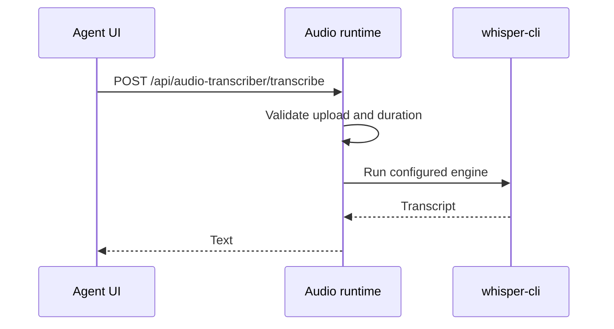

# Audio Dictation

Voice input uses a separate local audio runtime. The Agent UI records audio, sends it to the audio transcriber service, and inserts returned text into the composer.

The root launcher starts it automatically:

```bash
./startup.sh
```

Start it by itself with:

```bash
./startup-audio.sh
```

The default audio service URL is:

```text
http://127.0.0.1:8012
```

## Flow



## Model Tiers

`startup.sh` and `startup-audio.sh` default to the low model tier. `startup-audio.sh` supports low, medium, and high model tiers through `--low`, `--med`, and `--high`.

The service can be disabled or configured with `AOR_AUDIO_TRANSCRIBER_*` environment variables. See the generated environment reference for the complete discovered list.

## Troubleshooting

Check that `ffmpeg`, `ffprobe`, the configured transcription binary, and the configured model path exist. The Agent UI audio controls can be visible even when the runtime reports a service error, so use `/healthz` and `/config` on the audio service when debugging.
