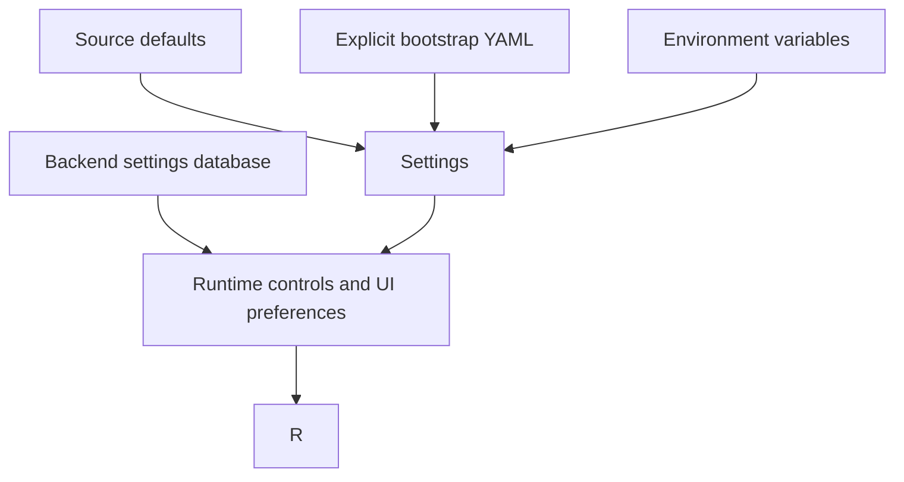

# Configuration And Storage

Configuration comes from source defaults, optional explicit bootstrap config,
environment variables, and backend-persisted preferences. Runtime controls in
the settings database are the source of truth for Agent UI execution behavior.
The browser does not own persistent agent behavior or theme settings.

## Configuration Layers

## Runtime Controls

The Agent UI reads and writes runtime controls through backend settings
endpoints. Agent requests receive a fresh backend settings snapshot before
execution; client request context cannot override these controls.

| Control | Values | Default |
| --- | --- | --- |
| `operator_policy_profile` | `deterministic`, `assisted` | `deterministic` |
| `reasoning_profile` | `fast`, `balanced`, `deep` | `fast` |
| `repair_profile` | `conservative`, `balanced`, `aggressive` | `balanced` |
| `workflow_execution_mode` | `auto`, `full_plan`, `streaming` | `auto` |
| `response_streaming_enabled` | `true`, `false` | `false` |
| `agent_clarification_mode` | `auto_pilot`, `balanced`, `pedantic` | `balanced` |
| `lrnt_enabled` | `true`, `false` | `true` |
| `lrnt_similarity_threshold` | `0.0` to `1.0` | `0.92` |
| `lrdirect_enabled` | `true`, `false` | `true` |

Accuracy and Speed are profile presets over these canonical controls. `auto`
uses decomposition-driven streaming for non-trivial tool requests, while
`full_plan` is the explicit whole-plan escape hatch. Removed legacy keys are
rejected by settings endpoints instead of being normalized.

## UI Preferences

Durable UI preferences are also backend settings, not only browser local
storage. They are read by the desktop, client, mobile, and standalone settings
surfaces through `/api/agent/settings/preferences`.

| Preference Area | Examples |
| --- | --- |
| Identity and mode | Agent display name, Agentic, Conversational, or Advisory mode |
| Layout | Visible terminal, trace, visualization, auto immersive width |
| Conversation style | Chat bubble style, number animation, chat pop animation |
| Notifications and audio | Browser notifications, sound, voice input, capture preset, silence timeout |
| Theme | Selected theme and generated palette preference |

The desktop square terminal button, Settings terminal toggle, and mobile
terminal handoff all update the same terminal visibility preference. Collapsing
the terminal header is local pane state; hiding or showing the terminal is a
backend-persisted UI preference.

Browser storage still holds local ergonomics such as drawer widths, prompt
history, selected gateway hints, transient drawer state, and random pastel
seeds. Gateway records, saved gateway cwd values, runtime controls, and UI
preferences live in SQLite-backed stores.

## Common Stores

Most local runtime state lives under `artifacts/` unless environment variables override paths.

| Store | Typical Purpose |
| --- | --- |
| `runtime.db` | Compatibility run/session records |
| `agent_memory.db` | Durable memory seed and user memory |
| `prompts.db` | Prompt templates |
| `agent_events.db` | Scheduled events and run history |
| `agent_gateways.db` | Gateway registry |
| `agent_tasks.db` | Task records |
| `agent_monitors.db` | Monitor records |
| `agent_parameters.db` | Runtime parameters |
| `agent_ui_settings.db` | Runtime controls and backend-persisted UI preferences |
| `agent_learning_ledger.db` | Run evidence, lessons, capability insights, and capability proposals |
| `agent_lrn_total_tasks.db` | LRN-T/LR-T learned total-task structures |
| `agent_command_template_cache.db` | Command templates plus LR Direct/LR-EX command replay entries |
| `agent_computation_cache.db` | Deferred Python and LR Direct/LR-EX computation replay entries |
| `agent_reliability.db` | Reliability events, model profiles, approval envelopes, and eval summaries |

Parameter records contain `value_json` for executable values and `context_json`
for non-secret domain guidance. Raw execution and shell environment data are
derived only from `value_json`.

SQL database profile discovery stores generated `schema_catalog`,
`relation_foreign_scheme`, and `schema_discovery` in `value_json`; user/domain
guidance belongs in `context_json` and is edited through `/parameter-editor`.

## Manual Storage

The manual service builds its search index in memory on startup. It does not create a persistent database by default.

## Learning Ledger Storage

The Learning Ledger is local runtime state. It stores:

- run records and action evidence;
- legacy learning lessons;
- capability insights;
- capability proposals;
- proposal status, applied refs, and apply errors.

Use `AOR_AGENT_LEARNING_LEDGER_DB_PATH` to move the database. Use
`AOR_AGENT_LEARNING_LEDGER_ENABLED=0` to disable the feature and
`AOR_AGENT_LEARNING_LEDGER_AUTO_LEARN_ENABLED=0` to turn off automatic proposal
and lesson approval.

## Learned Cache Storage

Learned runtime caches are local accelerators, not reviewed capability
proposals:

- `artifacts/agent_lrn_total_tasks.db` stores LRN-T/LR-T total-task
  structures. Override with `AOR_LRNT_DB_PATH`.
- `artifacts/agent_command_template_cache.db` stores command template replay
  entries, including LR Direct and LR-EX payload-aware command entries.
  Override with `AOR_AGENT_COMMAND_TEMPLATE_CACHE_DB_PATH`.
- `artifacts/agent_computation_cache.db` stores deferred Python computation
  entries and direct Python replay metadata. Override with
  `AOR_AGENT_COMPUTATION_CACHE_DB_PATH`.

Use `AOR_LRNT_ENABLED`, `AOR_LRNT_SIMILARITY_THRESHOLD`,
`AOR_LRNT_MAX_ENTRIES`, and `AOR_LRDIRECT_ENABLED` to control the new learned
reuse paths from the environment. Mission Control and the Agent UI expose the
same runtime controls for everyday use.

## Reliability Storage

The Capability Reliability Kernel is local runtime state. It stores:

- normalized failure, repair, retry, verifier, and outcome events;
- per-model capability profiles;
- confirmation-time approval envelopes;
- deterministic weak-model eval summaries.

Use `AOR_AGENT_RELIABILITY_DB_PATH` to move the database. Runtime controls for
mode, probes, repair attempts, weak-model action cap, verifier enforcement, and
approval-envelope budget are available from Mission Control and `/reliability`.

## Safety Notes

Treat tracked seed databases as portable project assets. Treat local runtime databases as workspace state. Do not commit private run history, secrets, or personal memory unless that is explicitly intended.
