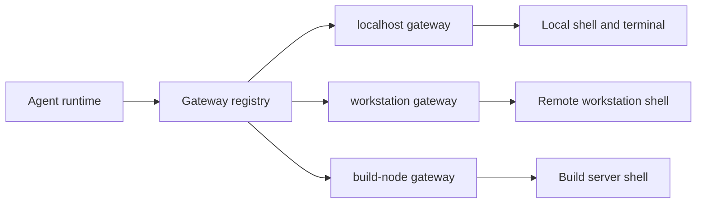

# Clone Setup Quick Start

This guide starts from a freshly cloned Git repository and ends with a running
OpenFabric workspace: Agent UI, manual service, audio runtime, gateway, and an
attached OpenAI-compatible model endpoint.

The native source setup is the best path when you are developing OpenFabric,
debugging the runtime, editing manual content, using the bundled local scripts,
or running a gateway and local LLM on the same machine.

For normal product operation after the source has been synced down, Docker is
the preferred path. Use [Complete Install And Startup Manual](02-install-startup.md)
or [Docker Setup](13-docker-setup.md) first when you want the Dockerized
all-services stack. Use this clone guide when you explicitly want the native
source launcher.

## What You Are Setting Up

OpenFabric is made of several local services:

| Service | Default URL | Purpose |
| --- | --- | --- |
| Agent runtime | `https://127.0.0.1:8011/agent-ui` when SSL is enabled | Main UI and API for agent requests |
| Audio runtime | `http://127.0.0.1:8012/healthz` | Local voice dictation and whisper.cpp transcription |
| Manual service | `http://127.0.0.1:8013/manual` | This manual and searchable technical docs |
| Gateway agent | `http://127.0.0.1:8787/healthz` | Local command execution and terminal boundary |
| LLM server | `http://127.0.0.1:8000/v1` | OpenAI-compatible model endpoint, often vLLM |

The full source launcher starts the Agent runtime, audio runtime, and manual
service. The gateway and LLM server are separate processes because they touch
the shell, terminals, GPUs, model weights, and machine-specific resources.

The gateway is required for command-backed agent work. It is the execution
boundary, or the "hands" of the system. Without a reachable gateway, the UI can
start and the model can answer direct questions, but shell actions, terminal
sessions, gateway-managed LLM launch controls, and command capsules cannot
operate correctly.

## Requirements

Use a Linux or macOS machine with:

- Git.
- Python 3.11 or newer.
- `pip` and `venv` support for that Python installation.
- `curl`, `openssl`, and `ffmpeg`.
- Build tools and `cmake` if the audio transcriber has to build whisper.cpp.
- A browser for the Agent UI.
- Docker if you plan to use the preferred Docker setup guide instead.
- A GPU and vLLM environment if you want to host a local model.

The installer can install common system dependencies on machines with
`apt-get`, `dnf`, `yum`, `pacman`, `zypper`, or Homebrew. If you are on a locked
down system, install dependencies yourself and run the installer with system
dependency installation disabled.

## Clone The Repository

Clone the repository and enter it:

```bash
git clone <repo-url> openfabric
cd openfabric
```

Confirm you are in the repository root. You should see files such as
`install.sh`, `startup.sh`, `src/`, `docker/`, and `README.md`.

```bash
pwd
ls
```

## Choose The Python Interpreter

OpenFabric requires Python 3.11 or newer. The installer automatically tries
`python3.13`, `python3.12`, `python3.11`, and then `python3`.

Check what you have:

```bash
python3 --version
```

If your machine has multiple Python versions, force a specific interpreter:

```bash
PYTHON_BIN=python3.11 ./install.sh
```

The installer creates or refreshes `.venv` in the repository root. If an old
virtual environment exists with an incompatible Python version, the installer
recreates it.

## Run The Installer

For the normal native install:

```bash
./install.sh
```

The installer does the following:

- installs common system packages when a supported package manager is available;
- creates `.venv`;
- upgrades `pip`, `setuptools`, and `wheel`;
- installs the project in editable mode with Python tooling extras;
- installs Playwright Chromium;
- marks launcher scripts executable;
- prepares the local audio transcriber when possible.

If your machine cannot or should not install system packages automatically:

```bash
AOR_SKIP_SYSTEM_DEPS=1 ./install.sh
```

If you want the audio transcriber setup skipped:

```bash
AOR_SKIP_AUDIO_TRANSCRIBER_SETUP=1 ./install.sh
```

If you want the core app install to avoid audio builds/downloads:

```bash
./install-no-build.sh
```

That path enables audio only when compatible local `.aor`, system, or explicit
audio assets already exist.

## Understand Runtime Configuration

The native launcher starts without a repository-root `config.yaml`. Agent UI
runtime controls, including the OpenAI-compatible LLM endpoint, are persisted in
the backend settings database and become the source of truth after first launch.

YAML remains available only as an explicit legacy bootstrap. Use it when you need
to override server-only startup values before the settings UI is reachable:

```yaml
server:
  host: 127.0.0.1
  port: 8011
llm:
  base_url: http://127.0.0.1:8000/v1
  api_key: local
  default_model: stelterlab/Qwen3-Coder-30B-A3B-Instruct-AWQ
  default_temperature: 0.1
  timeout_seconds: 120
runtime:
  run_store_path: .aor/runtime.db
```

`startup.sh` also sets runtime environment defaults before launching uvicorn.
The launcher binds the Agent runtime to `0.0.0.0:8011` by default so other local
clients can reach it. The audio and manual services bind to loopback unless you
explicitly pass `--host` or set service-specific host variables.

Use an explicit bootstrap config file when needed:

```bash
./startup.sh --config /path/to/config.yaml
```

or:

```bash
AOR_APP_CONFIG_PATH=/path/to/config.yaml ./startup.sh
```

## Start The Workspace

Start the Agent runtime, audio runtime, and manual service together:

```bash
./startup.sh
```

Open:

| Page | URL |
| --- | --- |
| Agent UI | `https://127.0.0.1:8011/agent-ui` when SSL is enabled; `http://127.0.0.1:8011/agent-ui` otherwise |
| Manual | `http://127.0.0.1:8013/manual` |
| Audio health | `http://127.0.0.1:8012/healthz` |
| Runtime health | `http://127.0.0.1:8011/healthz` |

The Agent UI server also serves `/agent-ui-client`, `/agent-ui-mobile`,
`/directory`, `/settings`, `/prompt-editor`, `/parameter-editor`,
`/learning-ledger`, and `/reliability`.

Use alternate ports when defaults are busy:

```bash
./startup.sh --port 8311 --audio-port 8312 --manual-port 8313
```

Use reload mode while editing Python, CSS, JavaScript, or manual Markdown:

```bash
./startup.sh --reload
```

Disable optional child services when you only want the Agent runtime:

```bash
AOR_AUDIO_TRANSCRIBER_AUTOSTART=0 AOR_MANUAL_AUTOSTART=0 ./startup.sh
```

Start the manual by itself:

```bash
./startmanual.sh --reload
```

## Enable HTTPS When Needed

HTTPS is useful when browser features such as microphone access are needed from
a LAN address instead of `localhost`.

Start with HTTPS:

```bash
./startup.sh --https
```

The launcher generates or reuses a self-signed certificate under
`artifacts/ssl/`. Browsers will warn because this is a local development
certificate, not a production credential.

Open:

```text
https://127.0.0.1:8011/agent-ui
```

or:

```text
https://<host-ip>:8011/agent-ui
```

## Start The Gateway

The gateway is the process that actually touches the shell. The Agent runtime
can plan and validate commands, but shell execution is routed through the
gateway boundary. Install and start a gateway before expecting agent execution
to work.

Install the gateway environment:

```bash
./src/gateway_agent/install.sh
```

Start it on loopback:

```bash
./src/gateway_agent/startup.sh
```

Verify it:

```bash
curl http://127.0.0.1:8787/healthz
```

The default runtime settings expect:

```text
AOR_GATEWAY_URL=http://127.0.0.1:8787
AOR_DEFAULT_NODE=localhost
AOR_AVAILABLE_NODES=localhost
```

Start the gateway on a reachable network address only when the Agent runtime is
on another machine:

```bash
./src/gateway_agent/startup.sh --host 0.0.0.0 --port 8787
```

Use a distinct node name when the gateway represents a specific machine:

```bash
GATEWAY_NODE_NAME=workstation ./src/gateway_agent/startup.sh --host 0.0.0.0 --port 8787
```

Each gateway exposes:

- `GET /healthz`
- `GET /capabilities`
- `POST /exec`
- `POST /exec/stream`
- `POST /exec/cancel`
- `WebSocket /terminal/ws`
- `GET /llm/status`
- `POST /llm/start`
- `POST /llm/stop`

The gateway does not include built-in authentication. Keep it on loopback or
behind a trusted network boundary.



## Attach A Local vLLM Server

OpenFabric expects an OpenAI-compatible API. For vLLM, that means the server
must expose:

- `GET /v1/models`
- `POST /v1/chat/completions`

The default base URL is:

```text
http://127.0.0.1:8000/v1
```

The default API key is:

```text
local
```

The API key is still sent as a bearer token. Most local vLLM setups accept any
non-empty value when API-key enforcement is not configured.

The repository includes vLLM launch profiles under `src/llm/`. They are tuned
as local convenience scripts, especially for single-GPU testing.

Create the recommended conda environment before running those scripts:

```bash
conda create -n vllm python=3.12 -y
conda activate vllm
pip install --upgrade uv
uv pip install vllm --torch-backend=auto
```

Example launch:

```bash
./src/llm/start-current-qwen3-coder-30b-a3b-awq.sh
```

Smaller first-launch option:

```bash
./src/llm/start-qwen2.5-1.5b-instruct.sh
```

Use overrides when needed:

```bash
PORT=8001 MAX_MODEL_LEN=16384 ./src/llm/start-qwen2.5-coder-32b-awq.sh
GPU_MEMORY_UTILIZATION=0.86 ./src/llm/start-qwen3-coder-30b-a3b-awq.sh
```

When a model fails to load because of memory pressure, reduce `MAX_MODEL_LEN`
first, then reduce `GPU_MEMORY_UTILIZATION`.

Verify the OpenAI-compatible endpoint:

```bash
curl http://127.0.0.1:8000/v1/models \
  -H 'Authorization: Bearer local'
```

You should receive a JSON payload with a `data` array or model list.

## Attach Any OpenAI-Compatible Server

You can point OpenFabric at any compatible service, local or remote, from the
Agent UI settings. Those values are persisted in `agent_ui_settings.db` as
runtime controls. For legacy bootstrap-only setup, provide an explicit YAML file:

```yaml
llm:
  base_url: http://127.0.0.1:8000/v1
  api_key: local
  default_model: auto
  default_temperature: 0.1
  timeout_seconds: 120
  max_tokens: 0
  context_window_tokens: 32768
```

Set `default_model: auto` when the model server has a reliable `/v1/models`
endpoint. OpenFabric will discover the first served model id and use it for
chat-completion calls.

Set an explicit model id when the server requires one:

```yaml
llm:
  base_url: http://127.0.0.1:8000/v1
  api_key: local
  default_model: my-model-id
```

The runtime sends structured JSON prompts through chat completions. A compatible
server should return assistant message content containing a JSON object. The
client first tries `response_format: {"type": "json_object"}` and falls back
without that field when a server rejects it.

If the model server reports context-window metadata from `/v1/models`,
OpenFabric uses it. Otherwise it falls back to `llm.context_window_tokens` or
`AOR_LLM_CONTEXT_WINDOW_TOKENS`.

## Use The Agent UI Model Controls

The Settings drawer in the Agent UI exposes the configured model endpoint as
scheme, host, port, and path. It also includes gateway-backed controls for
starting and stopping a local LLM launch command.

Default LLM launch settings:

```text
conda env: vllm
command: ./src/llm/start-current-qwen3-coder-30b-a3b-awq.sh
cwd: workspace root or configured launch cwd
```

Override the defaults before starting the Agent runtime:

```bash
export AOR_AGENT_UI_LLM_LAUNCH_CONDA_ENV=vllm
export AOR_AGENT_UI_LLM_LAUNCH_COMMAND=./src/llm/start-current-qwen3-coder-30b-a3b-awq.sh
export AOR_AGENT_UI_LLM_LAUNCH_CWD=/path/to/openfabric
./startup.sh
```

The launch buttons call the gateway `/llm/start`, `/llm/stop`, `/llm/status`,
and `/llm/log` endpoints. That means the gateway must be running for the UI to
manage the local LLM process.

```mermaid
flowchart TD
    Settings[Agent UI Settings] --> Gateway[Gateway /llm routes]
    Gateway --> Conda[conda env: vllm]
    Conda --> Launcher[src/llm/start-*.sh]
    Launcher --> VLLM[vLLM OpenAI-compatible server]
    VLLM --> Models[/v1/models]
    VLLM --> Chat[/v1/chat/completions]
    Models --> Runtime[Agent runtime]
    Chat --> Runtime
```

## First Validation Checks

After everything is running, verify each layer:

```bash
curl http://127.0.0.1:8011/healthz
curl http://127.0.0.1:8012/healthz
curl http://127.0.0.1:8013/healthz
curl http://127.0.0.1:8787/healthz
curl http://127.0.0.1:8000/v1/models -H 'Authorization: Bearer local'
```

Then open the Agent UI and try a read-only request:

```text
What repository am I in, and what branch is checked out?
```

For mutating commands, expect the runtime to pause for approval. That is
intentional. The LLM proposes actions, the runtime validates them, and the
gateway only runs commands after the runtime policy allows them.

## Common Startup Variants

Bind the Agent UI to loopback only:

```bash
AOR_HOST=127.0.0.1 ./startup.sh
```

Bind all child services to a LAN-visible host:

```bash
./startup.sh --host 0.0.0.0
```

Change the gateway URL:

```bash
AOR_GATEWAY_URL=http://127.0.0.1:8787 ./startup.sh
```

Run with a different LLM endpoint through config:

```bash
./startup.sh --config ./config.local.yaml
```

Run with LLM preflight enabled for debugging:

```bash
AOR_LLM_PREFLIGHT_ENABLED=1 AOR_LLM_PREFLIGHT_TIMEOUT_SECONDS=3 ./startup.sh
```

The default launcher skips LLM preflight so the UI can start even when the
model server is still loading.

## Where Local State Lives

Native source runs keep local state in the repository unless overridden:

| State | Default location |
| --- | --- |
| Runtime DB | `artifacts/runtime.db` unless explicitly overridden by env/bootstrap config |
| Memory seed and active memory | `artifacts/agent_memory.db` |
| Prompt templates | `artifacts/prompts.db` |
| Gateway registry | `artifacts/agent_gateways.db` |
| Agent UI settings | `artifacts/agent_ui_settings.db` |
| Chats | `artifacts/chats.db` |
| Events | `artifacts/agent_events.db` |
| Tasks | `artifacts/agent_tasks.db` |
| Monitors | `artifacts/agent_monitors.db` |
| Parameters | `artifacts/agent_parameters.db` |
| Outputs | `outputs/` unless overridden |
| Playwright browser profile | `artifacts/playwright-duckai-profile` |
| Generated SSL certs | `artifacts/ssl/` |

These files are intentionally local runtime state. Treat them as machine-owned
unless you deliberately curate seed data for the repository.

## Troubleshooting

If `startup.sh` says `.venv` is missing, run:

```bash
./install.sh
```

If Python is too old, install Python 3.11 or newer and rerun:

```bash
PYTHON_BIN=python3.11 ./install.sh
```

If the Agent UI opens but model calls fail, check:

```bash
curl http://127.0.0.1:8000/v1/models -H 'Authorization: Bearer local'
```

If command execution fails, check the gateway:

```bash
curl http://127.0.0.1:8787/healthz
```

If ports are busy, choose new ports:

```bash
./startup.sh --port 8311 --audio-port 8312 --manual-port 8313
./src/gateway_agent/startup.sh --port 8887
```

If audio setup fails, the Agent runtime can still run. Voice dictation remains
unavailable until `ffmpeg`, `ffprobe`, `whisper-cli`, and a model file are
configured.

If a vLLM profile runs out of memory, lower context first:

```bash
MAX_MODEL_LEN=8192 ./src/llm/start-current-qwen3-coder-30b-a3b-awq.sh
```

If the browser warns about HTTPS, confirm you are using the local development
certificate intentionally, then continue in the browser for local testing.
