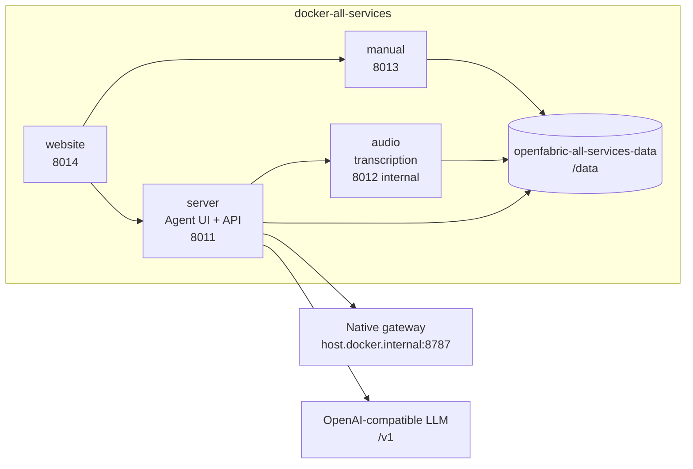
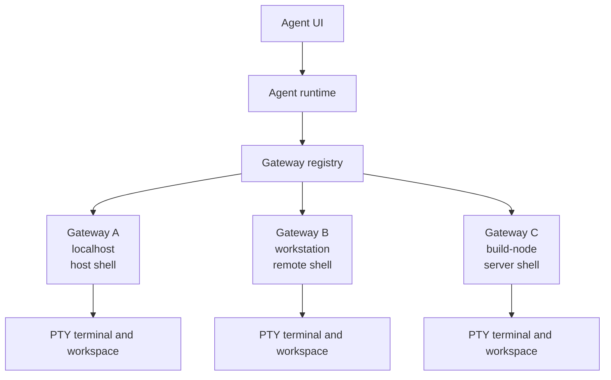
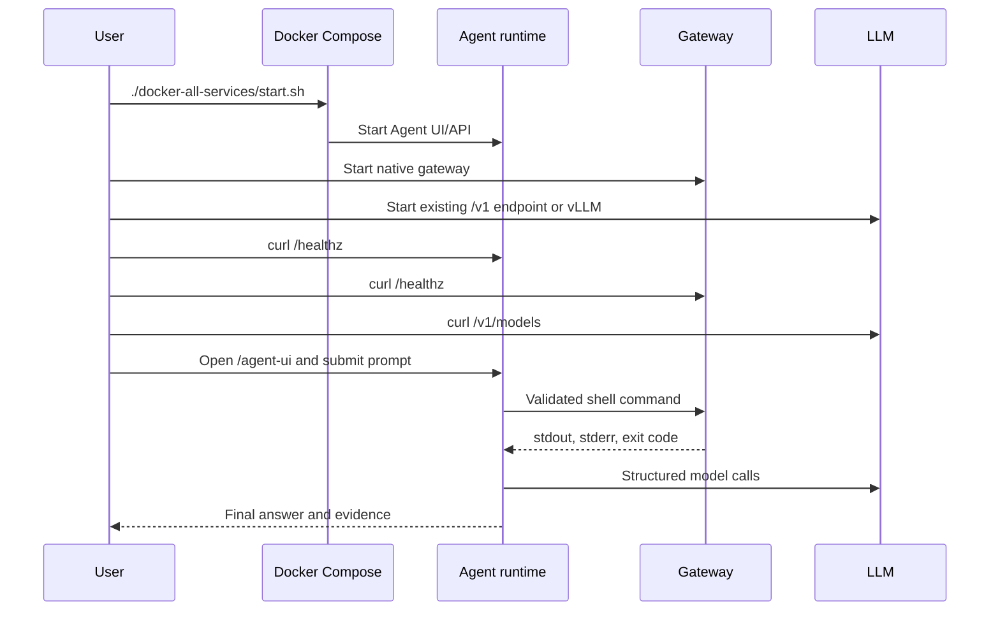

# Docker Setup

This is the preferred product setup after cloning or syncing the source. The
all-services Docker stack builds OpenFabric from the repository and runs the
Agent runtime, Agent UI, manual, website, and audio runtime. Gateways and LLM
servers remain outside the stack because they belong on the machines that own
shell execution, terminals, GPUs, model weights, and private workspaces.

The correct high-level order is:

1. Build the all-services Docker image.
2. Start the all-services compose stack.
3. Install and start one or more native gateways.
4. Attach an existing OpenAI-compatible LLM endpoint or start local vLLM.
5. Validate service, gateway, and model health.
6. Open the Agent UI and run a read-only request.

## Docker Architecture

The preferred stack uses:

- `docker/server.Dockerfile` to build the shared image;
- `docker-all-services/docker-compose.yaml` to run the product stack;
- `docker-all-services/build.sh` to build the image;
- `docker-all-services/start.sh` to start the stack;
- a named Docker volume, `openfabric-all-services-data`, mounted at `/data`.

| Service | Container name | Purpose | Host port |
| --- | --- | --- | --- |
| `server` | `openfabric-all-server` | Agent runtime and Agent UI | `8011` |
| `audio` | `openfabric-all-audio` | Audio transcription runtime | internal `8012` |
| `manual` | `openfabric-all-manual` | Searchable manual | `8013` |
| `website` | `openfabric-all-website` | Product website | `8014` |

The server container is configured with:

```text
AOR_GATEWAY_URL=http://host.docker.internal:8787
AOR_AVAILABLE_NODES=localhost
AOR_DEFAULT_NODE=localhost
AOR_AUDIO_TRANSCRIBER_SERVICE_URL=http://audio:8012
```

The LLM endpoint defaults to `http://127.0.0.1:8000/v1` unless changed in the
Agent UI settings or by an explicit bootstrap config.



## Requirements

Use a machine with:

- Git and a synced OpenFabric source tree.
- Docker Engine with Compose v2.
- Enough disk space for the image, Python dependencies, Playwright Chromium,
  audio assets, local databases, and generated artifacts.
- `curl` for validation checks.
- Python 3.11 or newer on every gateway machine.
- Conda or Miniconda if you plan to create a local `vllm` environment.
- A reachable OpenAI-compatible model endpoint, or GPU hardware suitable for
  the vLLM model profile you choose.

## Build The All-Services Image

From the repository root:

```bash
./docker-all-services/build.sh
```

Build a tagged version:

```bash
./docker-all-services/build.sh v1.0.0
```

The script builds from `docker/server.Dockerfile` and uses these defaults:

```text
OPENFABRIC_IMAGE=openfabric-all-services
OPENFABRIC_VERSION=latest
```

It also passes `AOR_BUILD_AUDIO=1`, so this is the Docker path that builds the
local `whisper-cli` binary for voice dictation.

## Start The All-Services Stack

Start in the foreground:

```bash
./docker-all-services/start.sh
```

Start in the background:

```bash
./docker-all-services/start.sh -d
```

Start a tagged version:

```bash
./docker-all-services/start.sh v1.0.0
```

Open:

| Page | URL |
| --- | --- |
| Agent UI | `http://127.0.0.1:8011/agent-ui` |
| Runtime health | `http://127.0.0.1:8011/healthz` |
| Manual | `http://127.0.0.1:8013/manual` |
| Manual health | `http://127.0.0.1:8013/healthz` |
| Website | `http://127.0.0.1:8014/website` |
| Website health | `http://127.0.0.1:8014/healthz` |

View logs:

```bash
docker compose -f docker-all-services/docker-compose.yaml logs -f
docker compose -f docker-all-services/docker-compose.yaml logs -f server
docker compose -f docker-all-services/docker-compose.yaml logs -f audio
```

Stop without deleting local state:

```bash
docker compose -f docker-all-services/docker-compose.yaml down
```

## Persistent Data

The all-services stack mounts:

```yaml
volumes:
  - openfabric-all-services-data:/data
```

The entrypoint prepares:

| Path | Purpose |
| --- | --- |
| `/data/artifacts` | Runtime databases, gateway registry, settings, generated SSL |
| `/data/outputs` | Generated output artifacts |
| `/data/playwright-duckai-profile` | Browser profile for online AI checks |
| `/data/models/whisper` | Whisper model files |

Existing files in `/data` are not overwritten. Prompt edits, memory, chats,
gateway settings, scheduled events, caches, generated outputs, browser profile
state, and audio model files survive rebuilds and restarts.

Inspect volumes:

```bash
docker volume ls
docker volume inspect openfabric_openfabric-all-services-data
```

The exact volume name can be prefixed by the Compose project name.

## Install Required Gateways

The gateway is the process that touches the real shell. It is required for
command-backed agent work, terminal sessions, gateway-routed tasks, and the UI
LLM launch controls. Install it natively on every machine that should execute
commands.

On the Docker host:

```bash
./src/gateway_agent/install.sh
./src/gateway_agent/startup.sh
```

Verify from the host:

```bash
curl http://127.0.0.1:8787/healthz
curl http://127.0.0.1:8787/capabilities
```

Verify from the server container:

```bash
docker exec openfabric-all-server curl -s http://host.docker.internal:8787/healthz
docker exec openfabric-all-server curl -s http://host.docker.internal:8787/capabilities
```

For a gateway on another trusted machine:

```bash
GATEWAY_NODE_NAME=workstation ./src/gateway_agent/startup.sh --host 0.0.0.0 --port 8787
```

Add it in the Agent UI Gateway drawer with a nickname, host, port, and node.
The gateway exposes `/healthz`, `/capabilities`, `/exec`, `/exec/stream`,
`/exec/cancel`, `/terminal/ws`, and `/llm/*` routes. It does not include
built-in authentication. Keep it on loopback or a trusted network boundary.



## Attach An Existing LLM Endpoint

The Dockerized runtime calls an OpenAI-compatible endpoint. The endpoint must
provide:

- `GET /v1/models`
- `POST /v1/chat/completions`

Verify an existing endpoint from the host:

```bash
curl http://127.0.0.1:8000/v1/models \
  -H 'Authorization: Bearer local'
```

If the endpoint runs on the Docker host and the server container cannot reach
`127.0.0.1`, use `host.docker.internal` or the host LAN IP in the Agent UI LLM
Endpoint settings:

```text
http://host.docker.internal:8000/v1
```

Verify from the server container:

```bash
docker exec openfabric-all-server curl -s http://host.docker.internal:8000/v1/models \
  -H 'Authorization: Bearer local'
```

Use `Model = auto` when `/v1/models` returns the model id you want. Use an
explicit model id when the server requires one.

## Or Host vLLM Locally With Conda

Use this path when you want the same machine to host an OpenAI-compatible vLLM
server. Current vLLM quickstart guidance supports creating a Python 3.12 conda
environment and installing vLLM through `uv`. Upstream references:
`https://docs.vllm.ai/en/latest/getting_started/quickstart/` and
`https://vllm.ai/releases`.

```bash
conda create -n vllm python=3.12 -y
conda activate vllm
pip install --upgrade uv
uv pip install vllm --torch-backend=auto
```

Then launch one of the repository profiles:

```bash
./src/llm/start-current-qwen3-coder-30b-a3b-awq.sh
```

Smaller first-launch option:

```bash
./src/llm/start-qwen2.5-1.5b-instruct.sh
```

Verify:

```bash
curl http://127.0.0.1:8000/v1/models \
  -H 'Authorization: Bearer local'
```

If the selected profile runs out of memory, reduce context first:

```bash
MAX_MODEL_LEN=8192 ./src/llm/start-current-qwen3-coder-30b-a3b-awq.sh
```

The Agent UI Settings drawer can also start or stop the configured local LLM
command through the gateway. The defaults are:

```text
conda env: vllm
command: ./src/llm/start-current-qwen3-coder-30b-a3b-awq.sh
cwd: workspace root
```

Those controls call `/api/agent/llm/status`, `/api/agent/llm/start`,
`/api/agent/llm/stop`, and `/api/agent/llm/log`, which proxy to the selected
gateway's `/llm/*` routes.

## Docker Runtime Configuration

Agent UI runtime controls are persisted in the backend settings database. YAML
is optional legacy bootstrap only. If you need a bootstrap file, mount it and
set `AOR_APP_CONFIG_PATH`:

```yaml
services:
  server:
    environment:
      AOR_APP_CONFIG_PATH: /data/config.yaml
    volumes:
      - openfabric-all-services-data:/data
      - ../config.yaml:/data/config.yaml:ro
```

Example LLM bootstrap:

```yaml
llm:
  base_url: http://host.docker.internal:8000/v1
  api_key: local
  default_model: auto
  default_temperature: 0.1
  timeout_seconds: 120
  max_tokens: 0
  context_window_tokens: 32768
runtime:
  run_store_path: artifacts/runtime.db
```

Keep secrets out of committed config files.

## Server-Only Docker Stack

Use the smaller `docker/` stack only when you want the Agent runtime and manual
without the website and audio service:

```bash
./docker/build.sh
./docker/start.sh
```

That stack uses the same Dockerfile with the default `AOR_BUILD_AUDIO=0`, so it
does not build `whisper-cli`.

Or use the compatibility launcher:

```bash
./docker/start-server.sh
```

Open:

| Page | URL |
| --- | --- |
| Agent UI | `http://127.0.0.1:8011/agent-ui` |
| Manual | `http://127.0.0.1:8013/manual` |

The same gateway and LLM requirements apply.

## Enable HTTPS

For Docker:

```bash
AOR_SSL_ENABLED=1 ./docker-all-services/start.sh
```

The container generates or reuses a self-signed certificate under
`/data/artifacts/ssl/`.

Open:

```text
https://127.0.0.1:8011/agent-ui
```

Browsers warn because this is a local development certificate.

## Health Checks

From the host:

```bash
curl http://127.0.0.1:8011/healthz
curl http://127.0.0.1:8013/healthz
curl http://127.0.0.1:8014/healthz
curl http://127.0.0.1:8787/healthz
curl http://127.0.0.1:8000/v1/models -H 'Authorization: Bearer local'
```

From inside the server container:

```bash
docker exec openfabric-all-server curl -s http://host.docker.internal:8787/healthz
docker exec openfabric-all-server curl -s http://host.docker.internal:8000/v1/models \
  -H 'Authorization: Bearer local'
```

Then submit a read-only request:

```text
What repository workspace can you see, and what files are at the root?
```

If the gateway is connected and shell execution is allowed by policy, the
runtime routes read-only commands through the gateway and renders command
capsules in the response.



## Troubleshooting

If the UI does not open:

```bash
docker compose -f docker-all-services/docker-compose.yaml ps
docker compose -f docker-all-services/docker-compose.yaml logs server
```

If the gateway works on the host but not from Docker, check the container-side
host:

```bash
docker exec openfabric-all-server curl -s http://host.docker.internal:8787/healthz
```

If a remote gateway fails, verify its bind host, firewall, node name, and the
Agent UI gateway registry entry.

If model calls fail, test `/v1/models` from both host and container. Use
`host.docker.internal`, a LAN IP, or a mounted bootstrap config if the endpoint
is not reachable at `127.0.0.1`.

If vLLM fails to load, lower context or choose a smaller profile:

```bash
MAX_MODEL_LEN=8192 ./src/llm/start-current-qwen3-coder-30b-a3b-awq.sh
./src/llm/start-qwen2.5-1.5b-instruct.sh
```

If Docker state looks stale, inspect `/data`:

```bash
docker exec -it openfabric-all-server bash
ls /data
ls /data/artifacts
```

Remove the data volume only when you intentionally want to erase local runtime
state.
