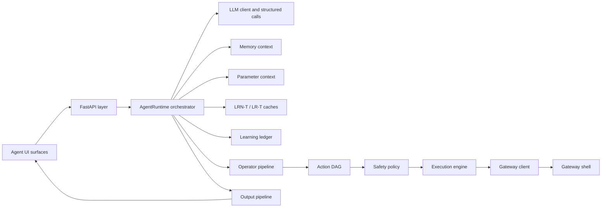

# Architecture Overview

The local runtime is an orchestration system around typed contracts. The model helps interpret intent, but runtime-owned code decides whether a plan is structurally valid, safe enough, and ready to execute.
That boundary is also the smaller-model strategy: OpenFabric improves the
usefulness of local or OpenAI-compatible models by surrounding each model stage
with guardrails, validation, approval gates, trace evidence, recovery, and
durable workflow state instead of relying on raw model strength alone.

## Core Ownership

| Component | Owns |
| --- | --- |
| API layer | HTTP routes, UI surfaces, backend settings, request context, streaming |
| Orchestrator | Stage order, request state, memory and parameter attachment |
| LLM layer | Structured calls, repairs, tracing wrappers |
| Operator pipeline | Planning, validation, LR Direct/LR-EX replay checks, observation, repair, final formatting |
| Execution engine | Trusted DAG execution and result storage |
| Gateway | Real shell and terminal sessions |
| Stores | SQLite-backed state for memory, parameters, events, tasks, monitors, prompts, UI settings, and learned runtime caches |
| Learning Ledger | Run evidence, lessons, capability insights, and reviewed proposals |
| Output pipeline | DisplayDocument and structured rendering |

## Boundary Principle

Every boundary narrows trust. The browser does not execute shell commands. The LLM does not bypass validation. The gateway does not decide semantic intent. The runtime joins the pieces and records evidence.

The primary browser surface is `/agent-ui`. Current companion surfaces include
`/agent-ui-client`, `/agent-ui-mobile`, `/directory`, `/settings`,
`/prompt-editor`, `/parameter-editor`, `/learning-ledger`, and `/reliability`.
They share the static frontend style system and backend settings preference
store while preserving their own layouts.

Profiles change pacing inside those boundaries. The default operator path
decomposes non-trivial requests into small steps, validates each step, records
evidence, and feeds that evidence into the next operator call. A request can
still be one action when the decomposed task is genuinely atomic.

Smaller-model support is one reason the pipeline is granular. Structured
outputs, typed action contracts, repair attempts, verifier profiles, and evals
make weaker model behavior easier to measure, constrain, and recover from
before execution reaches the gateway.

Parameter context follows the same boundary principle. `value_json` may feed
execution-only values, while bounded `context_json` can guide prompts and
clarification resolution. Context guidance cannot reveal secrets, lower risk,
approve SQL joins, or skip confirmations.

Learned runtime caches follow it too. LRN-T/LR-T may reuse validated task
frames, and LR Direct/LR-EX may reuse exact or equivalent step replay shapes,
but current validation, memory compliance, safety, approval, and gateway
policy still decide whether anything runs.

Final answers summarize those cache decisions in grouped learning rows. Applied
reuse, rejected LR-T candidates, LR Direct replay, and new LRN writes are shown
as concise user-facing summaries, while raw ids remain in trace details.

For a stage-by-stage view of how raw user text becomes model prompts,
validated actions, memory decisions, approval states, execution records, and
final output, read [Prompt Evolution From Input To Action](10-prompt-evolution.md).
