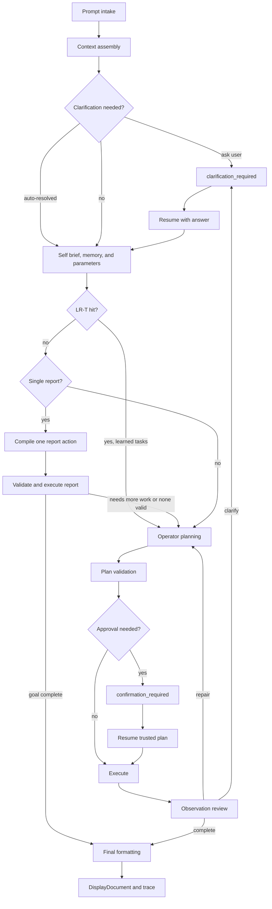

# Request Lifecycle

A request begins as plain text and ends as either a conversational answer, a
paused interaction, or verified local work. Integration requests use this same
lifecycle while returning non-streaming JSON envelopes for external systems.

## Important Pause States

| State | Meaning |
| --- | --- |
| `clarification_required` | The runtime needs one more user answer |
| `confirmation_required` | A validated plan needs approval before execution |
| stopped | The user or runtime ended the request before completion |
| completed | The final response and artifacts are ready |

## Context Assembly

Context assembly attaches request controls, selected gateway/cwd, conversation
state, matched memory, and matched Parameter Store entries. Parameter
`value_json` is kept for execution-only use, while bounded `context_json`
guidance can be sent to prompt builders and clarification resolution.

The composer Run button creates a durable task with `start_now: true` and
`source: chat`. When the runtime is idle, the backend starts the oldest queued
task immediately and the UI attaches to that request stream. When another
request, durable task, approval, or clarification is active, the same button
changes to Queue and the new task waits behind older queued work. That task
preserves conversation id, selected model, agent mode, gateway/routing
metadata, settings context, terminal context when active, and request-scoped
auto-approve intent.

When a queued durable task starts while the UI is open, the UI fetches the
saved trace first, replays retained events, and then streams with `after_id`
set to the latest retained trace event. If background auto-approval continues
the task on a child request, the UI follows the task's current request id and
renders the child trace or final result.

The Integration Execution API submits prompts through the same request handler
and waits on trace events until completion, failure, cancellation,
confirmation, clarification, or timeout. It does not open the Agent UI SSE
stream, and persisted runtime controls remain the source of truth.

After memory and parameters are attached, LR-T can reuse a validated learned
total-task structure when the prompt shape, classification, model family,
workflow mode, and registry contract hash match closely enough. A hit skips
decomposition only; planning, validation, approval, execution, and observation
continue normally.

Clarification mode is carried as `agent_clarification_mode` and can be
`auto_pilot`, `balanced`, or `pedantic`. Legacy clarification-strategy input is
normalized into that mode.

Before the UI sees a clarification card, the typed resolver can continue with
selected entities and assumptions when confidence is high enough. That context
feeds the next SQL/operator/capability step, but does not bypass validation or
approval.

## Why The Flow Loops

Execution can reveal that a command failed, a result was empty, or a user choice is still missing. The observation stage can repair, ask, or finalize based on evidence rather than assumptions.

## Stepwise Operator Loop

When a request needs tools and is not already atomic, the runtime decomposes it
into small task frames. The operator plans only the current task, execution
records fresh evidence, and the next operator call receives that evidence
through the streaming task context and input bindings.

For repeated streaming steps, LR Direct can reuse an exact prior command or
Python replay shape. LR-EX can reuse a semantically equivalent payload-aware
shape after a structured LLM judge accepts the candidate and maps current prior
outputs safely.
