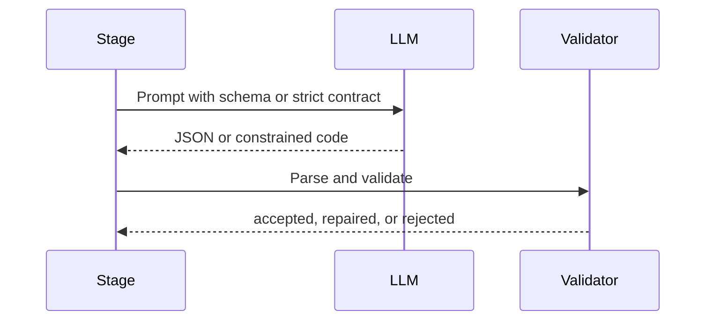

# LLM Contracts

LLM calls are stage-specific. They produce structured proposals or bounded natural-language output. Runtime code validates responses before using them.

## Contract Pattern

## Typical Checks

- JSON must parse.
- Required fields must exist.
- Capability IDs must be registered.
- Action kinds must match allowed operator types.
- Code contracts must define the expected function.
- Risk and interaction metadata must be explicit.
- Repairs are bounded to avoid endless correction loops.

## Clarification Resolution Contract

Clarification behavior is governed by `agent_clarification_mode`:

- `auto_pilot`;
- `balanced`;
- `pedantic`.

When a stage is about to ask the user a clarification, a typed resolver can run
as a separate LLM operation. Its response includes a decision, mode,
confidence, selected entities, assumptions, execution directives, optional user
question, risk flags, and reason.

The runtime validates this response before using it. Invalid or low-confidence
output falls back to asking the user. Resolver output can guide the next agent
step, but cannot bypass validation, SQL safety, mutation confirmation,
credential handling, or approval policy.

## Parameter Context Contract

Parameter Store records split executable data from guidance:

- `value_json`: credentials, hosts, ports, tokens, paths, IDs, SQL schema and
  relation metadata, and other values execution may need;
- `context_json`: non-secret summary, prompt guidance, clarification guidance,
  concepts, metrics, and relationships.

Normal prompts receive bounded context summaries. Clarification resolution can
receive richer matched context. Raw execution values and shell environment
variables never include `context_json`.

## Single-Report Contract

For low-risk report requests, the LLM returns one `OperatorTask` and one
concrete `OperatorAction`; the action discovers, computes, validates, and
prints the complete report. It may be a shell command or a complete Python
action, but it must not defer code generation or depend on upstream bindings.

The model still does not run commands. Validation failures and command
stdout/stderr are fed back into bounded one-action repair. Hard safety blocks
stop execution.

## What The Model Does Not Own

The model does not directly run shell commands, write memory, skip approval, or create hidden capabilities. It proposes. The runtime decides whether the proposal can move forward.
