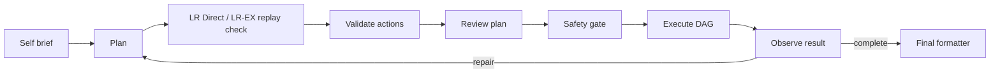
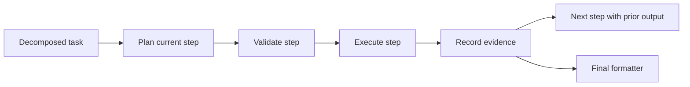

# Operator Pipeline

The operator pipeline is the main path for local work. It turns intent into a small action graph, validates the graph, executes it, reads the result, and formats the final answer.

For non-trivial requests, Agentic mode uses a decomposition-driven operator loop:

## Operator Action Families

| Action | Purpose |
| --- | --- |
| `operator.shell_command` | Concrete shell commands with cwd, risk, timeout, and output shape |
| `operator.python_action` | Complete Python program for local inspection or manipulation |
| `operator.python_transform` | Pure transformation over upstream inputs |

## Workflow Execution Modes

| Mode | Planner Shape | Execution Pace |
| --- | --- | --- |
| `auto` | Runtime uses staged streaming for non-trivial tool requests | One scoped step at a time |
| `full_plan` | Whole workflow plan up front | Normal validation, approval, execution, observation |
| `streaming` | Decomposed workflow execution | One scoped step at a time |

## Validation Goals

Validation makes sure the plan is typed, dataflow is explicit, command risk is labeled, execution mode is appropriate, and outputs can be observed.

Minimal reports use the same validation path with a one-action plan. Hard
safety validation, command deny rules, cwd validation, binding validation, and
policy checks remain authoritative.

This shape is intentional for smaller models. The runtime asks for granular
steps, structured outputs, and scoped repairs so a weak model can be corrected
or stopped at a narrow boundary instead of producing one unchecked plan. Approval
envelopes, verifier profiles, trace evidence, and evals make the weak points
visible enough to operate.

## Learned Reuse Paths

LR-T can supply already validated task frames before the operator loop starts.
Inside the loop, LR Direct can reuse exact prior streaming-step command or
Python replay entries. LR-EX can ask a structured LLM shape judge whether a
payload-aware cached replay shape is equivalent to the current step.

Reuse never changes cached commands or Python code to fit a new prompt. The
runtime still validates the rebuilt plan and applies current memory,
risk/effect, approval, cwd, gateway, and execution checks.

The final-answer learning footer is a summary layer over this trace evidence.
It groups reuse and write activity into rows such as `LR-T applied`,
`LR-T not applied`, `LR-D applied`, and `LRN learned` while keeping ids and
score diagnostics in trace details.

## Observation And Repair

Observation is the stage that reads stdout, stderr, exit codes, result shapes, and verification evidence. It can request a repair when the plan did not meet the goal.
