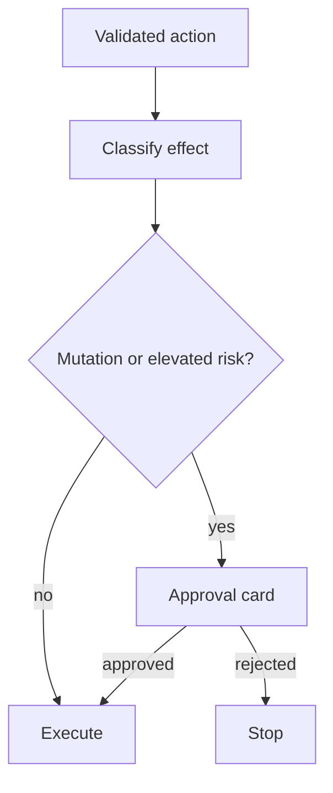

# Execution Safety And Gateway Boundaries

Execution starts only after the runtime has a trusted action plan. Trust can come from low-risk read-only checks or from explicit user approval.

Decomposition-driven execution is the default pacing for non-trivial tool
requests. Each validated step keeps hard safety in force: blocked commands,
deny rules, cwd validation, binding validation, policy checks, and gateway
boundaries remain authoritative.

## Safety Gate

## Gateway Boundary

The gateway owns shell interaction:

- command execution;
- terminal sessions;
- cancellation;
- working directory markers;
- platform-specific shell profile;
- optional managed LLM launcher process routes.

## Why Captured Output Matters

Captured output gives the runtime evidence for final answers. Detached terminal commands are useful, but they do not produce the same dataflow outputs for later actions.

Minimal reports and staged workflows both use captured output as repair
evidence. stdout, stderr, validation failures, and execution failures are
streamed to the user and passed back to the LLM only within the configured
retry budget.
