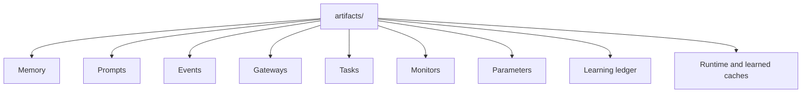
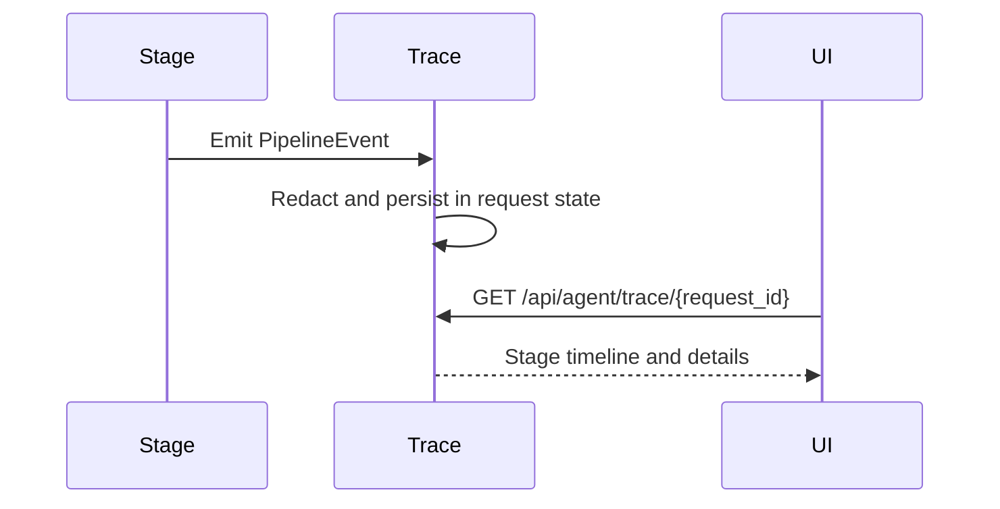

# Storage And Observability

OpenFabric uses small local SQLite stores for durable state and trace events
for runtime transparency.

## Storage Map

## Observability Flow

## What To Inspect

- request trace for model and runtime stage behavior;
- command capsules for execution evidence;
- generated route and storage references for code-level inventory;
- LRN-T/LR-T stats and clear routes for learned total-task structures;
- LR Direct/LR-EX command and computation replay cache behavior in trace
  events;
- learning ledger records for feedback-derived lessons, capability insights,
  and capability proposals;
- proposal trace events such as proposed, auto-approved, applied, failed-apply,
  rejected, and retired.

## Parameter Store Observability

Parameter Store records are stored in `artifacts/agent_parameters.db`.
List/get responses expose masked `value_json`, bounded `context_json`, schemas,
environment names, use counts, and audit metadata. Raw `value_json` appears
only after the audited reveal route or in execution-only runtime context.

`context_json` is intentionally visible as non-secret guidance, but prompt and
trace paths still use bounded/redacted summaries. SQL trace events show whether
stored schema, relation metadata, and bounded domain context were supplied to
the SQL LLM.

## Learned Cache Observability

LRN-T/LR-T events include lookup, hit, rejected-candidate, write, and
quarantine metadata in the request trace. The Agent UI renders concise grouped
learning summaries in final answers when LRN-T, LR Direct/LR-EX, or LRN writes
apply or do not meet thresholds. Examples include `LR-T applied`,
`LR-T not applied`, `LR-D applied`, and `LRN learned`. Raw ids and detailed
scores stay in trace details rather than the default final-answer footer.

The cache APIs expose `GET /api/agent/lrnt/stats`,
`POST /api/agent/lrnt/clear`, `GET /api/agent/cache/stats`,
`POST /api/agent/cache/clear`, and `POST /api/agent/lrdirect/clear`.
Clearing these caches does not remove approved memory, prompt templates,
Learning Ledger proposals, task records, or gateway settings.
