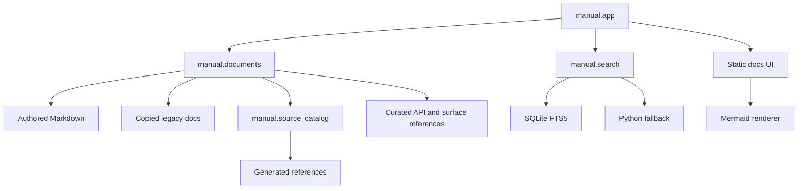

# Manual Service Architecture

The manual service is standalone. It is not proxied through the Agent UI server and defaults to port `8013`. It combines authored manuals, copied legacy docs, generated source references, generated route references, and curated current-state references such as System Surfaces And API Reference.

## Components

## API Surface

| Endpoint | Purpose |
| --- | --- |
| `GET /manual` | Single-page docs workspace |
| `GET /healthz` | Manual service health |
| `GET /api/manual/catalog` | Grouped document metadata |
| `GET /api/manual/document/{doc_id}` | Rendered document HTML |
| `GET /api/manual/search` | Search by query, tag, and kind |
| `GET /api/manual/tags` | Tag counts |
| `GET /api/manual/related/{doc_id}` | Related reading |

## Search Refresh

Search is built in memory at app creation. Restart the service or use reload mode to refresh generated references, curated route references, and search after source changes.
