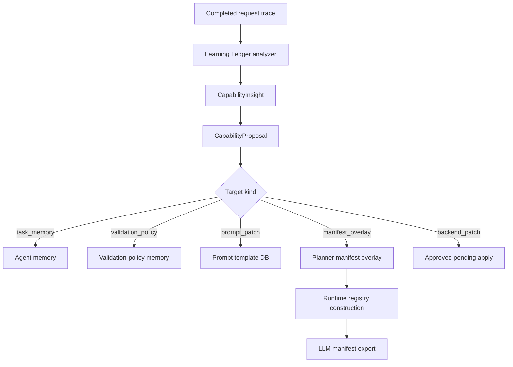

# Capability Evolution Architecture

The Capability Evolution Layer is a Learning Ledger extension. It converts
runtime evidence into typed improvement proposals that can be reviewed, safely
applied to local artifact stores, or held for explicit code work.

It is designed around one boundary:

> Learning can add guidance. It cannot bypass validation, approval, or execution policy.

This architecture is distinct from private learned runtime caches such as
LRN-T/LR-T total-task structures and LR Direct/LR-EX replay entries. Those
caches accelerate local reuse and can be cleared independently; they do not
create reviewable capability proposals by themselves.

## Data Flow



## Storage

All capability evolution records live in:

```text
artifacts/agent_learning_ledger.db
```

The store adds two tables beside existing run, action, cache, and lesson
tables:

| Table | Purpose |
| --- | --- |
| `capability_insights` | Normalized evidence from traces, validator failures, repaired actions, gaps, and feedback. |
| `capability_proposals` | Typed proposed changes, status, confidence, draft payload, safety decision, applied ref, and apply error. |

The ledger is local runtime state. It is not a tracked seed database.

## Models

`CapabilityInsight` records evidence:

- insight type;
- source request id;
- source stage and event;
- source error type;
- target kind and target id;
- prompt key;
- capability id;
- model, gateway, and cwd;
- summary and evidence;
- dedupe key.

`CapabilityProposal` records lifecycle state:

- target kind;
- status;
- title, summary, rationale;
- confidence;
- source;
- source request and insight ids;
- target id;
- draft payload;
- evidence;
- safety decision;
- auto-approved flag;
- applied ref;
- apply error;
- dedupe key.

## Analyzer Inputs

The analyzer runs after request evidence is recorded.

It currently drafts proposals from:

- `unresolved_shell_placeholder` validation errors;
- failed command followed by corrected success;
- capability gap metadata;
- structured LLM proposal metadata when supplied by the pipeline.

The analyzer records an insight first, then creates a proposal with a stable
dedupe key. Duplicate traces update evidence or return the existing proposal
instead of creating repeats.

## Application Paths

### Memory And Validation Policy

`task_memory` and `validation_policy` proposals apply through the existing
memory store. The proposal becomes active memory with provenance
`learning_ledger`.

Validation policies are stored as memory but retrieved only for matching
validator contexts.

### Prompt Patch

`prompt_patch` proposals apply through the prompt template store.

The applicator:

1. fetches the active prompt template;
2. inserts or replaces a proposal-specific marked block;
3. validates template syntax;
4. checks existing template variables are preserved;
5. stores rollback metadata with the previous body;
6. writes the new version to `artifacts/prompts.db`.

### Capability Manifest Overlay

`capability_manifest_overlay` proposals are stored in the ledger and marked
applied. During runtime construction, the registry reads approved overlays and
applies them before LLM-visible manifest export.

The registry only accepts additive planner-visible fields. Execution backend,
risk, read-only status, mutation status, confirmation status, schemas, and
operation ids remain unchanged.

### Executable Backend Patch

`executable_backend_patch` proposals are not applied by the ledger. Approval
sets `approved_pending_apply`. A maintainer must apply code explicitly, run
tests, and restart the runtime.

## Safety Policy

Proposal creation and approval block:

- approval bypass;
- validation bypass;
- confirmation bypass;
- sandbox bypass;
- unsafe policy language;
- credential-like strings;
- risk relaxation;
- executable hot-load language.

Auto-approval thresholds:

| Source | Threshold |
| --- | ---: |
| Deterministic | 0.72 |
| LLM | 0.85 |

Auto-approval only runs when learning ledger auto-learn is enabled. Executable
backend proposals never auto-apply.

## Registry Integration

Runtime construction calls the Learning Ledger store, reads applied manifest
overlays, and applies them to the default capability registry.

`CapabilityRegistry.planning_view()` preserves overlays so the planner sees the
same additive metadata that was loaded into the parent registry.

`export_llm_manifest()` includes `semantic_tags`, which allows overlays to
influence planning without mutating execution behavior.

## API And Trace Integration

API routes:

```text
GET   /api/agent/learning-ledger/proposals
GET   /api/agent/learning-ledger/proposals/{proposal_id}
PATCH /api/agent/learning-ledger/proposals/{proposal_id}
POST  /api/agent/learning-ledger/proposals/{proposal_id}/approve
POST  /api/agent/learning-ledger/proposals/{proposal_id}/apply
POST  /api/agent/learning-ledger/proposals/{proposal_id}/reject
POST  /api/agent/learning-ledger/proposals/{proposal_id}/retire
```

Trace events:

- `learning.proposal.proposed`;
- `learning.proposal.auto_approved`;
- `learning.proposal.applied`;
- `learning.proposal.apply_failed`;
- `learning.proposal.rejected`;
- `learning.proposal.retired`;
- `learning.proposal.approved_pending_apply`.

These events attach to the source request when a source request id is known.

## Maintainer Checklist

When extending this layer:

1. Add typed model fields before adding unstructured payloads.
2. Keep analyzer inputs redacted.
3. Create stable dedupe keys.
4. Add target-specific safety checks.
5. Keep prompt changes bounded and reversible.
6. Keep overlays additive and planner-only.
7. Keep executable code changes outside automatic learning.
8. Add tests for analyzer, safety, application, API, UI, and registry export.
