# Prompt Evolution From Input To Action

This guide follows one user prompt as it moves through OpenFabric. The useful
mental model is not "one prompt goes to one LLM." The prompt becomes a request
envelope, then a series of typed prompts, policy subjects, validators, approval
states, execution records, repair attempts, and final-response evidence.

The LLM is important, but it is not the runtime. The model proposes,
classifies, extracts, judges, drafts, repairs, and formats. The runtime owns
state, safety, validation, approvals, memory, terminal execution, and trace
records.

## The One-Screen Map

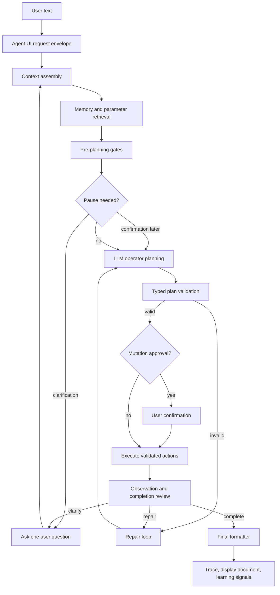

The runtime uses multiple prompts because each stage has a different job. A
classifier prompt should not write shell commands. A planner prompt should not
decide whether validation can be ignored. A final formatter should not invent
execution evidence. Keeping those duties separate is what makes the pipeline
debuggable.

## What "Prompt" Means Here

There are three different things people casually call a prompt:

| Term | Meaning | Example |
| --- | --- | --- |
| User prompt | The text the user typed. | `are there any changes in this repo?` |
| Runtime prompt | A model-facing instruction assembled by a stage. | `operator.plan`, `operator.policy_review`, `events.draft` |
| Prompt template | A versioned DB-backed template in `artifacts/prompts.db`, seeded from `src/agent_runtime/prompts/default_templates.json`. | `operator.plan` |

The user prompt is never simply handed to an all-powerful model with full
authority. It is wrapped in context, sent through specific typed contracts, and
checked by non-LLM validators.

## High-Level Stage Inventory

| Stage | Main owner | LLM involved? | What the LLM does | What runtime code still owns |
| --- | --- | --- | --- | --- |
| UI intake | Agent UI routes | Sometimes | Event/todo recognition may use typed extraction | Request IDs, trace records, settings, gateway context |
| Context assembly | Core orchestrator | No or indirect | None in the assembly itself | Mode, cwd, gateway, conversation, settings |
| Memory retrieval | Memory store and prompt helpers | Optional policy review later | Memory applicability can be judged by typed policy | Storage, status, scope, directive filtering |
| Clarification | Operator clarification mixin | Yes | Decides whether one user answer is needed, or resolves safe assumptions | Repetition guards, read-only guards, credential handling |
| Policy review | Operator policy module | Yes | Classifies policy subjects such as effect, memory question, stdout, verb | Cache keys, typed schema, skip notes, enforcement |
| Preflight helpers | Operator runtime | Sometimes | Drafts commit messages, event drafts, parameter matches, etc. | Evidence collection, approval state, protected payloads |
| Planning | Operator prompt builder | Yes | Produces `OperatorPlan` JSON with tasks and actions | Schema validation, capability registry, safety validators |
| Validation | Operator validation | Sometimes | Adjudicates narrow context-sensitive validation cases | Hard deny rules, schemas, cwd, bindings, risk, dataflow |
| Approval | Agent UI and trace store | No | None | User confirmation, trusted replay context |
| Execution | Step runner and gateway | No for shell execution | Generated Python/code may come from earlier LLM stages | Process execution, env, cwd, stdout/stderr, result store |
| Observation and repair | Repair control | Yes | Reviews failure/completion, proposes bounded repairs | Loop limits, approval envelope, completed mutation guards |
| Final response | Final formatter | Yes | Writes user-facing response from evidence | Trace, artifacts, citations to execution records |
| Learning | Learning Ledger and memory | Sometimes | Suggests lessons or proposals from run evidence | Approval, safety review, memory writes |

## Intake: From Text To Request Envelope

The Agent UI receives the typed text, selected gateway, terminal cwd, settings,
conversation ID, and any pending continuation state. The request becomes a
traceable envelope before the operator sees it.

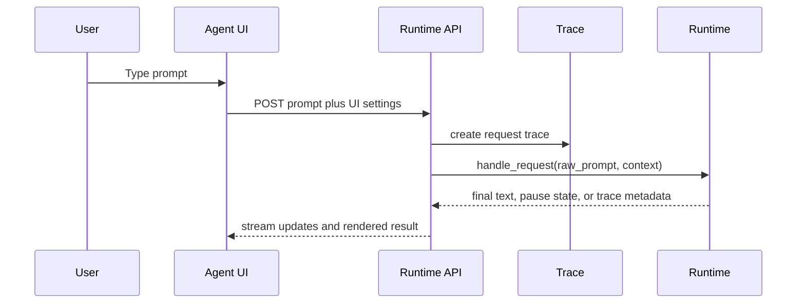

Important context assembled here includes:

| Context item | Why it matters |
| --- | --- |
| `agent_mode` | Selects standard, operator, or other runtime behavior. |
| `agent_clarification_mode` | Controls how aggressively clarification can be auto-resolved. |
| Gateway and cwd | Determines where commands would run. |
| Conversation context | Lets follow-ups refer to earlier turns without giving the model hidden state. |
| Runtime controls | Policy modes, output settings, confirmation behavior, and LLM endpoints. |
| Pending clarification or confirmation state | Lets one user answer resume a paused request. |

## Event And Todo Recognition

Natural-language scheduling is treated as a typed extraction problem. The UI
does not rely on browser regex as the authority. When events are enabled, the
server-side event draft path asks the typed `events.draft` LLM extractor whether
the prompt is a schedule, reminder, appointment, todo, or ordinary chat.

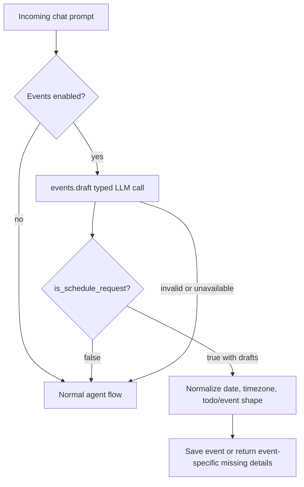

The LLM decides recognition. Runtime code still normalizes dates, timezones,
scheduled-vs-todo shape, notification text, and explicit context hints. A failed
recognition call falls through to normal chat rather than blocking the user.

## Context Assembly And Memory Retrieval

Memory is retrieved before it can influence prompts. It is not supposed to be a
magic command. A memory entry is durable guidance with metadata such as kind,
scope, task type, tool type, intent type, tags, and status.

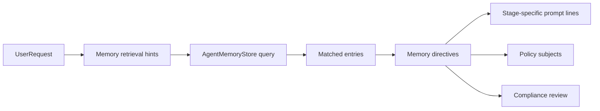

Memory can enter several stages:

| Stage | Memory role |
| --- | --- |
| Clarification | May propose that missing user input should be asked for. |
| Planning | Adds user-approved constraints and preferences. |
| Plan review | Checks whether the plan respected applicable memory. |
| Repair | Restores or filters directives around failed attempts. |
| Learning | Approved lessons can become new memory entries. |

## Is Memory Applied Correctly?

Memory is correct when it is conditional, scoped, and subordinate to the current
request. It is incorrect when a memory that applies to one operation leaks into
a different operation just because the same nouns appear.

The important distinction:

| User asks | Memory says | Correct behavior |
| --- | --- | --- |
| `stage and commit all changes` | Ask for commit message if missing. | Applies, but generated-message preflight may satisfy it. |
| `are there any changes in this repo?` | Ask for commit message if committing. | Does not apply. This is read-only status. |
| `list branches and commit counts` | Ask for commit message if committing. | Does not apply. This is history/reporting. |
| `commit these files` | Ask for commit message if missing. | Applies if no supplied or generated approved message exists. |

The current intended memory-question flow is:

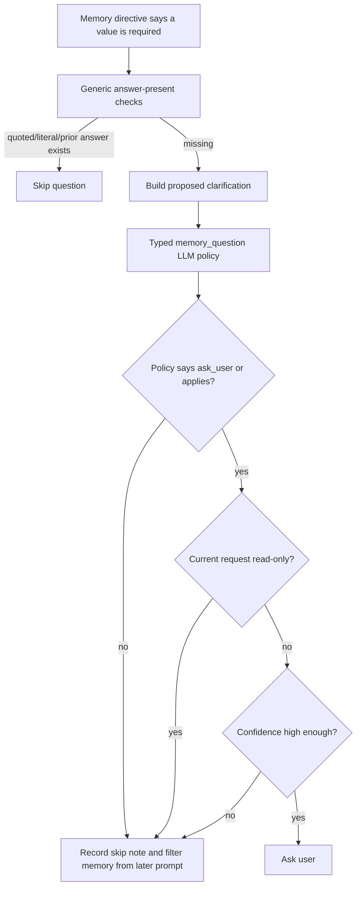

The read-only check is deliberately generic. It does not know about Git,
Docker, SQL, or any one tool. It asks: is the current request seeking status,
existence, counts, lists, summaries, inspection, or other information? If yes,
a memory cannot force a missing value needed only by a side-effect operation.

This matters because the LLM policy can still be over-eager. It may see shared
domain words and choose `ask_user`. The generic scope guard prevents that bad
policy verdict from turning a read-only request into an irrelevant pause.

## Clarification: The One-Question Gate

Clarification exists to avoid unsafe guessing, not to ask the user for facts the
runtime can discover. The operator tries hard to ask at most one useful question.

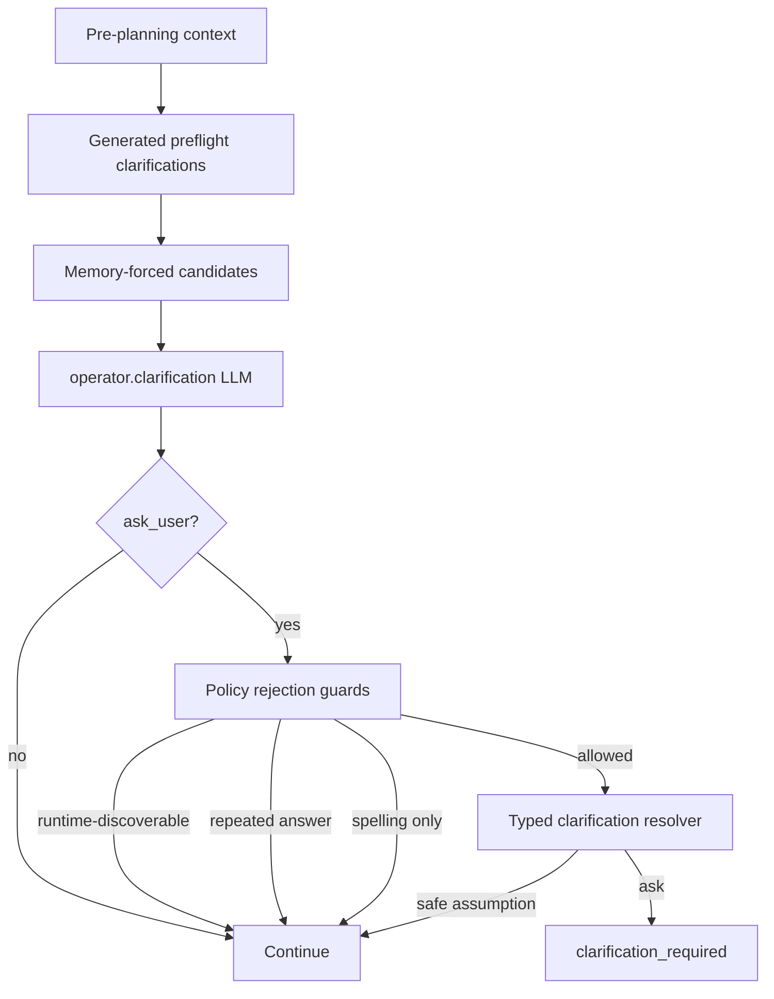

Clarification has multiple layers because each layer catches a different kind
of failure:

| Layer | Example problem it catches |
| --- | --- |
| Answer-present checks | The user already supplied the value in quotes or a literal payload. |
| Memory-question policy | A memory is unrelated to the current request. |
| Read-only scope guard | A memory asks for mutation input during an information request. |
| Discoverability guard | The model asks "which branch?" when it can run `git branch --show-current`. |
| Clarification resolver | The question can be answered by a safe assumption in balanced or auto-pilot mode. |

## Preflight Helpers And Custom Handling

There are custom preflight paths. The question is whether they are narrow
tool-specific hacks or reusable runtime contracts.

### Evaluation

| Area | Custom handling? | Evaluation |
| --- | --- | --- |
| Generated command arguments | No domain-specific preflight. | Generate-and-use flows should be represented as ordinary producer/consumer tasks with `input_bindings`; quoted user text should flow through generic literal payloads. |
| Event/todo recognition | Yes, through `events.draft`. | Good pattern: one typed extractor is the authority, deterministic code only normalizes safe post-processing. |
| Memory-forced clarification | Yes, but should be systemic. | Correct pattern is LLM applicability plus generic scope guards, not domain-specific exceptions. |
| Parameter Store credential picking | Yes. | Necessary because secrets and context must be separated and masked. |
| Online lookup and online AI context | Yes. | Should remain explicit and never silently auto-enable. |
| Validation policy feedback | Yes. | Useful when it creates auditable policy proposals, not hidden validator bypasses. |

The main architectural advice is:

- Prefer typed LLM stages over regex gates when classification is semantic.
- Prefer generic guards over tool-specific special cases.
- Keep prompt copy in the prompt DB.
- Keep executable authority in validators and gateway code, not in LLM text.
- Record skip notes when a memory or policy is rejected so later prompts do not
  reintroduce the same bad instruction.

## Case Study: Generated Then Used Values

A user can ask the ordinary agent to "generate a message and use it" or supply
the value in quotes. The runtime no longer has a Git-specific preflight for
that. Instead the planner expresses the workflow as normal actions:

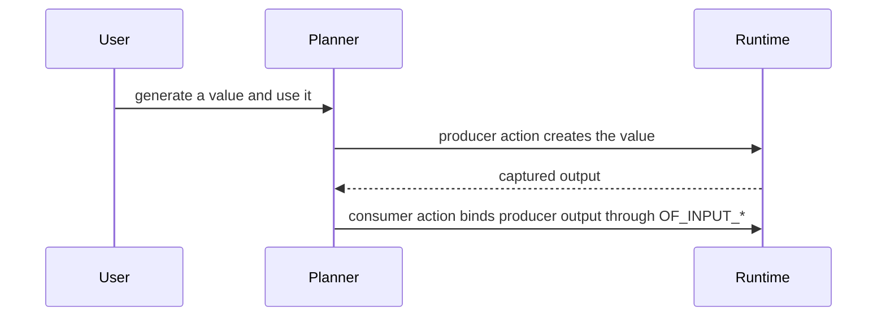

The key safety details are:

| Detail | Why it exists |
| --- | --- |
| Producer/consumer actions | Generated values are runtime evidence, not planner-invented literals. |
| `input_bindings` | Later shell actions consume generated values through `OF_INPUT_*`. |
| Literal payloads | Quoted user text is protected generically and can be used by any command. |
| Validators | The runtime still checks dataflow, mutation risk, and executable shape before running. |

## Planning: Turning Intent Into A Typed Action Graph

Once clarification is resolved, the operator planner builds an `OperatorPlan`.
The planner prompt includes the user request, memory directives that survived
scope filtering, parameter guidance, gateway context, literal payload summaries,
policy notes, online context if explicitly present, and prior execution or
failure context when repairing.

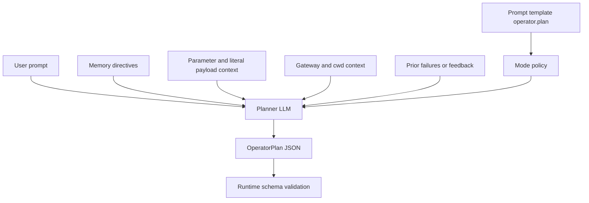

The planner LLM owns these decisions:

- task decomposition;
- action kind selection;
- shell command or Python code text;
- action dependencies;
- declared output shape;
- effect intent and risk labels;
- inputs and environment variable references;
- verification strategy.

The runtime still owns:

- whether the plan schema is valid;
- whether capability IDs exist;
- whether command patterns are allowed;
- whether inputs are bound safely;
- whether cwd and gateway constraints are respected;
- whether mutation approval is required;
- whether generated Python follows its contract;
- whether execution output proves the goal.

## Prompt DB: Where Runtime Prompt Text Lives

Prompt templates are seeded from `src/agent_runtime/prompts/default_templates.json`
into `artifacts/prompts.db`. Runtime code calls helpers such as `prompt_lines`
or `render_prompt` to assemble the actual model-facing text.

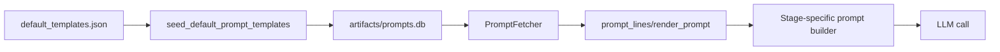

The prompt DB makes prompt changes inspectable and editable without hiding
strings inside unrelated control flow. It also means a long-running Python
server may need a restart to load code changes, while DB prompt changes are
available through the fetcher path after seeding or process initialization.

## Validation: The Runtime Says "Prove It"

Validation is where model output becomes accountable. The LLM may propose a
plan, but validators decide whether it can move.

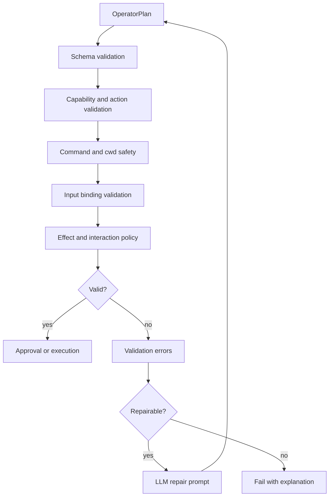

Some validation cases can invoke a typed LLM adjudicator, but that is scoped.
It is for context-sensitive questions such as whether a string is a literal
payload false positive. It is not a permission slip to ignore hard safety
rules.

## Approval And Trusted Replay

When a plan mutates state or requires confirmation, the UI receives a
confirmation card. The user approval is stored and replayed with trusted context
so the runtime can continue from the validated plan rather than asking the LLM
to re-invent the whole thing.

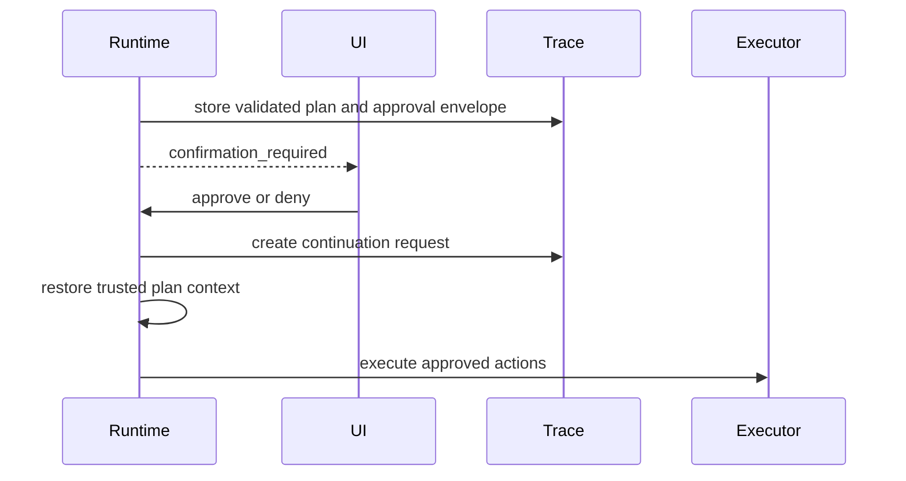

This is separate from generated-message approval. A user may approve a generated
commit message and still later approve or reject the actual mutating commit
plan.

## Execution: Commands Are Not Model Calls

Shell commands and Python actions execute through the gateway and step runner.
The LLM does not run them. The runtime prepares cwd, environment variables,
stdin policy, timeout, interaction mode, and output capture.

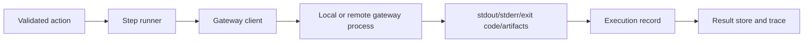

The execution record becomes evidence. Later stages should quote or summarize
that evidence, not invent new outcomes.

## Observation, Repair, And Completion

After execution, the runtime asks whether the observed evidence satisfies the
goal. If not, it can repair. Repair is bounded by attempt limits and approval
envelopes.

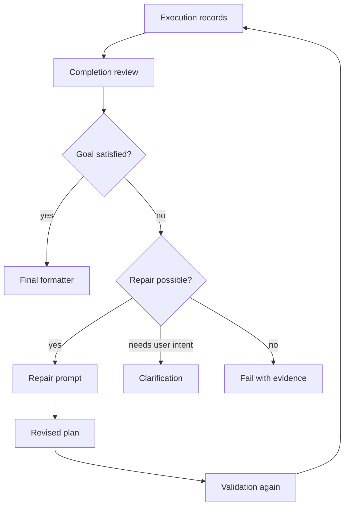

Repair prompts can use:

- validation errors;
- failed stdout and stderr;
- completed execution records;
- memory directives that still apply;
- the original user request as background;
- approval envelope limits.

Repair prompts should not repeat successful mutations, erase requested
mutations, or verify against stale pre-mutation state.

## Final Formatting

Final formatting is a model stage when enabled, but it is evidence-bound. It
receives bounded execution records, result summaries, display document hints,
and online context only when that context was explicitly produced.

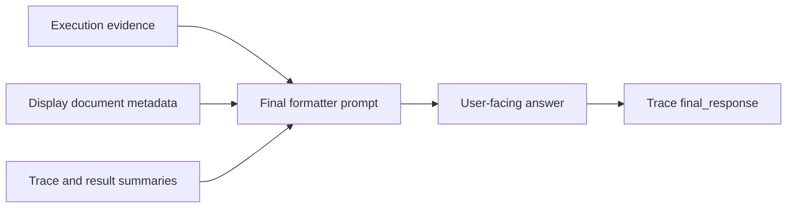

The final formatter should explain what happened, surface relevant outputs, and
avoid claiming work that did not execute.

## Learning Ledger And Feedback

Feedback can become durable guidance, but only after review. The Learning
Ledger records run evidence and can propose memory, validation policy, prompt
guidance, planner manifest overlays, or backend patch work.

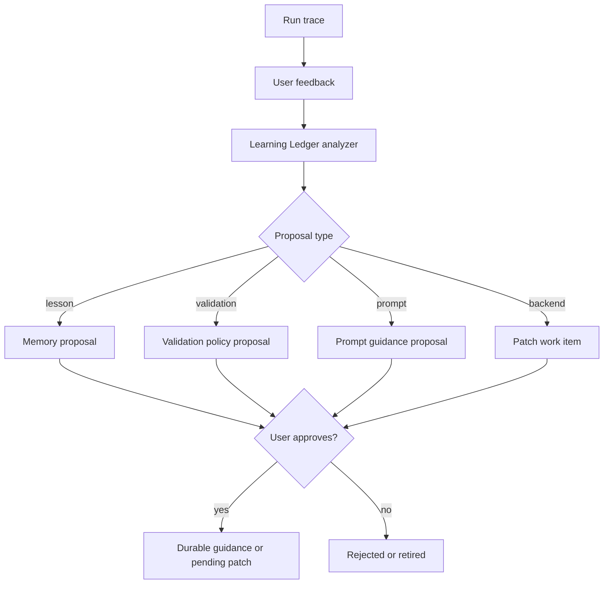

The learning path is intentionally slower than one-off execution. It is a way
to make future runs better without silently changing safety policy.

## Where The LLM Is Involved

This table is the compact reference for model involvement.

| Prompt key or stage | Input | Output | Authority boundary |
| --- | --- | --- | --- |
| `events.draft` | User prompt, timezone, scheduling context | Event/todo draft response | LLM recognizes intent; runtime saves only valid drafts. |
| `operator.policy_review` | Policy subjects | `OperatorPolicyReviewResult` | LLM judges policy subject; runtime can still skip or enforce. |
| `operator.clarification` | Request context and schema | `OperatorClarificationDecision` | LLM proposes ask/continue; runtime guards discoverability and scope. |
| Clarification resolver | Proposed question, mode, risk flags | assumptions, selected entities, or user question | LLM may avoid needless question; validation and approvals remain. |
| Self brief | Request and context | concise internal brief | LLM frames goal, risks, evidence needs. |
| `operator.plan` | Context, memory, parameters, prompt | `OperatorPlan` | LLM writes plan; validators decide if usable. |
| Plan review | Plan, request, memory | review result | LLM critiques plan; runtime enforces validation. |
| Validation adjudication | Narrow validation failure | adjudication | LLM can resolve context-sensitive false positive only. |
| Repair | Failure evidence and previous plan | revised plan | LLM proposes repair; validation and approval repeat. |
| Completion review | Execution evidence | complete/needs more actions | LLM judges evidence; runtime loop limits apply. |
| Final formatter | Evidence and display hints | final answer | LLM explains results; cannot invent execution. |

## Why Loops Exist

The pipeline loops because local work is evidence-driven. A first plan can be
valid and still fail at runtime. A command can succeed but output nothing. A
repair can need fresh confirmation. A memory can be skipped early and should
not reappear later.

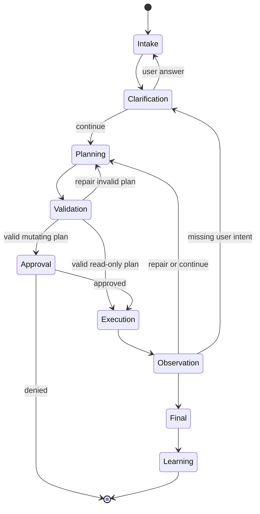

The loops are not model indecision. They are deliberate checkpoints where the
runtime can incorporate new evidence.

## Practical Debugging Questions

When a prompt behaves strangely, ask these in order:

1. Which stage produced the behavior?
2. Was the text user prompt, prompt template, memory, policy note, or execution evidence?
3. Did a typed LLM call produce a bad decision, or did deterministic runtime code skip the wrong guard?
4. Was a stale server process still running old code?
5. Did a skipped memory get filtered out of later prompt lines?
6. Did the planner receive a protected payload or raw user text?
7. Did validation fail, repair, or get bypassed by a continuation path?
8. Did final formatting summarize real execution records?

## Design Guidance

The healthy pattern is:

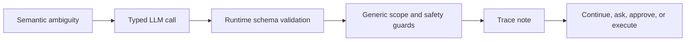

Avoid this pattern:

The runtime should use the LLM where language is fuzzy, then use generic guards
where safety or workflow boundaries are crisp. Memory is useful when it is
applied through that same discipline: relevant, scoped, auditable, and never
stronger than the current user request.
