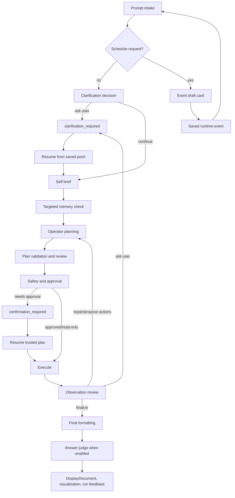

# Request Lifecycle

This document explains the current request lifecycle stage by stage.

It focuses on the typed runtime path used by the local Agent UI. Compatibility
request surfaces route through the same runtime, but they do not expose every UI
feature such as command capsules, memory editing, terminal input, and
conversation controls.


## Lifecycle At A Glance




## Shared LLM Usage Pattern

LLM-assisted stages follow the same pattern:

1. build a small stage-specific prompt;
2. include targeted memory guidance when available;
3. ask for typed JSON or strict code shape;
4. validate the response with Pydantic models and structural checks;
5. reject malformed proposals or ask for bounded repair when appropriate;
6. trust only the deterministic validated result.

If the model returns JSON that is close but fails the target schema, the shared
structured-call layer can ask for one schema-only repair. That repair prompt
contains the expected schema, invalid payload, and Pydantic errors, and it
explicitly tells the model not to re-answer the user task.

The LLM is responsible for semantic authorship. The runtime is responsible for
typed contracts, safety, and execution.


## 0. Prompt Intake

**Where:** `src/agent_runtime/api/agent_ui.py`,
`src/agent_runtime/api/app.py`

**Purpose**

Convert the incoming Agent UI or compatibility payload into a prompt and
runtime context.

**Inputs**

- prompt text;
- workspace root;
- Agentic, Conversational, or Advisory mode;
- final response mode;
- agent display name;
- memory and clarification settings;
- terminal session id and cwd when available;
- conversation id;
- cancellation state.
- selected gateway and per-gateway terminal cwd;
- event context when a scheduled event launched the request;
- runtime controls such as Auto-Approve Commands.

**Outputs**

- prompt text;
- context passed to `AgentRuntime.handle_request(...)`.

**LLM step:** No


## 1. Clarification Decision

**Where:** `src/agent_runtime/operator/pipeline.py`,
`src/agent_runtime/core/orchestrator.py`

**Purpose**

Let the LLM ask one user-facing question before planning if user intent is
missing and the selected clarification mode calls for asking.

**Allowed outcomes**

- continue;
- ask one clarification question with exactly three suggested options plus UI
  freeform Other.

**Important rule**

The LLM should not ask about discoverable local facts such as current branch,
cwd, installed environments, Docker images, file lists, versions, command
output, or repository status. It should inspect those facts with read-only
actions.

**Runtime checks**

- typed `clarification_required` shape;
- max clarification rounds;
- saved pause state for resume.


## 2. Self Brief

**Where:** `src/agent_runtime/operator/pipeline.py`

**Purpose**

Ask the LLM to generate a compact request brief before planning. The brief
captures task type, tool type, intent type, relevant tags, risks, likely
terminal needs, and known constraints.

**Why it exists**

The self-brief gives later stages a stable task classification and makes memory
retrieval targeted instead of broad.


## 3. Targeted Memory Check

**Where:** `src/agent_runtime/core/orchestrator.py`,
`src/agent_runtime/memory/`

**Purpose**

Retrieve relevant persistent memory after the request has enough
classification context.

**Retrieval priority**

1. exact active model;
2. model family;
3. global.

**Relevance checks**

- task type;
- tool type;
- intent type;
- tags;
- request text overlap;
- active status only.

The retrieval context can be enriched by deterministic hints. For example,
stage/commit/push/repo language promotes an otherwise generic prompt to the
Git domain so Git memories can be considered, while a phrase like "stage the
presentation" remains generic.

Diagnostic searches and UI previews do not increment usage. Memory applied to a
real request increments `use_count`.

**LLM step:** No for retrieval, yes for memory draft/optimization endpoints.

Applied memory is converted into runtime-only directives. Operator plans and
cache hits can be checked for memory compliance before deterministic validation
continues.


## 4. Operator Planning

**Where:** `src/agent_runtime/operator/pipeline.py`

**Purpose**

Create one or more operator actions for ordinary work.

Current operator kinds:

- `shell_command`;
- `python_action`;
- `python_transform`.

The planner may also decide to finalize from existing context or ask for
clarification if user intent is required.

**Runtime checks**

- known action kind;
- unique ids;
- dependencies exist;
- input bindings are valid;
- no cycles;
- no unresolved placeholders;
- interaction and execution modes are valid.


## 5. Deferred Python Code Generation

**Where:** `src/agent_runtime/operator/pipeline.py`,
`src/agent_runtime/input_pipeline/argument_extraction.py`

**Purpose**

When Python depends on upstream output, the plan may omit final code at planning
time. The runtime executes upstream actions first, then asks the LLM for Python
code using a bounded preview of the real input shape.

`python_action` code must start with:

```python
def main(inputs):
```

`python_transform` code must start with:

```python
def transform(inputs):
```

**Repair packet includes**

- exact validation failure or exception;
- generated code;
- input preview;
- upstream stdout/stderr/output preview;
- original user goal;
- previous repair attempts.


## 6. Plan Validation And Review

**Where:** `src/agent_runtime/operator/pipeline.py`,
`src/agent_runtime/input_pipeline/planning_review.py`

**Purpose**

Validate the plan and optionally ask the LLM to review for obvious logical
gaps.

**Biases**

- verification should test the actual user goal;
- verification should not contradict itself;
- if a verification command is harder than the task, simplify it;
- successful source rows or computed artifacts must not disappear from the
  final answer.

**Runtime checks**

- review output cannot directly execute;
- any revised plan is revalidated from scratch;
- repeated same-shape validation failures stop cleanly.
- memory compliance review can request one repair pass when high-confidence
  directives are violated.
- cache hits are checked against current memory so stale cached plans do not
  bypass newer user-approved instructions.


## 6b. Dynamic Validation Adjudication

**Where:** `src/agent_runtime/operator/pipeline.py`,
`src/agent_runtime/memory/`

**Purpose**

Keep deterministic validation strict while allowing a scoped LLM adjudication
step for marked context-sensitive errors, such as placeholder-looking text that
is actually literal source payload.

**Allowed decisions**

- allow literal payload;
- require repair;
- block;
- ask user.

Hard safety checks remain non-overridable. Validation-policy memories are
retrieved separately from normal memory and only for matching validator error,
task, tool, and intent context.


## 7. Safety And Approval

**Where:** `src/agent_runtime/execution/safety.py`,
`src/agent_runtime/operator/pipeline.py`

**Purpose**

Decide whether execution is allowed and whether approval is required.

**Runtime checks**

- registered operation;
- command safety;
- cwd/workspace bounds;
- mutating vs read-only classification;
- Python risk;
- terminal requirement;
- confirmation requirement.

Read-only shell commands can execute without approval. Mutating or risky
commands pause and wait for approval.

If Auto-Approve Commands is enabled, the UI or scheduler submits the existing
confirmation approval through the same confirmation endpoint. The runtime still
creates the confirmation state first.


## 8. Execution

**Where:** `src/agent_runtime/execution/engine.py`

**Purpose**

Execute trusted DAG nodes.

**Runtime work**

- execute nodes in dependency order;
- send shell actions to gateway `/exec` or `/exec/stream`;
- send prompt-shaped shell commands to the Agent UI terminal when required;
- start terminal-detached commands for long-running terminal-owned work;
- run Python actions/transforms as local trusted operator code;
- populate result store and data refs;
- stream stdout/stderr/result output to the Agent UI.


## 9. Observation Review

**Where:** `src/agent_runtime/operator/pipeline.py`

**Purpose**

Review the result after execution, whether actions succeeded or failed.

The LLM can decide to:

- finalize;
- propose more actions;
- repair failed actions;
- ask the user for intent;
- fail with evidence.

Observation review replaces older drift where success-only completion review
and error-only repair had separate behavior.


## 10. Code-Only Repair For Deferred Python

**Where:** `src/agent_runtime/operator/pipeline.py`

**Purpose**

If deferred Python fails structurally, throws an exception, or produces a
suspicious zero/empty result from non-empty input, the runtime first attempts a
focused code-only repair before falling back to broader plan repair.

This keeps a good plan from being discarded because one generated Python body
was malformed.


## 11. Final Formatting And Answer Judge

**Where:** `src/agent_runtime/output_pipeline/`,
`src/agent_runtime/operator/final_formatter.py`

**Purpose**

Produce a concise final answer from operator outputs without duplicating raw
capsule output unnecessarily.

Modes:

- Detailed: compose a richer final answer.
- Simple: return a short completion/result summary and rely more on capsules.

Scheduled event runs force detailed final composition so Event History has a
useful result summary even when the user normally prefers Simple mode.

Streaming decomposition can add visible stepwise execution before this final
stage. For non-trivial Agentic work, the runtime asks for granular subtasks,
validates and executes one scoped task/action, streams real evidence, and then
continues with that evidence available to the next step.

When enabled, the answer judge checks that required artifacts are present. For
example, if the user asked to list rows, an empty final table is not acceptable
when the source command produced rows.


## 12. Display, Feedback, And Memory Proposals

**Where:** `src/agent_runtime/api/static/agent_ui/`,
`src/agent_runtime/memory/`

**Purpose**

Render the final response and let the user turn post-run feedback into durable
memory.

The feedback flow captures a typed object containing:

- outcome;
- prompt;
- request id;
- run status;
- final response;
- error when present;
- model name;
- applied memory ids and counts.

The LLM can draft editable feedback text or propose memory entries, but
LLM-authored memory remains proposed until the user applies it.

Feedback can become task memory, preference memory, or validation-policy memory.
Workflow advice such as "empty `docker ps` output means no containers" should
be stored as task memory rather than validator policy.


## Persistent Event Branch

When a prompt looks like a schedule request, the UI first calls the event draft
endpoint. If the draft says it is not a schedule request, the normal request
flow continues. If it is a schedule request, the UI shows editable event drafts
instead of executing the task immediately.

Saved events store:

- title and prompt to run;
- interval schedule;
- selected gateway and node;
- terminal cwd;
- model and operator settings;
- auto-approve confirmation preference;
- run history.

The scheduler poller launches due events through the same `_run_agent_request`
path as normal prompts. It does not backfill every missed interval after
restart; overdue active events run once and then compute the next interval.
Overlapping runs for the same event are prevented and marked as skipped or
delayed.


## Conversational Branch

When Conversational mode is enabled, the request context uses a conversation id.

The runtime first decides whether the follow-up can be answered from prior
context or whether it needs new operator actions. New actions use the same
clarification, memory, validation, safety, approval, execution, observation,
and rendering path as Agentic mode.


## The Most Important Pattern

Across the lifecycle, the same rule repeats:

1. use the LLM for semantic authorship when meaning is fuzzy;
2. use memory as targeted advisory context, not proof;
3. validate proposals against typed contracts;
4. execute only trusted actions;
5. repair with concrete evidence;
6. ask the user only for intent, not discoverable facts;
7. show enough trace and visualization to explain what happened;
8. store reusable memory and scheduled events separately from local runtime
   history and caches.
