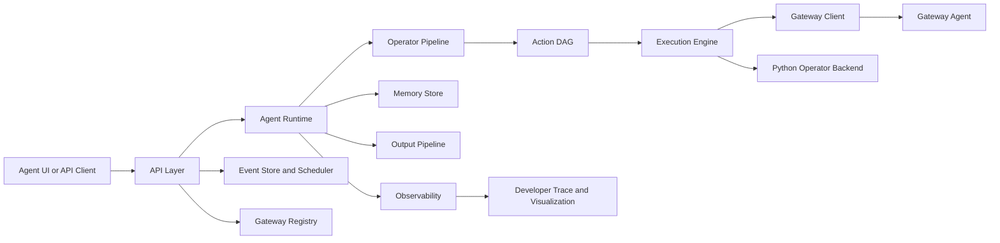

# Components And Boundaries

This document explains the major subsystems, what each one owns, and where the
hard boundaries are.

## Top-Level Boundary Map

## Component Summary

| Component | Main Location | Owns | Does Not Own |
| --- | --- | --- | --- |
| API layer | `src/agent_runtime/api/` | HTTP routes, request state, confirmation/clarification resume, settings, memory/events/gateway endpoints | semantic interpretation |
| Agent UI assets | `src/agent_runtime/api/static/agent_ui/` | browser UI, chat controls, Settings/Memory/Gateway/Events drawers, trace/visualization display, terminal, command capsules | runtime trust decisions |
| Agent runtime | `src/agent_runtime/core/orchestrator.py` | end-to-end orchestration, stage order, memory attachment | raw shell execution |
| Operator pipeline | `src/agent_runtime/operator/` | self-brief, clarification, planning, validation, observation, repair, conversational decisions | bypassing safety |
| Capability registry | `src/agent_runtime/capabilities/` | trusted manifests for `runtime.*` and `operator.*` | free-form tool invention |
| Persistent memory | `src/agent_runtime/memory/` | SQLite schema, retrieval, audit, proposals, prompt helper | overriding current user intent |
| Persistent events | `src/agent_runtime/events/` | event schema, schedule persistence, run history, due-event acquisition | bypassing runtime execution |
| Gateway registry | `src/agent_runtime/gateways/` | durable gateway records, health state, per-gateway cwd | command execution |
| Execution engine | `src/agent_runtime/execution/` | trusted DAG execution and result bundles | prompt interpretation |
| Output pipeline | `src/agent_runtime/output_pipeline/` | final formatting, display documents, renderers | environment access |
| Observability | `src/agent_runtime/observability/` | trace events, safe previews, profiling, stage cards | changing trusted decisions |
| Gateway agent | `src/gateway_agent/` | bounded local command execution, streaming, terminal PTY, cancellation | user intent |
| Local LLM tooling | `src/llm/` | vLLM launch scripts and benchmarks | runtime planning policy |

## API Layer

**Main files:** `src/agent_runtime/api/app.py`,
`src/agent_runtime/api/agent_ui.py`

### Responsibilities

- expose `/healthz`;
- serve `/agent-ui`;
- accept `/api/agent/request`;
- stream request events and command output;
- expose request traces and raw payloads;
- store pending confirmation state;
- store pending clarification state;
- replay approved or clarified requests;
- deny or cancel pending work;
- preserve conversation ids for Conversational mode;
- expose Settings, Memory, Events, Gateway, model, terminal, runtime-control,
  cache, and restart endpoints;
- draft and persist scheduled events;
- start the in-process event scheduler;
- store gateway registry entries and per-gateway terminal cwd;
- forward stop requests to the runtime and gateway.

### Boundary

The API layer does not decide whether a command is safe. It preserves state and
delegates trust decisions to the runtime.

## Agent UI

**Directory:** `src/agent_runtime/api/static/agent_ui/`

### Responsibilities

- display conversation history and final responses;
- show Agentic, Conversational, and Advisory controls and Quick controls -> Agent behavior ->
  Answers for Detailed/Simple final responses;
- expose workflow execution controls that keep Agentic work decomposed and
  streaming by default;
- provide New Chat, Stop, Clear, Restart, Apply, and Reset controls;
- show inline confirmation and clarification controls;
- show Modify Memory and Run Feedback flows;
- show collapsible command output capsules inline with the conversation;
- host the trusted interactive terminal pane;
- host the vLLM launch terminal in Settings;
- show separate resizable Settings, Memory, Gateway, and Events drawers;
- show trace, progress, and Mermaid visualization when enabled;
- show event draft cards, event editor, scheduled event list, and Event
  History;
- show gateway status cards, active gateway details, and gateway-specific
  terminal cwd;
- autosave terminal workspace on browser close and gateway switch;
- persist UI preferences in browser storage.

### Boundary

The UI does not validate runtime safety and does not treat memory as trusted
evidence. It renders structured state returned by the API.

## Agent Runtime Orchestrator

**Main file:** `src/agent_runtime/core/orchestrator.py`

### Responsibilities

- run the request lifecycle;
- manage Agentic vs Conversational mode;
- coordinate clarification and confirmation pauses;
- attach targeted persistent memory after self-brief classification, including
  deterministic Git/Docker hints when the LLM classification is generic;
- build and execute trusted operator plans;
- coordinate cancellation;
- collect profiling;
- call final formatting and rendering;
- emit trace events.

### Boundary

The orchestrator owns control flow, not every low-level policy. Detailed rules
live in operator validation, manifests, safety policy, memory retrieval, and the
gateway.

## Operator Pipeline

**Directory:** `src/agent_runtime/operator/`

### Responsibilities

- generate self-briefs;
- decide whether clarification is needed;
- plan shell/Python operator actions;
- validate dependency graphs and input bindings;
- check plans and cache hits against actionable memory directives;
- normalize terminal-prompting shell actions;
- run dynamic validation adjudication only for marked context-sensitive
  validator errors;
- generate deferred Python after upstream output exists;
- execute decomposed tasks step by step, feeding real evidence into the next
  operator decision;
- run plan review and observation review;
- run code-only repairs and broader execution repairs;
- make Conversational follow-up decisions;
- enforce raw-output context limits for conversations.

### Boundary

The operator pipeline proposes trusted artifacts, but it does not execute shell
commands directly and cannot bypass approval.

## Capability Registry

**Directory:** `src/agent_runtime/capabilities/`

### Responsibilities

- define manifests for `runtime.*`;
- define manifests for `operator.shell_command`;
- define manifests for `operator.python_action`;
- define manifests for `operator.python_transform`;
- declare argument schemas, risk fields, interaction modes, execution modes,
  and execution backends.

### Boundary

The default LLM-visible registry does not expose ordinary legacy filesystem,
shell, system, data, markdown, or placeholder SQL capabilities. Ordinary work
uses operator-backed actions.

## Persistent Memory

**Directory:** `src/agent_runtime/memory/`

### Responsibilities

- initialize and migrate the SQLite schema;
- create, edit, retire, restore, list, and audit memory entries;
- store LLM-generated proposals until the user applies them;
- retrieve relevant active memories by model scope, task/tool/intent/tags, and
  request text;
- keep validation-policy retrieval separate from task/preference memory;
- expose retrieval diagnostics, match reasons, and runtime directives;
- increment use counts only when memory is applied to a request;
- provide bounded advisory prompt snippets.

### Boundary

Memory does not execute work, lower risk, skip confirmation, or override live
runtime evidence. It is advisory context for the LLM.

## Persistent Events

**Directory:** `src/agent_runtime/events/`

### Responsibilities

- store scheduled event records in SQLite;
- store event run history and request/trace links;
- acquire due active events without overlapping runs for the same event;
- compute the next interval after each run or restart;
- record skipped, failed, running, completed, clarification, and confirmation
  states;
- provide typed create/update/delete/list models to the API.

### Boundary

Events do not execute directly. They launch saved prompts through the same
request runner, validation, memory, gateway, approval, and formatting path as
manual requests.

## Gateway Registry

**Directory:** `src/agent_runtime/gateways/`

### Responsibilities

- persist user-configured gateway endpoints;
- track enabled/disabled state and health details;
- preserve the last selected gateway;
- store per-gateway terminal cwd/workspace;
- supply gateway context for request execution and terminal sessions.

### Boundary

The registry describes reachable gateways. It does not run commands and does
not decide command safety.

## Execution Engine

**Directory:** `src/agent_runtime/execution/`

### Responsibilities

- execute a trusted DAG in dependency order;
- route shell actions through the gateway;
- stream stdout and stderr events;
- route may-prompt shell commands through the Agent UI terminal when needed;
- start terminal-detached long-running commands;
- execute Python actions/transforms locally;
- store outputs and data refs;
- return a `ResultBundle`.

### Boundary

The execution engine assumes planning is already trusted. It does not interpret
the original prompt.

## Output Pipeline

**Directory:** `src/agent_runtime/output_pipeline/`

### Responsibilities

- normalize results into shapes;
- ask for optional final formatter code;
- execute formatter code locally;
- build a structured `DisplayDocument`;
- render concise final markdown/text;
- avoid duplicating stdout already shown in command capsules;
- support Detailed and Simple final response modes;
- run deterministic fallback output when formatter/display advice fails.

### Boundary

The output pipeline does not re-run actions and does not invent unavailable
results.

## Gateway Agent

**Directory:** `src/gateway_agent/`

### Responsibilities

- execute shell commands locally on the gateway host;
- stream stdout and stderr;
- track active execution ids;
- cancel active process groups;
- provide websocket PTY terminal sessions;
- detect terminal prompts and surface input-required events;
- enforce node matching and timeout behavior.
- expose gateway-managed local LLM start/stop/status/log endpoints;
- restart itself when requested by the local runtime.

### Boundary

The gateway receives concrete validated commands. It does not receive raw user
intent as authority.

## Observability

**Directory:** `src/agent_runtime/observability/`

### Responsibilities

- emit request, stage, validation, LLM, memory, approval, execution, terminal,
  scheduled-event, visualization, and profiling events;
- redact or bound sensitive previews;
- format trace cards for the Agent UI;
- expose safe runtime profiling data such as stage timings, LLM retry groups,
  longest stage/call, and final status;
- make failures explainable.

### Boundary

Observability explains what happened. It does not repair or mutate trusted
runtime state.

## Confirmation And Clarification State

**Main files:** `src/agent_runtime/api/agent_ui.py`,
`src/agent_runtime/core/orchestrator.py`

### Responsibilities

- detect plans that require approval;
- return `confirmation_required`;
- preserve the trusted pending plan;
- resume execution on approval;
- auto-submit approval only when Auto-Approve Commands or a saved event's
  auto-approve setting is enabled;
- discard pending plans on denial;
- return `clarification_required`;
- preserve operator pause state and completed records where possible;
- resume with the user's answer as an explicit constraint.

Read-only actions can run without confirmation. Mutating or risky actions
remain approval-gated. Clarifications ask for user intent, not discoverable
local facts.

## The Four Most Important Boundaries

### 1. Meaning vs Trust

The LLM proposes meaning, actions, memory drafts, and repairs. The runtime
decides what becomes trusted.

### 2. Trusted Plan vs Environment

Only a validated action plan reaches execution. Shell work reaches the machine
through the gateway or terminal session.

### 3. Memory vs Evidence

Memory is a useful hint, but live stdout/stderr, user instructions, validation,
and approval policy always override it.

### 4. Schedule vs Execution

An event schedule decides when to run. The normal runtime still decides whether
the resulting actions are valid, safe, and approved.
