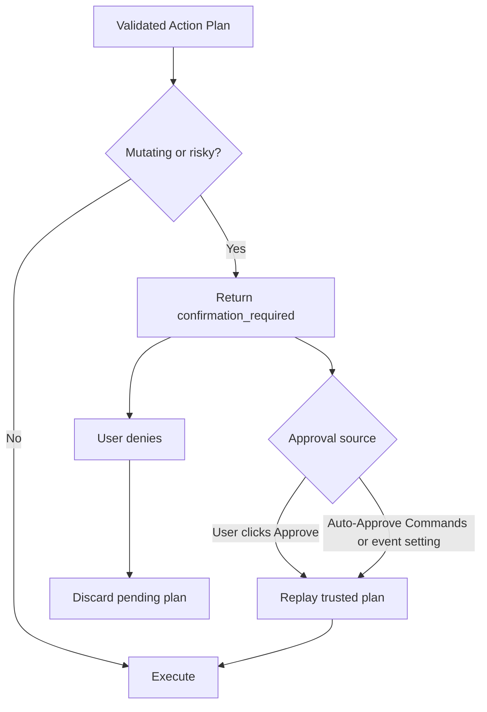
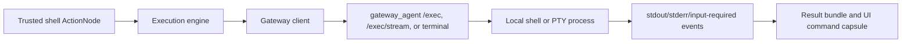

# Capabilities, Safety, And Gateway

This document explains the current executable surface, how safety policy gates
it, and how shell commands reach the real environment.


## Current Capability Surface

The default LLM-visible registry is intentionally small.

Ordinary work uses:

- `operator.shell_command`
- `operator.python_action`
- `operator.python_transform`

Runtime self-inspection uses deterministic `runtime.*` capabilities:

- `runtime.describe_capabilities`
- `runtime.describe_pipeline`
- `runtime.show_last_plan`
- `runtime.explain_last_failure`

Older ordinary capability families are no longer the default planning surface
for normal prompts. Filesystem, shell, system, data, markdown, and placeholder
SQL behavior is represented through operator-authored commands and Python
operators unless the request is explicitly runtime introspection.


## `operator.shell_command`

`operator.shell_command` represents a concrete shell command authored by the
LLM and validated by the runtime.

The action contract includes:

- command;
- cwd;
- inputs;
- input bindings;
- declared output shape;
- risk;
- timeout;
- reason;
- interaction mode;
- execution mode;
- dependencies.

The runtime checks:

- command is concrete;
- no unresolved placeholders such as `{{container_name}}`;
- literal source/file payloads that look like placeholders are only allowed
  through scoped context-sensitive validation adjudication;
- cwd is allowed;
- command risk is classified;
- read-only commands can run without approval;
- mutating commands require approval;
- prompt-shaped commands are routed to a terminal when needed;
- shell execution goes through the gateway.

Streaming decomposition changes how evidence is gathered, not authority.
Agentic mode validates and executes one scoped task/action at a time, then
feeds real outputs into the next step. Every step still uses the same command
contract and safety checks.


## Shell Interaction Modes

Shell commands can be:

- `non_interactive` - normal captured commands.
- `may_prompt` - finite commands that may ask for passphrase, password,
  credentials, confirmations, or a controlling TTY.
- `long_running` - terminal-owned commands intended to keep running.

Execution modes:

- `captured` - runtime captures stdout/stderr into result records.
- `terminal_detached` - command is started in the Agent UI terminal and is not a
  downstream dataflow source.

If the LLM forgets to mark a known prompt-shaped command as `may_prompt`, the
runtime normalizes it before validation/execution. This covers common SSH, Git,
GitHub CLI, Docker/Podman login and push/pull, cloud login, package publishing,
Hugging Face, W&B, GPG, and password-store shaped commands.


## `operator.python_action`

`operator.python_action` represents a trusted local Python program.

The code must define:

```python
def main(inputs):
    ...
```

Use it when Python should do the whole job: run subprocesses, inspect files,
parse output, calculate totals, manipulate data, and return a final result.

Python actions are approval-gated by risk. A high-risk Python action that writes
files, deletes data, removes environments, pushes code, or mutates local state
requires approval just like a mutating shell command.


## `operator.python_transform`

`operator.python_transform` represents a Python function over declared inputs.

The code must define:

```python
def transform(inputs):
    ...
```

Use it when the Python step primarily transforms previous action output into a
cleaner result.

Python transforms can use normal local Python capabilities where allowed by the
action risk. The contract is structural and approval-based, not a promise that
imports, filesystem access, or subprocess access are impossible.


## Runtime Introspection

Runtime introspection is deliberately deterministic.

These capabilities describe the runtime itself and should not be invented by
operator commands:

- `runtime.describe_capabilities`
- `runtime.describe_pipeline`
- `runtime.show_last_plan`
- `runtime.explain_last_failure`


## Safety Model

Safety is enforced in:

- `src/agent_runtime/execution/safety.py`
- `src/agent_runtime/operator/pipeline.py`

The safety layer checks:

- capability exists in the registry;
- operation matches the manifest;
- action payload is valid;
- command/code obeys operator validation;
- cwd/workspace bounds;
- read-only vs mutating behavior;
- approval requirements;
- terminal routing requirements;
- gateway routing for shell work.

Memory cannot lower risk. A remembered instruction may help the LLM choose a
better command, but the resulting action still goes through the same safety and
approval checks.

Validation-policy memory also cannot lower risk. It can only help adjudicate
marked context-sensitive validation errors, such as C++ `#include <iostream>`
inside a literal file payload. It cannot override disabled shell execution,
forbidden destructive commands, invalid Python contracts, missing approvals, or
execution-policy failures.


## Read-Only vs Mutating

Read-only actions can execute without confirmation.

Examples:

- `git branch --show-current`
- `docker ps --format ...`
- `conda env list`
- `df -h`

Mutating or risky actions require approval.

Examples:

- `rm ...`
- `docker rmi ...`
- `git add ...`
- `git commit ...`
- `git push ...`
- writing files;
- stopping/removing containers;
- removing conda environments;
- Python programs that mutate local state.

The runtime evaluates action-level risk. It does not block all operator actions
just because the generic capability can be mutating.

There is no pacing exception that lets the LLM bypass approval. Critical
blocked commands, command deny rules, cwd validation, input binding validation,
and policy checks still apply.


## Confirmation Flow



The confirmation card can also open Modify Memory so a user can explain what is
wrong with a proposed plan before approving or denying.

Auto-approval is deliberately narrow. It submits the same approval action that
the user-facing confirmation UI would submit. It does not approve
clarifications, validation failures, schema failures, disabled shell execution,
or hard safety blocks.


## Gateway Interaction

Shell actions are executed by the gateway:



The gateway receives a concrete command and execution metadata. It does not
receive raw user intent as authority.

The Agent UI stores gateway endpoints in a local registry. A request carries
the selected gateway id/node/base URL into runtime context, so the execution
engine can send shell work to the intended host.


## Streaming, Terminal Input, And Cancellation

The gateway supports:

- `POST /exec` for buffered execution;
- `POST /exec/stream` for stdout/stderr streaming;
- `POST /exec/cancel` for cancelling active execution ids;
- `WebSocket /terminal/ws` for PTY-backed Agent UI terminal sessions;
- `POST /terminal/exec/stream` for running commands inside a terminal session;
- `POST /terminal/exec/detach` for terminal-owned long-running commands.
- `POST /terminal/write` for mirroring runtime output into an active terminal
  session.
- local LLM runtime routes for status, log, start, and stop when configured.

The Agent UI displays streamed command output inline in collapsible command
capsules. The Stop button cancels the active runtime request and attempts to
cancel the gateway process when an execution id is known.

If terminal output looks like it is waiting for a passphrase/password or other
input, the UI brings the terminal forward so the user can type into the PTY.


## Workspace And Cwd Behavior

Shell commands have a cwd. The runtime validates cwd before execution.

When the Agent UI terminal is active, its current cwd is sent with each request
and becomes the default cwd for operator actions unless the user explicitly
asks for another path. This is why the terminal prompt should be set to the
working directory the user wants the agent to use.

The terminal cwd is stored per gateway in the gateway registry. The terminal
Save Workspace button persists the current cwd, and the browser also attempts a
silent save on gateway changes, tab close, and page hide. When the UI reloads,
the last operated gateway and that gateway's saved cwd are restored.

Scheduled events also store their own working directory in the saved runtime
context. Two events can run against different directories even when they use
the same gateway.


## Remote Gateway Binding

The gateway defaults to loopback. For a gateway that must be reached from
another machine, start it with an explicit host and port:

```bash
./src/gateway_agent/startup.sh --host 0.0.0.0 --port 8787
```

The service has no built-in authentication, so bind to `0.0.0.0` only on a
trusted network or behind a trusted proxy/firewall.


## Scheduled Event Safety

Scheduled events do not bypass safety. Each run goes through the same memory,
cache, validation, confirmation, gateway, observation, and final-formatting
path as a manual request.

If an event has auto-approval enabled, only generated confirmation prompts are
approved automatically. Clarification-required runs remain paused for user
input and appear in Event History.


## Final Formatting Safety

Final formatting does not get to claim success unless the underlying records
support it.

Detailed mode asks the LLM to compose a richer answer. Simple mode returns a
shorter status/result summary and relies more on command capsules for details.

When answer judging is enabled, the runtime checks for missing required
artifacts, suspicious zero-like computed results, and final answers that drop
source rows the user requested.


## Adding New Executable Behavior

Prefer extending declarative metadata and operator validation before adding new
special-purpose capabilities.

Add a new specialized capability only when:

- shell/Python operator actions are not enough;
- the operation needs a stable typed API;
- there is a clear safety policy;
- the output contract should be reusable by later planning stages.

For ordinary local tasks, keep using `operator.shell_command`,
`operator.python_action`, and `operator.python_transform`.
