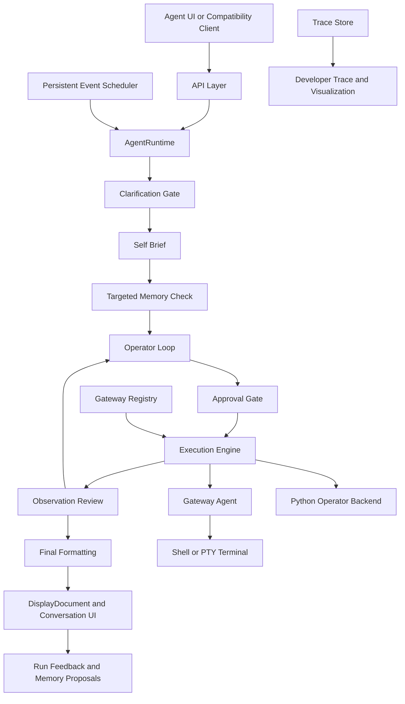

# Agent Runtime Documentation

This page is the landing page for the current runtime documentation suite.

It describes the codebase as it works now: one operator-native execution path
for Agentic and Conversational modes, typed validation, approval-gated local
execution, stage-agnostic clarification, persistent memory, persistent runtime
events, gateway-specific workspaces, live visualization, and structured UI
rendering.

## Core Rule

> The LLM decides meaning.
> The runtime validates typed contracts and safety.
> The gateway touches the real environment.

## Supported Interactive Surface

The local Agent UI is the primary supported interactive surface:

- `GET /agent-ui`
- `POST /api/agent/request`
- `GET /api/agent/stream/{request_id}`
- `GET /api/agent/trace/{request_id}`
- `POST /api/agent/confirmation/{request_id}`
- `POST /api/agent/clarification/{request_id}`
- `GET/POST /api/agent/runtime-controls`
- `GET/POST/PATCH/DELETE /api/agent/events...`
- `GET/POST/PATCH/DELETE /api/agent/gateways...`

Compatibility endpoints and the `aor` CLI still route into the runtime, but the
docs focus on the Agent UI because it exposes confirmations, command streaming,
terminal input, conversation state, persistent memory, scheduled events,
gateway selection, trace/visualization details, and `DisplayDocument`
rendering directly.

## Big Picture

In plain language:

1. The user sends a natural-language request.
2. The LLM may ask one clarifying question if user intent is genuinely missing.
3. The runtime creates a self-brief and retrieves only relevant persistent
   memory, promoted by conservative domain hints when the prompt is obviously
   Git or Docker shaped.
4. The LLM proposes operator actions.
5. The runtime validates structure, bindings, safety, approval, and terminal
   requirements.
6. Read-only work can run directly; mutating or risky work pauses for approval.
7. Shell work goes through the gateway; prompt-shaped commands use the Agent UI
   terminal; Python work runs as a trusted operator backend.
8. Results are observed, repaired when possible, formatted, displayed,
   visualized, and made available for feedback/memory learning.
9. Persistent interval events can re-enter the same request path later with
   their saved gateway, cwd, model, and operator context.

## Repository Map

- API entrypoint: `src/agent_runtime/api/app.py`
- Agent UI API/routes: `src/agent_runtime/api/agent_ui.py`
- Agent UI assets: `src/agent_runtime/api/static/agent_ui/`
- Runtime orchestrator: `src/agent_runtime/core/orchestrator.py`
- Core typed models: `src/agent_runtime/core/types.py`
- Semantic compatibility: `src/agent_runtime/core/semantic_compatibility.py`
- Input pipeline: `src/agent_runtime/input_pipeline/`
- Capability manifests: `src/agent_runtime/capabilities/`
- Operator loop, prompts, validation, repair: `src/agent_runtime/operator/`
- Execution engine and safety: `src/agent_runtime/execution/`
- Persistent memory: `src/agent_runtime/memory/`
- Persistent events: `src/agent_runtime/events/`
- Gateway registry: `src/agent_runtime/gateways/`
- Output planning and rendering: `src/agent_runtime/output_pipeline/`
- Observability and trace formatting: `src/agent_runtime/observability/`
- Gateway app and terminal runner: `src/gateway_agent/`
- Local vLLM scripts and benchmark tools: `src/llm/`

## Current Runtime Truths

- Ordinary local work uses generic operator actions rather than a large menu of
  one-off capabilities.
- The current operator actions are `operator.shell_command`,
  `operator.python_action`, and `operator.python_transform`.
- Standard Agent requests and Conversational requests share the same
  operator-native planning/execution primitives for ordinary work.
- The old product/dataflow planner is bypassed for operator-backed requests.
- Operator input bindings carry stdout, stderr, output, JSON, or typed Python
  results between actions.
- Deferred Python code can be generated after upstream output exists, using a
  bounded preview of the real input shape.
- Python operator execution is trusted local execution. It is structurally
  validated and approval-gated by risk; it is not treated as an import-whitelist
  security sandbox.
- Shell commands execute through the gateway, including streaming,
  cancellation, and PTY-backed terminal input when required.
- Agentic requests decompose non-trivial work into granular streaming steps.
  Each step runs only after the existing validator, safety policy, approval
  gates, and execution engine accept it.
- Commands that may require passphrases, credentials, or a controlling TTY are
  normalized to `interaction_mode: may_prompt` and require an active trusted
  terminal session.
- Persistent memory is retrieved after self-brief/task classification and must
  match model scope plus task/tool/intent/tag/text relevance. Deterministic
  hints add Git/Docker context for obvious prompts when the LLM classification
  is generic.
- Retrieved memory becomes request-specific directives used by direct answers,
  operator planning, plan review, cache reuse, and final answers.
- Memory is advisory and compliance-checked. It cannot bypass current user
  instructions, validation, approval, or live runtime evidence.
- Validation policies are stored in the memory system but retrieved separately
  for matching context-sensitive validator errors only.
- The Agent UI has separate Settings, Memory, Gateway, and Events drawers, all
  resizable and browser-persisted.
- The Developer Trace pane is preserved beside a Visualization pane that builds
  a live Mermaid request-flow map from SSE trace events and final trace payloads.
- Stepwise execution emits trace and command events so each scoped action,
  output, repair, and approval state is visible before final completion.
- Runtime events are stored in SQLite and scheduled by an in-process poller.
  They run through the same agent pipeline and can auto-approve only generated
  confirmation prompts.
- Final responses can be Detailed or Simple. Command capsules remain the source
  of raw stdout/stderr detail.
- Scheduled events force detailed final answers so run history contains a useful
  result summary.
- Read-only shell actions do not require approval. Mutating or risky actions
  pause for confirmation.
- The Auto-Approve Commands toggle auto-submits that visible confirmation
  prompt; it does not answer clarifications or bypass validation/safety.
- Rendering produces both user-facing markdown/text and a structured
  `DisplayDocument` for the Agent UI.

## Storage Model

Persistent runtime storage:

- `artifacts/runtime.db` - compatibility/run store path.
- `artifacts/agent_memory.db` - persistent agent memory SQLite database,
  overridable with `AOR_AGENT_MEMORY_DB_PATH`.
- `artifacts/prompts.db` - seed LLM prompt-template catalog,
  overridable with `AOR_AGENT_PROMPTS_DB_PATH`.
- `artifacts/agent_events.db` - scheduled events and event run history,
  overridable with `AOR_AGENT_EVENTS_DB_PATH`.
- `artifacts/agent_gateways.db` - local gateway registry and per-gateway
  terminal cwd, overridable with `AOR_AGENT_GATEWAYS_DB_PATH`.
- `artifacts/agent_plan_cache.db` - private reusable operator plan cache.
- `artifacts/agent_computation_cache.db` - private deferred-computation cache.
- `src/llm/results/` - local benchmark reports when vLLM benchmarks are run.

Only the curated seed memory database and prompt-template catalog are intended
to be tracked by default. Runtime DBs, event history, gateway settings, chats,
and caches are local artifacts.

Volatile process memory:

- pending confirmations;
- pending clarification pause state;
- active request traces;
- Agent UI conversation turns;
- terminal session handles and active process ids;
- cancellation events.

Browser-local storage:

- UI theme and random pastel theme state;
- Settings and Memory drawer widths;
- Gateway and Events drawer widths;
- prompt history;
- selected mode/settings toggles;
- cached UI preferences such as pane visibility.

## Documentation Guide

- [01_overview_for_humans.md](01_overview_for_humans.md)
  - A plain-language explanation of what the runtime is and why it exists.

- [02_request_lifecycle.md](02_request_lifecycle.md)
  - The full request flow from prompt intake to final rendering.

- [03_components_and_boundaries.md](03_components_and_boundaries.md)
  - The major subsystems, what each one owns, and where the boundaries are.

- [04_llm_stages_and_contracts.md](04_llm_stages_and_contracts.md)
  - Every stage where the LLM is used, plus the structured contracts and
    deterministic checks around it.

- [05_capabilities_safety_and_gateway.md](05_capabilities_safety_and_gateway.md)
  - Operator-backed capabilities, safety, approval, terminal routing, and
    gateway behavior.

- [06_worked_example_memory_report.md](06_worked_example_memory_report.md)
  - One full prompt walkthrough using operator actions.

- [07_user_manual.md](07_user_manual.md)
  - User-facing manual for the UI, memory, settings, terminal, LLM launch, and
    storage locations.

- [08_agent_memory_seed_and_capability_store.md](08_agent_memory_seed_and_capability_store.md)
  - Guidance for maintaining the tracked reusable memory/capability database.

## Good Starting Paths

If you are new to the system:

1. Start with [01_overview_for_humans.md](01_overview_for_humans.md).
2. Then read [07_user_manual.md](07_user_manual.md).
3. Then use [02_request_lifecycle.md](02_request_lifecycle.md) as the precise
   stage reference.

If you are implementing or debugging:

1. Start with [02_request_lifecycle.md](02_request_lifecycle.md).
2. Then read [04_llm_stages_and_contracts.md](04_llm_stages_and_contracts.md).
3. Keep [05_capabilities_safety_and_gateway.md](05_capabilities_safety_and_gateway.md)
   nearby while changing execution, approval, terminal, or Python behavior.
